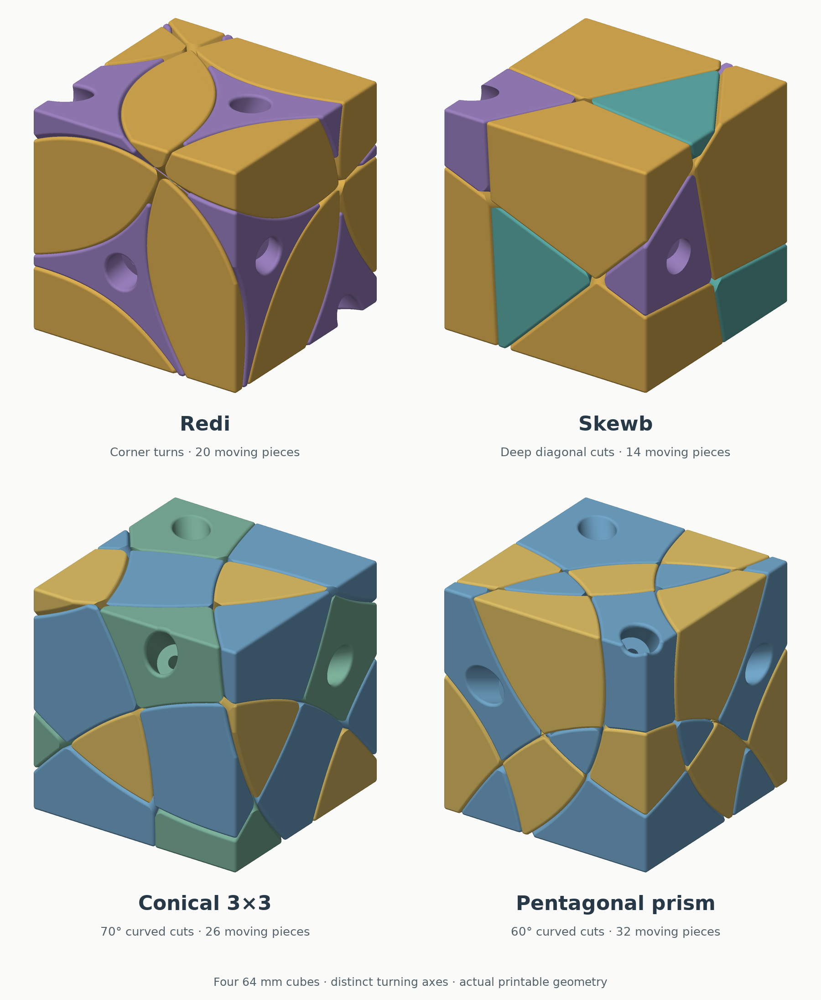

# Wonkycube

Four 3D-printable twisty puzzles with **64 mm cube exteriors**, rotated away from their turning axes. Redi, Skewb, conical 3×3 and pentagonal-prism mechanisms produce different patterns of cuts and change shape when scrambled. Solve the shape; no stickers are needed.

## Choose a cube

| Puzzle | What makes it different | Download | Build guide |
|---|---|---|---|
| **Redi** | Eight corner axes; twelve movable edges with distinct outside shapes | [STLs, plates and source](https://github.com/lukacslacko/wonkycube/releases/tag/v4.3) | [Printing and assembly](designs/redi-v4.3/ASSEMBLY.md) · [Piece map](designs/redi-v4.3/NEIGHBORS.md) |
| **Skewb** | Deep planar cuts and diagonal turns; fourteen moving pieces | [STLs, plates and source](https://github.com/lukacslacko/wonkycube/releases/tag/skewb-v1.1) | [Printing and assembly](designs/skewb-v1.1/ASSEMBLY.md) · [Piece map](designs/skewb-v1.1/NEIGHBORS.md) |
| **Conical 3×3** | Six face axes and 70° conical cuts; curved edges and twenty-six moving pieces | [STLs, plates and source](https://github.com/lukacslacko/wonkycube/releases/tag/conical-3x3-v1.1) | [Printing and assembly](designs/conical-3x3-v1.1/README.md) · [Piece map](designs/conical-3x3-v1.1/NEIGHBORS.md) |
| **Pentagonal prism** | Seven axes and 60° conical cuts; 180° side turns, 72° polar turns and thirty-two moving pieces | [STLs, plates and source](https://github.com/lukacslacko/wonkycube/releases/tag/pentagonal-prism-v1) | [Printing and assembly](designs/pentagonal-prism-v1/README.md) · [Piece map](designs/pentagonal-prism-v1/NEIGHBORS.md) |

All four have been printed by the designer; the pentagonal prism assembled very well and its nut-slot fit was reported well tuned. Colors in the render distinguish piece families for illustration; the files can be printed in any colors.

## Make one

Each puzzle uses a printed core, integral retaining feet, **DIN912 M3 × 20 screws**, **9 × 1 mm washers with M3 clearance holes**, and **DIN985 M3 locknuts**. No glue or separate hidden printed carriers are needed.

| Puzzle | Printed puzzle parts, including core | Screws / washers / nuts |
|---|---:|---:|
| Redi | 21 | 8 of each |
| Skewb | 15 | 4 of each |
| Conical 3×3 | 27 | 6 of each |
| Pentagonal prism | 33 | 7 of each |

Development used a **Bambu Lab P1S, 0.4 mm nozzle and PLA**. Print at **100% scale** in millimetres. Each build guide covers orientations, supports, nut-fit coupons and assembly order. The 3MF plates contain geometry, not a printer profile or G-code. Parts belong to their own mechanism and are not interchangeable between the puzzles.

**Redi nut fit:** its supplied core can let some nuts spin during installation. Read the [nut-seat fit note](docs/design.md#known-core-issue-and-next-change) before printing that core. The Skewb, conical 3×3 and pentagonal prism use a wide loading entrance and a tighter final nut seat, with fit alternatives supplied. The pentagonal prism's **5.20 mm final seat / 5.85 mm entrance** is the physically successful nut-fit reference; this does not change the cores shipped with the other puzzles.

## Design and modify

Flat retaining shoulders keep pieces captive; wider swept tracks and continuous rounded ridges help them pass one another. Screw adjustment controls bearing pressure separately from track clearance.

The [mechanism design guide](docs/mechanism-principles.md) explains these choices, including nut retention, printable flange tips, assembly paths and strong connections around washer wells.

| Design | Mechanism | CAD and regeneration | Checks |
|---|---|---|---|
| Redi | [Design](docs/design.md) | [Source](designs/redi-v4.3/source/README.md) | [Validation](designs/redi-v4.3/VALIDATION.md) |
| Skewb | [Design](designs/skewb-v1.1/DESIGN.md) | [Source](designs/skewb-v1.1/source/README.md) | [Validation](designs/skewb-v1.1/VALIDATION.md) |
| Conical 3×3 | [Design](designs/conical-3x3-v1.1/DESIGN.md) | [Source](designs/conical-3x3-v1.1/source/README.md) | [Validation](designs/conical-3x3-v1.1/VALIDATION.md) |
| Pentagonal prism | [Design](designs/pentagonal-prism-v1/README.md#mechanism) | [Source](designs/pentagonal-prism-v1/source/BUILD.md) | [Validation](designs/pentagonal-prism-v1/VALIDATION.md) |

Designed and physically iterated by **László Lukács**, with CAD, optimization and documentation developed with **OpenAI Codex**. Source, documentation and original generated models are available under the [MIT license](LICENSE).
