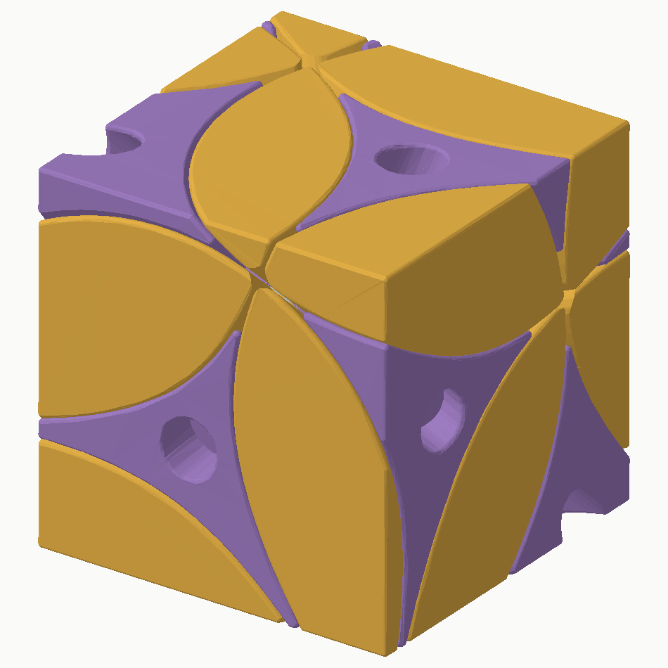

# Wonkycube

An open-source, 3D-printable corner-turning puzzle with a cube-shaped exterior rotated away from its mechanism. Eight corners turn about the mechanism's body diagonals; twelve movable edges have different exterior shapes. Scramble it and the cube changes shape. The latest version, **v4.3, is 64 mm across**.

Designed and physically iterated by **László Lukács**, with CAD, optimization and documentation developed with OpenAI Codex. Source, documentation and original generated models are available under the [MIT license](LICENSE).

## Print one

Download [v4.3](https://github.com/lukacslacko/wonkycube/releases/tag/v4.3), or use [designs/redi-v4.3](designs/redi-v4.3). The full set contains **21 puzzle parts**: one core, eight corners and twelve edges. You also need eight each of **DIN912 M3 × 20 socket-head screws**, **Ø9 × 1 mm washers with M3 clearance holes**, and **DIN985 M3 nylon-insert locknuts**. The nuts load sideways into the core; no glued shells or separate printed retainers are needed.

Use millimetres, **100% scale**, and a 0.4 mm nozzle. The project was developed on a Bambu Lab P1S with PLA as the original baseline. The edge STLs already point radially inward toward the bed, the owner's preferred print orientation. The 3MF plates contain geometry, not a validated slicer profile or G-code. Start with the [v4.3 printing and assembly guide](designs/redi-v4.3/ASSEMBLY.md) and [piece-neighbor list](designs/redi-v4.3/NEIGHBORS.md).

The owner built the compact revision and reports that everything except nut retention feels very nice. **Known core issue:** about half the nut seats allow the nut to spin under the locknut's installation torque. The proposed improvement keeps the loading entrance wide and narrows only the final seat around the screw hole, allowing the nut to be pressed home with a blunt metal rod. **That improvement is documented, not yet implemented in the released core.** See the [design and follow-up specification](docs/design.md#known-core-issue-and-next-change).

The [80 mm v4.2.1 release](https://github.com/lukacslacko/wonkycube/releases/tag/v4.2.1) and [its files](models/current) remain available. The compact version uses a smaller mechanism and different hardware; **do not mix parts between these versions**. The historical `models/current` directory still denotes the 80 mm set.

## Why it turns well

The mechanism gives different surfaces different jobs. Flat retaining shoulders obstruct edge withdrawal. Wider tracks follow the complete swept flange shape. Rounded entrances and continuous radial ridges reduce snagging, while flat axle feet and lightly adjusted screws support the corners without clamping them. A smaller exterior brings the grip closer to the mechanism.

The most useful result beyond this particular puzzle is the [mechanism design guide](docs/mechanism-principles.md): how to balance capture, clearance, rounding, support, size and assembly in other printed moving mechanisms. It includes what failed and how to diagnose similar failures.

## Explore or modify

| Resource | Purpose |
|---|---|
| [Mechanism principles](docs/mechanism-principles.md) | Transferable design knowledge, independent of this cube's appearance |
| [Design reference](docs/design.md) | Current dimensions, rotation, version comparison and pending core improvement |
| [Printing and assembly](designs/redi-v4.3/ASSEMBLY.md) | Compact hardware, orientation, nut loading and screw adjustment |
| [Validation](designs/redi-v4.3/VALIDATION.md) | Compact checks, physical feedback, provenance and practical limits |
| [Development history](docs/development-history.md) | How the printed feedback changed the design |
| [CAD and reproduction](designs/redi-v4.3/source/README.md) | Compact Python/Manifold source, canonical masters, regeneration and checks |

The chosen exterior rotation is a best-found numerical result under a sampled shape-distance objective, not a proof of the globally most distinctive possible puzzle. The edge attachments intentionally interchange during play; their exteriors distinguish solved locations. Mirror images count as different.
