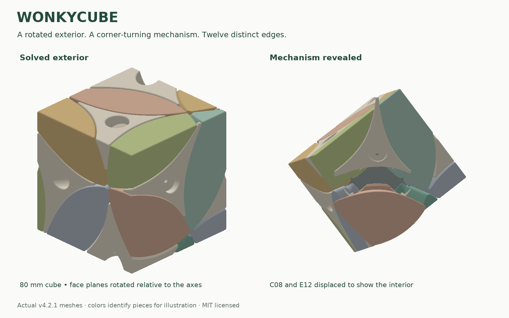

# Wonkycube

An 80 mm, 3D-printable corner-turning puzzle with a cube-shaped exterior rotated away from its mechanism. Eight corners turn about the cube's body diagonals; twelve movable edges have different exterior shapes. Scramble it and the cube changes shape.

Designed and physically iterated by **László Lukács**, with CAD, optimization and documentation developed with OpenAI Codex. Source, documentation and original generated models are available under the [MIT license](LICENSE).

## Print one

Download the [latest release](https://github.com/lukacslacko/wonkycube/releases/latest), or use [models/current](models/current). The full set contains **21 puzzle parts**: one core, eight corners and twelve edges. You also need **eight M3 × 20 machine screws with flat head undersides** and **eight washers, Ø13 × 0.55 mm**. No inserts, sleeves, hidden nuts or glued shells.

Use millimetres, **100% scale**, and a 0.4 mm nozzle. The project was developed on a Bambu Lab P1S with PLA as the original baseline. The 3MF plates contain geometry, not a validated slicer profile or G-code. Start with the [printing and assembly guide](docs/printing-and-assembly.md).

The owner reports that the **v4.2 / 3 mm revision printed very well**. The downloadable **v4.2.1** is a fresh, consistent publication export with the same main dimensions, unchanged core/corners, and the intended 3 mm rounding continued through the tracks. It has digital verification; that exact export has not separately been reported printed. [Validation and file provenance](docs/validation.md) explain the distinction.

## Why it turns well

The mechanism gives different surfaces different jobs. Flat retaining shoulders obstruct edge withdrawal. Wider tracks follow the complete swept flange shape. Rounded entrances and continuous radial ridges reduce snagging, while flat axle feet and lightly adjusted screws support the corners without clamping them. A smaller exterior brings the grip closer to the mechanism.

The most useful result beyond this particular puzzle is the [mechanism design guide](docs/mechanism-principles.md): how to balance capture, clearance, rounding, support, size and assembly in other printed moving mechanisms. It includes what failed and how to diagnose similar failures.

## Explore or modify

| Resource | Purpose |
|---|---|
| [Mechanism principles](docs/mechanism-principles.md) | Transferable design knowledge, independent of this cube's appearance |
| [Design reference](docs/design.md) | Actual dimensions, axes, rotation and shape-distinction objective |
| [Printing and assembly](docs/printing-and-assembly.md) | Hardware, orientation, adjustment, fixture and piece map |
| [Validation](docs/validation.md) | Checks, results, provenance and practical limits |
| [Development history](docs/development-history.md) | How the printed feedback changed the design |
| [CAD and reproduction](cad/README.md) | Python/Manifold source, fixed baseline, regeneration and checks |

The chosen exterior rotation is a best-found numerical result under a sampled shape-distance objective, not a proof of the globally most distinctive possible puzzle. The edge attachments intentionally interchange during play; their exteriors distinguish solved locations. Mirror images count as different.
