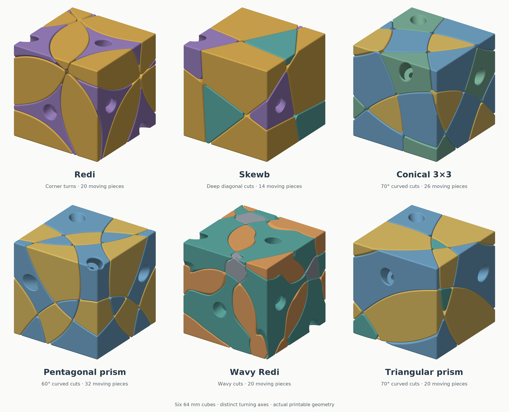
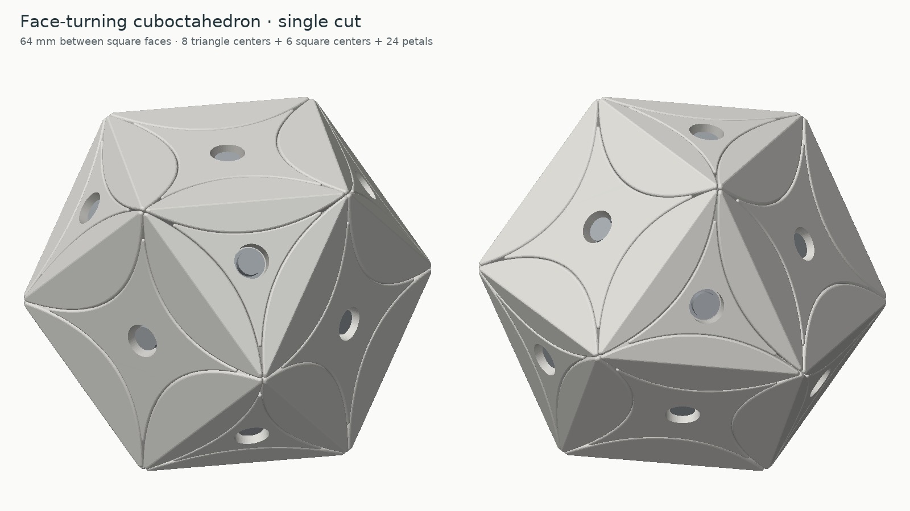
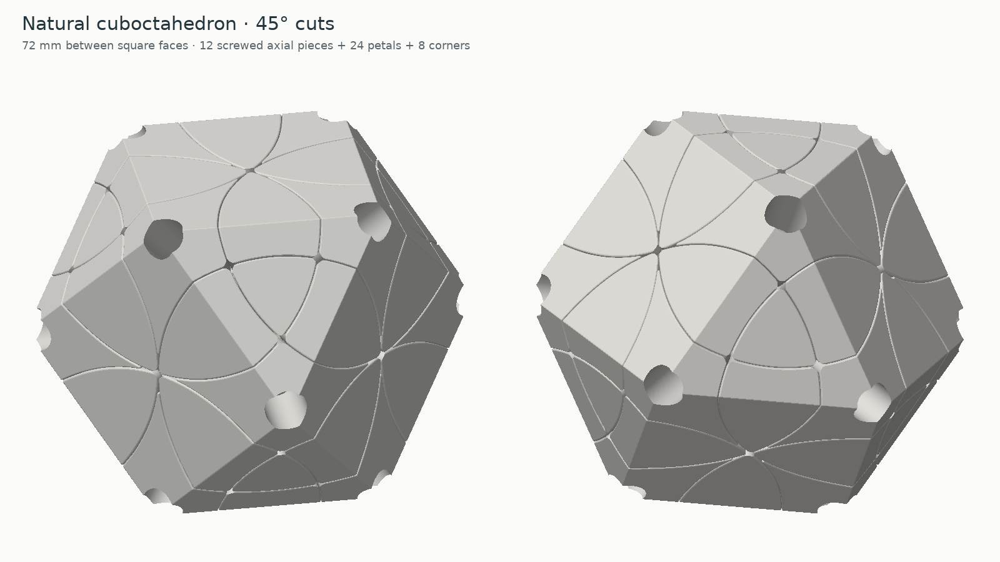
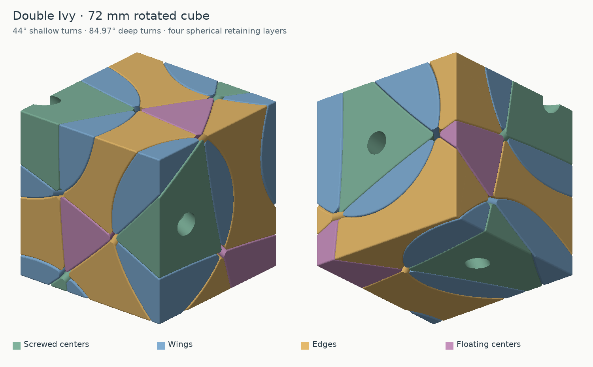

# Wonkycube

Six 3D-printable twisty puzzles with **64 mm cube exteriors**, rotated away from their turning axes. Redi, Skewb, conical 3×3, pentagonal-prism, Wavy Redi and triangular-prism designs produce different patterns of cuts and change shape when scrambled. Solve the shape; no stickers are needed.

## Cube shape mods

| Puzzle | What makes it different | Download | Build guide |
|---|---|---|---|
| **Redi** | Eight corner axes; twelve movable edges with distinct outside shapes | [STLs, plates and source](https://github.com/lukacslacko/wonkycube/releases/tag/v4.3) | [Printing and assembly](designs/redi-v4.3/ASSEMBLY.md) · [Piece map](designs/redi-v4.3/NEIGHBORS.md) |
| **Skewb** | Deep planar cuts and diagonal turns; fourteen moving pieces | [STLs, plates and source](https://github.com/lukacslacko/wonkycube/releases/tag/skewb-v1.1) | [Printing and assembly](designs/skewb-v1.1/ASSEMBLY.md) · [Piece map](designs/skewb-v1.1/NEIGHBORS.md) |
| **Conical 3×3** | Six face axes and 70° conical cuts; curved edges and twenty-six moving pieces | [STLs, plates and source](https://github.com/lukacslacko/wonkycube/releases/tag/conical-3x3-v1.1) | [Printing and assembly](designs/conical-3x3-v1.1/README.md) · [Piece map](designs/conical-3x3-v1.1/NEIGHBORS.md) |
| **Pentagonal prism** | Seven axes and 60° conical cuts; 180° side turns, 72° polar turns and thirty-two moving pieces | [STLs, plates and source](https://github.com/lukacslacko/wonkycube/releases/tag/pentagonal-prism-v1) | [Printing and assembly](designs/pentagonal-prism-v1/README.md) · [Piece map](designs/pentagonal-prism-v1/NEIGHBORS.md) |
| **Wavy Redi** | Eight corner axes, twelve broad petals and six exposed patches of the fixed core | [STLs, plates and source](https://github.com/lukacslacko/wonkycube/releases/tag/wavy-redi-v1.1) | [Printing](designs/wavy-redi-v1.1/README.md) · [Assembly and piece map](designs/wavy-redi-v1.1/ASSEMBLY.md) |
| **Triangular prism** | Five axes and 70° conical cuts; 180° side turns, 120° polar turns and twenty moving pieces | [STLs, plates and source](https://github.com/lukacslacko/wonkycube/releases/tag/triangular-prism-v1) | [Printing and assembly](designs/triangular-prism-v1/README.md) · [Piece map](designs/triangular-prism-v1/NEIGHBORS.md) |

All six cube shape mods have been printed by the designer. The 64 mm non-wavy triangular prism printed, assembled and turns well. The Wavy Redi built very well and turns great; its published v1.1 makes two small refinements to nut fit and four exterior tips, checked in CAD and awaiting a reprint. Colors in the render distinguish piece families for illustration; the files can be printed in any colors.

## Face-turning cuboctahedron

A naturally aligned **64 mm cuboctahedron** with eight triangular centers, six square centers and twenty-four interchangeable petals. Triangle faces turn 120° and square faces 90°. Paint the fourteen exterior faces with colors or symbols for solving.

**Printed and assembled well; the square faces are not very easy to turn.** A possible future alternative is the dual body, a **vertex-turning rhombic dodecahedron**, so each axis has a projecting shape to grasp. That grip improvement is a proposal, not a tested replacement.

[Download STLs, plates and source](https://github.com/lukacslacko/wonkycube/releases/tag/face-turning-cuboctahedron-v1) · [Build guide](designs/face-turning-cuboctahedron-v1/README.md) · [Piece map](designs/face-turning-cuboctahedron-v1/NEIGHBORS.md) · [Build feedback](designs/face-turning-cuboctahedron-v1/physical-feedback.json)

## Curvy Copter cuboctahedron

A naturally aligned **72 mm vertex-turning cuboctahedron** with twelve screwed centers, twenty-four petals and eight floating corners. It has 45° conical cuts, ordinary 180° turns and jumbling moves at suitable partial alignments. Paint the exterior faces with colors or symbols for solving.

**Printed and built very well.** Spherical-shell shoulders retain petals under the screwed centers and corners under the petals. The published v3.2 includes wider petal grooves, tip rounding through the exterior surface and R1.2 rounding of the center-flange outline while preserving its bearing faces. The original vertex-turning cuboctahedron core can be reused.

[Download STLs, plates and source](https://github.com/lukacslacko/wonkycube/releases/tag/curvy-copter-cuboctahedron-v3.2) · [Build guide](designs/curvy-copter-cuboctahedron-v3.2/README.md) · [Piece map](designs/curvy-copter-cuboctahedron-v3.2/NEIGHBORS.md) · [Build feedback](designs/curvy-copter-cuboctahedron-v3.2/physical-feedback.json)

## Double Ivy

A **72 mm rotated cube** with four tetrahedral axes, shallow 44° and deep 84.97° cuts, and twenty-six moving pieces. Four spherical retaining layers hold floating centers under edges, edges under wings, and wings under screwed centers.

**Printed, assembled and turns quite well after working it in.** Two deep turns initially bound and improved with repeated turning. The supplied v7.1 adds a checked outer-ridge rounding correction, which has not yet been reprinted. It includes the compatible tighter nut-seat core for new builds.

[Download STLs, plates and source](https://github.com/lukacslacko/wonkycube/releases/tag/double-ivy-v7.1) · [Build guide](designs/double-ivy-v7.1/README.md) · [Assembly and neighbors](designs/double-ivy-v7.1/ASSEMBLY.md) · [Build feedback](designs/double-ivy-v7.1/physical-feedback.json)

## Make one

Each puzzle uses a printed core, integral retaining feet, **DIN912 M3 × 20 screws** and **DIN985 M3 locknuts**. The six 64 mm cube shape mods, Double Ivy and Curvy Copter cuboctahedron use **9 × 1 mm washers**; the face-turning cuboctahedron uses **7 × 0.5 mm washers**, all with M3 clearance holes. No glue or separate hidden printed carriers are needed.

| Puzzle | Printed puzzle parts, including core | Screws / washers / nuts |
|---|---:|---:|
| Redi | 21 | 8 of each |
| Skewb | 15 | 4 of each |
| Conical 3×3 | 27 | 6 of each |
| Pentagonal prism | 33 | 7 of each |
| Wavy Redi | 21 | 8 of each |
| Triangular prism | 21 | 5 of each |
| Face-turning cuboctahedron | 39 | 14 of each; **7 × 0.5 mm washers** |
| Curvy Copter cuboctahedron | 45 | 12 of each; **9 × 1 mm washers** |
| Double Ivy | 27 | 4 of each; **9 × 1 mm washers** |

Development used a **Bambu Lab P1S, 0.4 mm nozzle and PLA**. Print at **100% scale** in millimetres. Each build guide covers orientations, supports, nut-fit coupons and assembly guidance. The 3MF plates contain geometry, not a printer profile or G-code. Parts belong to their own mechanism and are not interchangeable between the puzzles.

**Captive nut design:** use the self-contained [DIN985 M3 nut-slot specification](docs/design.md#captive-din985-m3-nut-slot-specification) when designing a part: **5.25 mm terminal seat / 5.85 mm entrance**. The guide defines the taper, axial capture, print orientation and installation-torque fit check. The supplied Redi v4.3 core can let some nuts spin during installation; consult its fit dimensions before printing it.

## Design and modify

Flat or spherical retaining shoulders oppose unwanted withdrawal; wider tracks and continuous rounded ridges help pieces pass one another. Screw adjustment controls bearing pressure separately from track clearance.

The [mechanism design guide](docs/mechanism-principles.md) explains these choices, including nut retention, printable flange tips, assembly paths and strong connections around washer wells.

| Design | Mechanism | CAD and regeneration | Checks |
|---|---|---|---|
| Redi | [Design](docs/design.md) | [Source](designs/redi-v4.3/source/README.md) | [Validation](designs/redi-v4.3/VALIDATION.md) |
| Skewb | [Design](designs/skewb-v1.1/DESIGN.md) | [Source](designs/skewb-v1.1/source/README.md) | [Validation](designs/skewb-v1.1/VALIDATION.md) |
| Conical 3×3 | [Design](designs/conical-3x3-v1.1/DESIGN.md) | [Source](designs/conical-3x3-v1.1/source/README.md) | [Validation](designs/conical-3x3-v1.1/VALIDATION.md) |
| Pentagonal prism | [Design](designs/pentagonal-prism-v1/README.md#mechanism) | [Source](designs/pentagonal-prism-v1/source/BUILD.md) | [Validation](designs/pentagonal-prism-v1/VALIDATION.md) |
| Wavy Redi | [Design](designs/wavy-redi-v1.1/README.md#mechanism-choices) | [Source](designs/wavy-redi-v1.1/source/README.md) | [Validation](designs/wavy-redi-v1.1/VALIDATION.md) |
| Triangular prism | [Design](designs/triangular-prism-v1/README.md#retention-and-fit) | [Source](designs/triangular-prism-v1/source/BUILD.md) | [Validation](designs/triangular-prism-v1/VALIDATION.md) |
| Face-turning cuboctahedron | [Design](designs/face-turning-cuboctahedron-v1/README.md#mechanism) | [Source](designs/face-turning-cuboctahedron-v1/source/BUILD.md) | [Validation and build feedback](designs/face-turning-cuboctahedron-v1/VALIDATION.md) |
| Curvy Copter cuboctahedron | [Design](designs/curvy-copter-cuboctahedron-v3.2/README.md#mechanism) | [Source](designs/curvy-copter-cuboctahedron-v3.2/source/BUILD.md) | [Validation and build feedback](designs/curvy-copter-cuboctahedron-v3.2/VALIDATION.md) |
| Double Ivy | [Design](designs/double-ivy-v7.1/DESIGN-NOTES.md) | [Source](designs/double-ivy-v7.1/BUILD.md) | [Validation and feedback](designs/double-ivy-v7.1/VALIDATION.md) |

Designed and physically iterated by **László Lukács**, with CAD, optimization and documentation developed with **OpenAI Codex**. Source, documentation and original generated models are available under the [MIT license](LICENSE).
