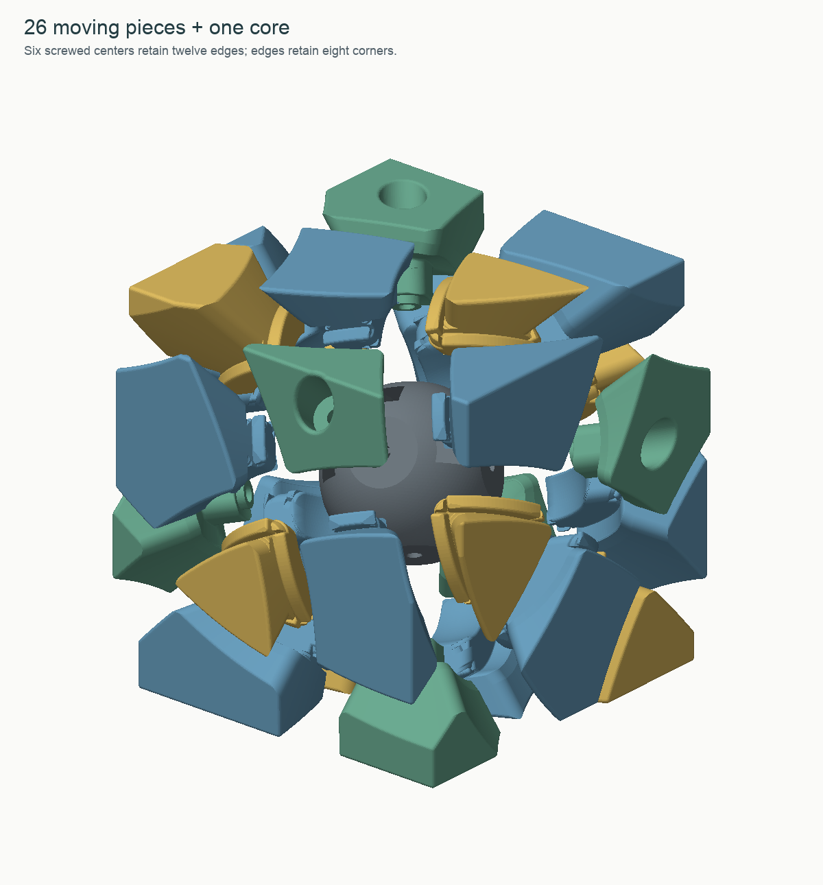

# Mechanism and dimensions

## Capture and movement

The six axes are ±X, ±Y and ±Z in the mechanism frame. Every quarter-turn moves
one center, four edges and four corners. Piece membership is the set of conical
caps containing that piece: one cap for a center, two for an edge and three for
a corner. Proper cube rotations permute this arrangement, giving ordinary
3×3 piece movement with visible center orientation.

The visible boundaries are cones with 70° half-angle and apex at the puzzle
center. Inside the outer shell, their profiles acquire flat shoulders. In local
axis coordinates `(rho, z)`, the nominal retaining lip extends to rho = 26.5 mm
between z = 5.5 and 8.5 mm, reconnecting to the cone at rho = 8.5 / cot(70°),
approximately 23.35 mm. That gives a 3 mm axial lip and approximately 3.15 mm
radial overhang **before rounding and clearance**. The exterior cut is still the
chosen cone; the hook lives inside it.

Each boundary is a surface of revolution about its associated turn axis. A
whole moving cap therefore follows an invariant boundary while turning. The
unrounded shoulder is expanded to define its mating track; the printed lip is
rounded separately. This preserves generous track entry without enlarging the
main cone gap. Rounding and exterior clipping only remove material.

Corners are retained by edges, edges by screwed centers. The checked insertion
order is K → E → C; the six screws are reached from outside. No snap-fit through
an already closed retaining loop is required. The optional stand has a checked
withdrawal route through the unoccupied C01 position.

## Parameters retained from the successful builds

| Parameter | Value and interpretation |
|---|---|
| Solved cube | 64 mm, same saved active exterior rotation |
| Main conical-face gap | 0.03 mm total nominal separation |
| Track allowance | 0.40 mm extra expansion of the unrounded mating profile, per boundary |
| Track transition | Tapers back to the main gap over local rho 26.8–29.0 mm |
| Long radial ridge rounding | R3 circular sections, continued through the track region |
| Other inner convex edges | 0.60 mm on edges/corners; 0.45 mm on centers |
| Exterior lips | Approximately R0.8 subtractive morphological rounding |
| Core sphere / moving inner cavity | R19.2 / R19.7 mm: 0.50 mm nominal radial separation |
| Core axle pad / center foot plane | 17.60 / 17.70 mm from origin: 0.10 mm nominal axial gap |
| Bearing foot | 6.2 mm outside diameter; matching flat core pad |
| Rotating shank bore | 3.6 mm diameter: 0.6 mm diametral clearance around an M3 shank |
| Washer access well | 9.6 mm diameter for a 9 mm washer |
| Washer seat | 28.8 mm along the axis (v1.1) |
| Washer / screw underside / screw head top | 1.0 mm / 29.8 mm / 32.8 mm |
| M3 × 20 screw tip | 9.8 mm from the origin |
| Nut axial envelope | 11.65–15.65 mm; screw extends 1.85 mm past the inner nut face |
| Core screw passage | 3.4 mm diameter, through the core |
| Nut loading mouth / terminal seat | 5.85 / 5.40 mm across flats; 5.30 and 5.50 mm alternatives |
| Nut pocket height / roof thickness | 4.25 / 1.95 mm |

The screw is fixed relative to the core; the printed center and washer provide
an adjustable bearing interface. The nuts resist screw loosening and are keyed
by their flats. There is no rigid spacer: tightening clamps the rotor, while a
small back-off permits rotation. Use the coupons to check actual hardware fit.

The 0.03 mm main gap is an intentional continuation of the owner's successful
close-fitting prints, **not a general claim of 0.03 mm FDM accuracy**. It is
independent of the wider hidden track and adjustable screw position.

## Rounding across branched tracks

The six-axis geometry has branched inner sections. Reusing the Redi's rule for
choosing the last material interval would round the far return of some sections
and leave thin fins. This design selects the entry boundary, softens other inner
protrusions, and verifies the delivered fillet arcs in transverse sections.
Intersections with the core cavity, other fillets and the outside cube can
terminate an arc; a spherical principal-curvature claim is not intended.

No disconnected flange scraps are deliberately included. The delivered layer
connectivity report checks all 27 main print files at two layer/line-width
combinations. This extends the Skewb lesson: mesh connectivity alone is not
sufficient evidence that a thin tip will produce connected extrusion paths.

## Stalk-root reinforcement in v1.1

The original center was a single solid, with a continuous stalk, but the washer
well approached the outside root to approximately 0.65 mm at its thinnest
measured location. A connected layer graph does not identify such a weak load
path. The v1.1 seat moves outward by 1.5 mm, adding approximately 93.27 mm³ inside
each old well. The corresponding root web measures at least 2.04 mm on all six
exported centers. The exposed flange and bearing dimensions remain unchanged.

The measurement samples 720 angles around the bottom rim of the washer well,
finds the nearest exposed root surface, and checks that the shortest connecting
segment lies in solid material. It is a geometric wall measurement, not an
FEA result or a force rating. See `reports/root-web.json` and
`images/root-reinforcement.png`.

The compatible patch starts from the actual v1 STLs; E/K/core files keep their
original hashes. Their original CAD-to-export fidelity data are retained with
hash checks. The six new C files are audited against their new pre-export CAD.
The standard full CAD build also uses the raised seat; exact STL bytes across
independent builds are not promised.

## Validation limits

The reports establish closed, connected delivered solids and collision-free
**sampled** intended turns, including a multi-axis scramble. They check radial
insertion, the hardware envelopes and loading routes, stand withdrawal, and
rigid extraction/rocking probes with modest center lift. Additional extraction
probes are made at 22.5°, 45° and 67.5° through a turn.

They do not measure turning torque, printed holding force, elastic popping,
thread durability or long-term wear, and do not exhaust every possible escape
motion.

**Owner-printed:** the owner reported that the reinforced v1.1 printed very well. These STL hashes match the supplied set associated with that report. See [physical-feedback.json](physical-feedback.json). This
is a successful-print report, not an instrumented strength test or a separate
assessment of turning performance.

The exterior rotation matrix is stored in `source/chosen_rotation.json`. All
piece directions are in mechanism coordinates. The manifest's transform is
`print = Q @ mechanism + t`; invert it to restore a printed piece to assembly.
The reference solved 3MF is expressed in the exterior cube's coordinates.
