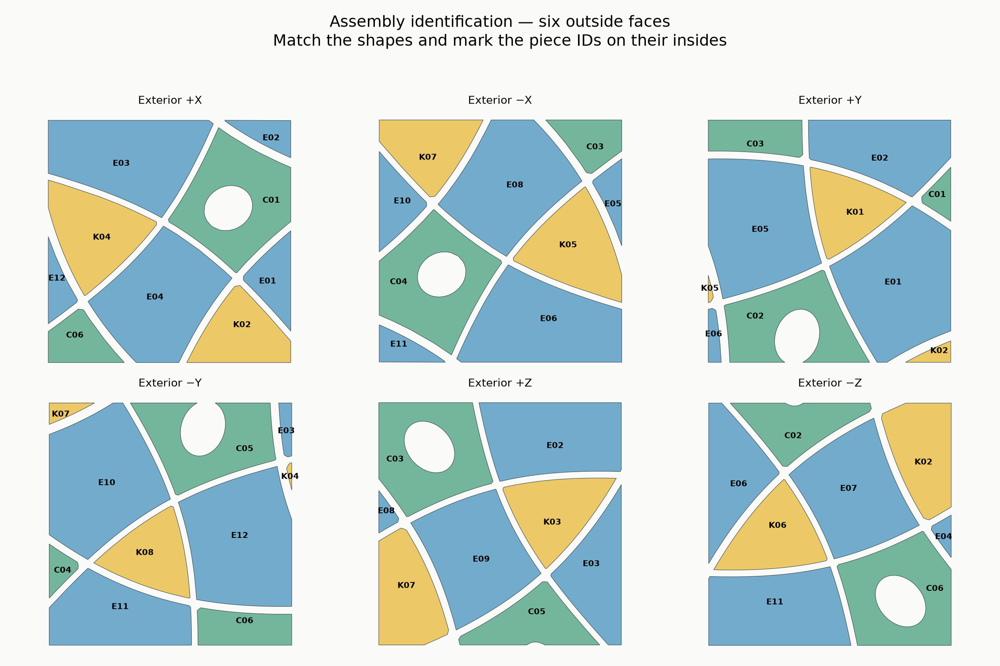

# Piece identification and neighbors

Mark these IDs on the inside of each piece after removing it from the bed. C means a screwed **center**, E an edge, and K a floating corner. These are mechanism names; a wonky piece can cover several exterior faces.

| Piece | Adjacent screwed centers / axis directions | Pieces sharing a seam |
|---|---|---|
| C01 | C01 (+X) | E01, E02, E03, E04 |
| C02 | C02 (+Y) | E01, E05, E06, E07 |
| C03 | C03 (+Z) | E02, E05, E08, E09 |
| C04 | C04 (−X) | E06, E08, E10, E11 |
| C05 | C05 (−Y) | E03, E09, E10, E12 |
| C06 | C06 (−Z) | E04, E07, E11, E12 |
| E01 | C01 (+X), C02 (+Y) | C01, C02, K01, K02 |
| E02 | C01 (+X), C03 (+Z) | C01, C03, K01, K03 |
| E03 | C01 (+X), C05 (−Y) | C01, C05, K03, K04 |
| E04 | C01 (+X), C06 (−Z) | C01, C06, K02, K04 |
| E05 | C02 (+Y), C03 (+Z) | C02, C03, K01, K05 |
| E06 | C02 (+Y), C04 (−X) | C02, C04, K05, K06 |
| E07 | C02 (+Y), C06 (−Z) | C02, C06, K02, K06 |
| E08 | C03 (+Z), C04 (−X) | C03, C04, K05, K07 |
| E09 | C03 (+Z), C05 (−Y) | C03, C05, K03, K07 |
| E10 | C04 (−X), C05 (−Y) | C04, C05, K07, K08 |
| E11 | C04 (−X), C06 (−Z) | C04, C06, K06, K08 |
| E12 | C05 (−Y), C06 (−Z) | C05, C06, K04, K08 |
| K01 | C01 (+X), C02 (+Y), C03 (+Z) | E01, E02, E05 |
| K02 | C01 (+X), C02 (+Y), C06 (−Z) | E01, E04, E07 |
| K03 | C01 (+X), C03 (+Z), C05 (−Y) | E02, E03, E09 |
| K04 | C01 (+X), C05 (−Y), C06 (−Z) | E03, E04, E12 |
| K05 | C02 (+Y), C03 (+Z), C04 (−X) | E05, E06, E08 |
| K06 | C02 (+Y), C04 (−X), C06 (−Z) | E06, E07, E11 |
| K07 | C03 (+Z), C04 (−X), C05 (−Y) | E08, E09, E10 |
| K08 | C04 (−X), C05 (−Y), C06 (−Z) | E10, E11, E12 |

Opposite centers: C01–C04, C02–C05, C03–C06. Directions here are in the **mechanism frame**; the face-map labels use the exterior cube frame.

Loose-part identification: [centers](images/catalog-C.png), [edges](images/catalog-E.png), [corners](images/catalog-K.png).

The solved reference 3MF contains named, overlapping assembly-position objects. Open it for inspection only; print the separated STL files or print plates.
