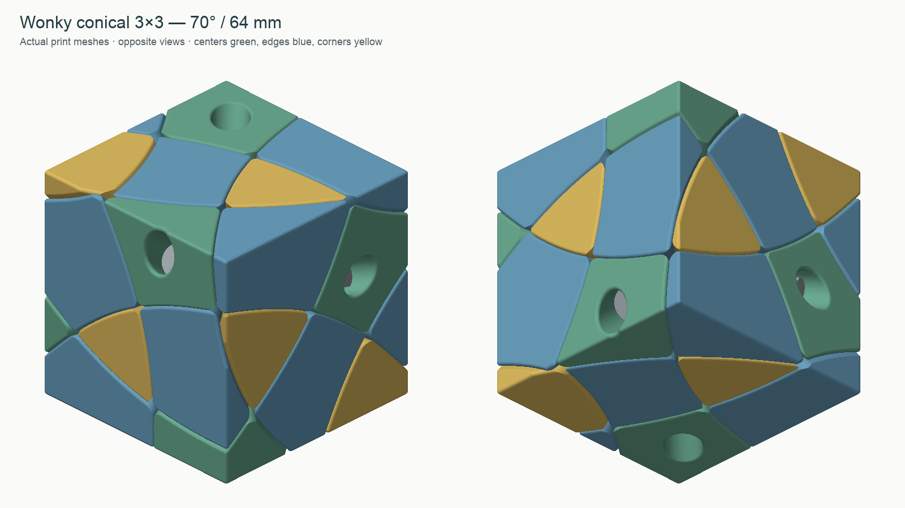
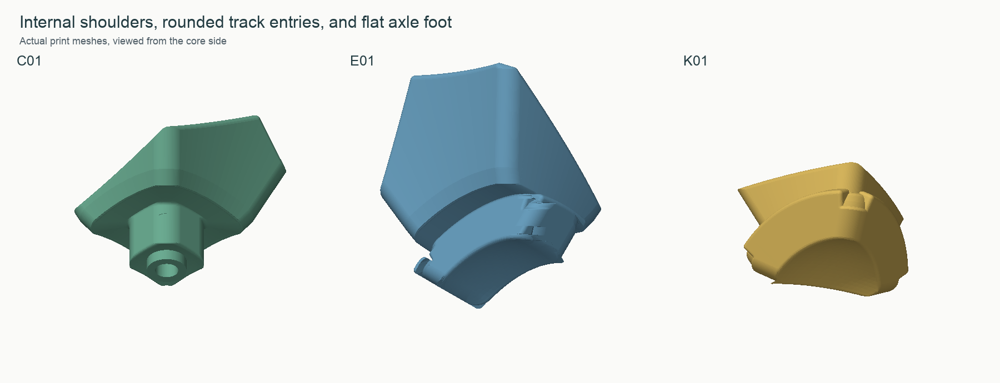

# Wonky conical 3×3 — 70°, 64 mm, v1.1

A complete printable design using six face-direction axes and the saved exterior
rotation of the successful 64 mm Wonky Redi and Skewb. Its 70° conical cuts give
six screwed centers, twelve edges and eight floating corners. The intended moves
are 90° face turns. The surface outline is the selected 70° gallery shape, with
working gaps and rounded edges added.

**Owner-printed:** the owner reported that the reinforced v1.1 printed very well. These STL hashes match the supplied set associated with that report.
See [the physical feedback record](physical-feedback.json) for the report and
its scope. Exact slicer settings were not restated; strength and endurance
have not been measured.

## Revision 1.1 — reinforced screwed centers

A slicer review exposed a thin connection between each center's stalk and body.
The original mesh was connected, but the shortest measured web between the wide
washer well and the outside root was only about **0.65 mm**. Connectivity and
collision checks did not establish sufficient strength at that junction.

The washer seat is now **1.5 mm farther outward**, shortening the wide well and
increasing that local web to about **2.04 mm**. The Ø3.6 mm through passage,
bearing foot, exterior and retaining surfaces keep their working dimensions.
The M3 × 20 screw still passes through the entire locknut, projecting about
**1.85 mm** beyond it. The head remains inside the solved cube.

Only the six **C01–C06** puzzle STLs change. The **core, twelve E edges and eight
K corners are byte-for-byte identical to v1** in this compatible release.
Keep any of those already printed. The optional rotor-fit coupon and reference
assembly are also updated; the assembly stand and nut coupons remain unchanged.

This is a geometric reinforcement, not a measured strength or endurance rating.
For the revised centers, retain the recommended walls and solid layers around
the washer seat; sparse infill alone is not a substitute for that load path.

## What to print

Print exactly one of each of the **27 files in `stl/puzzle/`**:

- `core.stl`: default 5.40 mm terminal nut seats.
- `C01`–`C06`: six screwed centers.
- `E01`–`E12`: twelve floating edges.
- `K01`–`K08`: eight floating corners.

The STLs are already on the bed, in millimetres. Use **100% scale**. E pieces have their inward radial vector pointing down, as preferred on the
previous prints. K corners and C centers use a broad exterior face down;
the K pieces otherwise have almost point-sized initial bed contact. The core
uses an axle flat down. Geometry-only 3MF plates preserve those poses and the object names.
They do not silently install a printer or filament profile.

The `E-face-down` / `K-radial-down` plates and individual `print-options/` files
are **alternate orientations of the same pieces**, not extra parts to print.
Do not print both sets. Keep the default radial-down pose for the edges to continue the approach
that worked on the Redi. The optional radial-down corner pose requires supports
under the tiny initial tips; the default broad-face-down corners have much
more bed contact.

Print the nut coupons first. `core-seat-5.30` and `core-seat-5.50` are optional
replacement cores with tighter/looser final seats; choose only one core.
The loading mouth is 5.85 mm in all variants. Test the actual DIN985 nut by
fully driving a screw through its nylon ring, not just by checking whether the
nut stays in place. The optional stand supports the core during assembly and
is removed before the last center is fitted.

## Hardware

- **6 × DIN912 M3 × 20 mm screws**.
- **6 × washers, 9 mm outside diameter × 1 mm thick**, with M3 clearance holes.
- **6 × DIN985 M3 nylon-insert locknuts**, nominal 5.5 mm across flats × 4 mm high.
- A matching hex key; a blunt approximately 3 mm rod to seat the nuts.

Besides the core, there are no separate hidden printed parts. The core,
26 visible pieces and six hardware stacks are the whole mechanism; assembly
uses no sleeves, inserts, springs, magnets or glued joints. The optional stand is an assembly tool only.

## Printing on the P1S

Use the 0.4 mm nozzle and PLA for the first trial, so that the material stays
consistent with the successful earlier builds. A practical starting point is
0.16 mm layers, 4 walls and 20–25% infill; use more walls/infill for the core if
desired. These are suggested starting settings; the successful-print report
did not restate the exact slicer settings used. Use a brim on the small radial-down footprints and removable
supports for the flange undersides. Inspect support placement before slicing;
keep the screw bores and nut-loading channels accessible. Small channel roofs
can be bridged; avoid packing inaccessible support inside a nut seat.

Remove support residue and raised seams from the sliding surfaces, especially
under the retaining lands. Do not sand away the lands or enlarge the main cone
gaps as a first step. The broad track clearance and close main faces have
different jobs. Any elephant foot on a radial-down retaining end needs removal.

The delivered meshes were checked for a connected printable layer graph at
0.16/0.42 mm and 0.20/0.45 mm layer-height/line-width combinations. This is a
geometric check, not Bambu Studio toolpaths or a physical strength test.

## Assembly

1. Mark every piece on its inside using [the ID map and neighbor table](NEIGHBORS.md).
   Open `reference/DO-NOT-PRINT-solved.3mf` to inspect the named solved assembly.
2. Load all six locknuts into the bare core through their side channels. Orient
   each nut with its nylon ring **toward the core's center**, so the screw enters
   the metal threads first. Press the nut into the tighter final seat with a
   blunt rod. Check all six seats against installation torque before covering them.
3. Optionally attach the assembly stand in the **C01** position, using the same
   screw and washer that will later hold C01. It leaves the other insertion paths
   open. Temporary tape or elastic bands around the outside can help hold loose
   pieces while the retainers are still absent.
4. Place **all eight K corners first**, then **all twelve E edges**, matching the
   outside shape and IDs. Each has a straight inward radial insertion path at
   this stage. No flange must be forced through another flange.
5. Fit C02–C06 over their corresponding core flats. Drop a washer down each
   access well and install its screw into the locknut. Start loose enough to
   permit small alignment adjustments. The centers retain the edges, which
   in turn retain the corners.
6. Support the assembly, remove the stand's screw and washer, and withdraw the
   stand straight along the C01 axis. Install C01 with that screw and washer.
   If no stand was used, simply install C01 last.
7. Adjust the six centers evenly. Tighten until the assembly just becomes firm,
   then back off slightly until it turns without force. M3 coarse pitch is
   0.5 mm, so **one fifth of a turn corresponds to 0.10 mm** of axial adjustment.
   Locknut drag is not the same as bearing clamp load: judge by the puzzle's feel.
   Remove any temporary tape/bands before turning.

Keep the screw adjustment small. The tests include modest center lift, but
excess lift can increase rocking and eventually allow popping. Do not force
a turn through support scars, a badly misaligned layer, or a tight nut seat.

## Design details and evidence

See [DESIGN.md](DESIGN.md), [NEIGHBORS.md](NEIGHBORS.md), and the JSON files in
`reports/`. Those reports check the **reloaded delivered STLs**, not only the
pre-export CAD. They include turns, scrambled positions, insertion and stand
withdrawal, hardware access, sampled extraction paths, fillet sections,
printable connectivity, and plate placement.

Full regeneration source is in `source/`; `manifest.json` records part hashes,
dimensions, volumes and the rigid print-to-assembly correspondence. The solved
reference is for inspection only. MIT license covers the source and generated
design. No print has been sent to a printer by this package.
