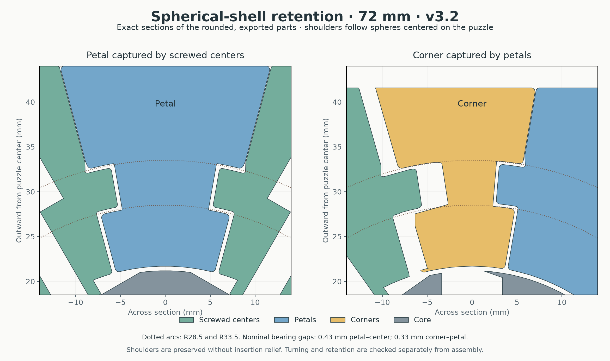

# Curvy Copter cuboctahedron · spherical v3.2

A **vertex-turning cuboctahedron** with Curvy Copter mechanics: twelve screwed axial pieces, twenty-four petals, eight floating corners and a one-piece core. It measures **72 mm between opposite square faces**, uses 45° exterior conical cuts, and permits ordinary 180° turns plus jumbling moves at suitable partial alignments. Paint the exterior faces with colors or symbols; the natural alignment does not distinguish every piece by shape alone.

**Printed and built very well**, reported by the owner on 2026-09-29. The supplied spherical-v3.2 print geometry is unchanged. [Build feedback](physical-feedback.json) · [Validation](VALIDATION.md).

## Print the puzzle

| File in `stl/puzzle/` | Quantity |
|---|---:|
| `axial-center-print-12.stl` | 12 |
| `petal-print-24.stl` | 24 |
| `corner-print-8.stl` | 8 |
| `core.stl` | 1 |

There are **45 printed puzzle parts**. Alternatively use the three full-set 3MF plates in `plates/`; together they contain the entire puzzle, including the core. Every copy in one family is identical. Geometry-only 3MF files include positions and names, without printer/material/support presets. Files marked `DO-NOT-PRINT` are reference assemblies.

Hardware: **12 DIN912 M3×20 screws, 12 DIN985 M3 locknuts and 12 washers with 9 mm outside diameter and 1 mm thickness**, with M3 clearance holes. Fit coupons and optional core nut-seat widths are supplied.

The original **64 mm vertex-turning cuboctahedron core is compatible**: its mounting geometry was preserved as the exterior grew to 72 mm. Existing embedded nuts can stay installed. The face-turning cuboctahedron is a separate mechanism with different hardware; its core is not the intended substitute. Do not mix floating pieces from the earlier cylindrical-retention version.

Use the supplied orientations at **100% scale in millimetres**. Development used a P1S, 0.4 mm nozzle, PLA and 0.20 mm layers. Four walls and about 25% infill are starting settings, not a record of the final successful slice. Petals point inward toward the bed; centers and corners rest on an exterior face. Inspect support coverage under retaining shoulders. Build-plate-only tree support works where it reaches the ledges; add support where it otherwise leaves an unsupported surface. Remove support nubs carefully from the tracks.

## Mechanism

The retaining shoulders are cut from **concentric spherical shells**, with nominal radii **28.5 and 33.5 mm**. The bearing faces directly oppose radial withdrawal. Screwed centers retain the petals; petals retain the floating corners. The shell profile transitions through a 40° internal neck to the 45° exterior cuts.

The center flange ends have **R1.2 rounding in their outline viewed radially**, extending through the flange thickness. This preserves the broad spherical bearing lands. Petal R2 radial fillets continue all the way through the exterior face, including the two tips beside each floating corner.

| Working dimension | Value |
|---|---:|
| Nominal center flange radial thickness | 4.42 mm |
| Nominal petal groove radial width | 5.28 mm |
| Gap at each center–petal spherical face | 0.43 mm |
| Total radial groove/flange clearance | 0.86 mm |
| Corner–petal bearing gap | 0.33 mm |
| Main conical body gap | 0.08 mm |
| Radial body/petal fillets | R2 mm |
| Center flange outline corners | R1.2 mm |

The petal groove has 0.20 mm more total width than the original spherical version, split equally between its two bearing walls, to accommodate supported-surface roughness. Keep body clearance separate from this track allowance. Extra clearance cannot compensate for an attached support nub.

## Assembly and painting

Install the locknuts in the core first. Interlock the floating corners, petals and screwed centers around it, keeping centers absent or loose while manipulating the floating shell. Add screws and washers progressively; leave the final centers out until neighboring floating pieces are seated. Seat gently, then loosen only enough for motion. No assembly relief, split core, glue or extra hidden carriers are required by the supplied design.

The owner successfully assembled the full puzzle. A detailed reproducible insertion sequence has not been recorded or proven in CAD, so this remains a hands-on interlocking assembly rather than a prescribed straight-in sequence. Use [NEIGHBORS.md](NEIGHBORS.md), the [painting map](images/painting-map.png) and the solved reference 3MF to locate parts. Keep paint off sliding surfaces.

For an optional small retention trial, [start-here/README.md](start-here/README.md) describes a seven-piece patch using the actual puzzle pieces. The patch checks retention; it is not a complete turning puzzle. Its parts count toward the full build, so avoid printing duplicates from the full-set plates.

## Reusing earlier spherical parts

Core and floating-corner STLs are unchanged from spherical v3. Petals are unchanged from v3.1, which added the wider grooves and full-depth surface-tip rounding. v3.2 changes the screwed centers: it restores the spherical bearing rims and rounds the flange outline in the radial view. Center-only test and full replacement plates are included in `start-here/`.

[Design notes](DESIGN-NOTES.md) · [Validation and physical feedback](VALIDATION.md) · [Regenerate from source](source/BUILD.md). Source, documentation and generated models are MIT licensed.
