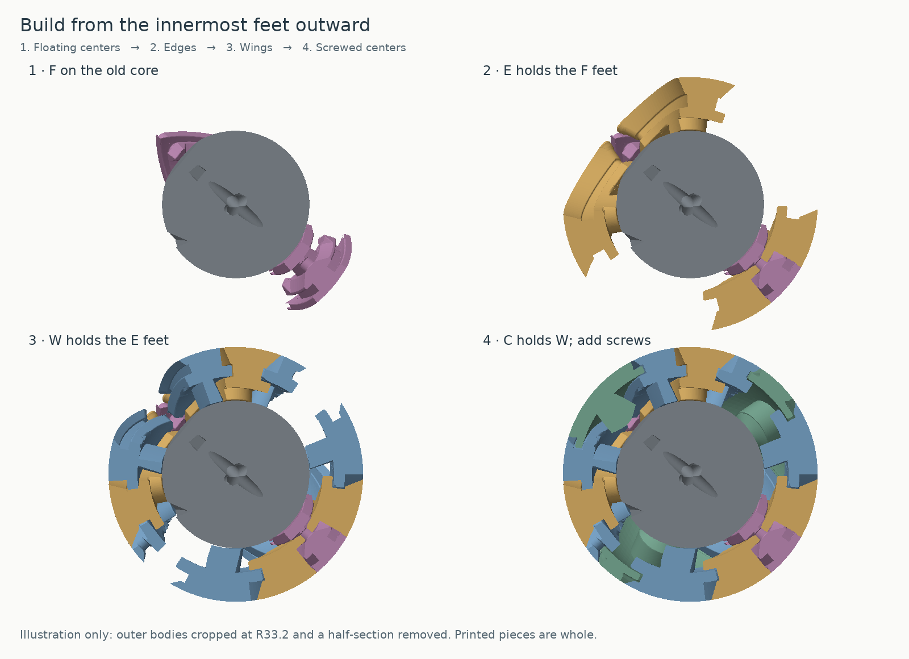
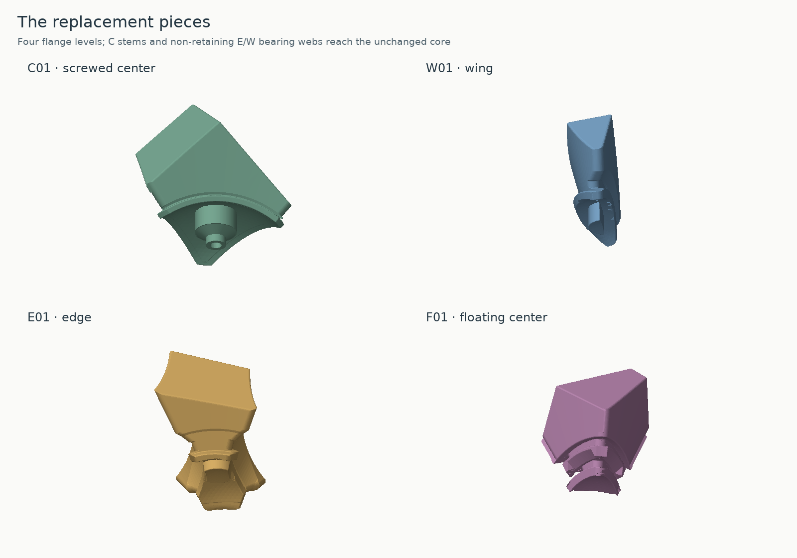

# Assembly — F, then E, then W, then C

The drawings show cutaways only; all printable pieces are whole. Install four locknuts in the supplied core, or keep them installed in a compatible existing one-piece core. See [CORE.md](CORE.md) for nut orientation and fit. The partly assembled puzzle needs support from your hands or a temporary holder until the screws close the retaining chain.

1. **Place F01–F04 around the core.** Their inner spherical feet sit closest to the core. If using the original stand, attach it temporarily at the C01 position with that screw and washer.
2. **Add E01–E06.** Each edge's lower spherical shoulders go above the adjacent floating-center feet and hold them down.
3. **Add W01–W12.** Their lower shoulders go above the edge feet. These wings will be held by the higher flanges of the screwed centers. The integral E/W bearing webs nest near the spherical core without hooking into it; no separate insertion or fastening is needed.
4. **Insert and fasten C02–C04, then C01.** The flanges fit over the wing feet. Add the 9×1 mm washers and M3×20 screws, and adjust evenly. If using the stand, remove its temporary screw/washer and withdraw it before installing C01 last.
5. Test both shallow and deep 120° turns while aligned. Start with the smallest center lift that permits free motion; excess screw lift propagates through the nested supports. M3 coarse pitch is 0.5 mm per revolution, so one fifth of a turn changes nominal screw height by 0.1 mm.

The checked paths insert each piece radially while all other pieces of its family and all inner families are in place. **No edge-and-wing preassembly or 180° wing-mating maneuver is required.** The backs of the receiving grooves are opened for these insertion paths; the captured feet remain intact in that operation. Fine hand adjustment for real printed tolerances is still expected.

## Which parts hold which

| Screwed center | Wings under its flange |
|---|---|
| C01 | W01, W02, W03 |
| C02 | W04, W05, W06 |
| C03 | W07, W08, W09 |
| C04 | W10, W11, W12 |

| Edge | Wings above it | Floating centers below it |
|---|---|---|
| E01 | W01, W04 | F03, F04 |
| E02 | W02, W07 | F02, F04 |
| E03 | W03, W10 | F02, F03 |
| E04 | W05, W08 | F01, F04 |
| E05 | W06, W11 | F01, F03 |
| E06 | W09, W12 | F01, F02 |

## Complete solved-neighbor list

These are neighbors across a cut face, excluding incidental point contacts and extra transient internal contacts during a turn. IDs match the earlier double-cut Ivy.

| Piece | Neighbors |
|---|---|
| C01 | W01, W02, W03 |
| C02 | W04, W05, W06 |
| C03 | W07, W08, W09 |
| C04 | W10, W11, W12 |
| W01 | C01, E01 |
| W02 | C01, E02 |
| W03 | C01, E03 |
| W04 | C02, E01 |
| W05 | C02, E04 |
| W06 | C02, E05 |
| W07 | C03, E02 |
| W08 | C03, E04 |
| W09 | C03, E06 |
| W10 | C04, E03 |
| W11 | C04, E05 |
| W12 | C04, E06 |
| E01 | W01, W04, F03, F04 |
| E02 | W02, W07, F02, F04 |
| E03 | W03, W10, F02, F03 |
| E04 | W05, W08, F01, F04 |
| E05 | W06, W11, F01, F03 |
| E06 | W09, W12, F01, F02 |
| F01 | E04, E05, E06 |
| F02 | E02, E03, E06 |
| F03 | E01, E03, E05 |
| F04 | E01, E02, E04 |

## Inspecting the arrangement

`reference/DO-NOT-PRINT-solved.3mf` is the complete solved assembly. Import it as one multi-part object without auto-arranging to inspect placement. It is not a print plate. `reference/parts.json` records signatures and radial directions; `manifest.json` records the reversible transform for each print orientation.

