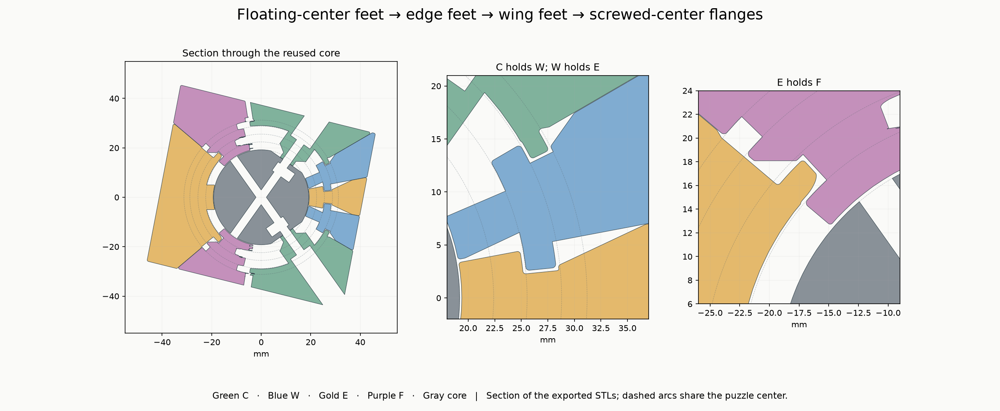
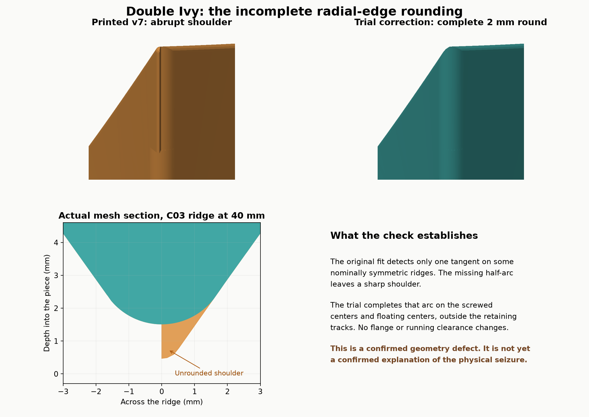

# Double Ivy · 72 mm · spherical retainers

A rotated-cube shape mod with **four tetrahedral axes and two 120° turns per axis**: shallow 44° cones and deep 84.96955° cones. It has four screwed centers, twelve wings, six edges and four floating centers. Solve it by restoring the cube shape; the illustration colors identify piece families.

**Printed, assembled and now turns quite well after working it in**, reported by the owner on 2026-09-30. The shallow turns were smooth immediately; two deep turns initially bound strongly and improved with repeated movement. The exact cause was not established. The published v7.1 includes a small **outer-ridge rounding correction that has been checked in CAD but not yet reprinted**. [Physical feedback](physical-feedback.json) · [Validation](VALIDATION.md).

The spherical retaining layers run outward as **floating-center feet → edge feet → wing feet → screwed-center flanges**. A compatible one-piece nut core supports the assembly, with integral E/W bearing webs limiting inward rocking.

## Size and layers

The solved cube measures **72 mm**. Its exterior room keeps assembly clearances beneath the skin while preserving usable retaining shoulders.

| Part family | Hidden layer begins at radius | Nominal retaining-foot limit / collar end | Held by |
|---|---:|---:|---|
| F01–F04 floating centers | 19.5 mm | 22.4 mm | Edges |
| E01–E06 edges | 22.6 mm | 25.55 mm | Wings |
| W01–W12 wings | 25.6 mm | 28.8 mm | Screwed centers |
| C01–C04 screwed centers | 29.0 mm | 31.2 mm | Screws into the old core |

Radii are measured from the puzzle center. The table describes the hidden feet/collars, not the entire visible piece; every part also has a stem/body reaching the outer cube. Profile offsets and rounding move local boundaries slightly. The C bearing stems reach inward to the unchanged core pads; their flanges remain at the outermost retaining level. Integral bearing webs under E and W also reach inward to the spherical core. These webs provide inward support, without adding retaining lips or changing the four flange levels.

The nominal internal profiles are: low deep-cut band R22.4–25.3 at 78°; middle shallow-cut band R25.55–28.45 at 49°; high deep-cut band R28.8–31.2 at 81°. The outer surfaces return to the original 44° / 84.96955° cones.

## What to print

Print **27 puzzle pieces**: C01–C04, W01–W12, E01–E06, F01–F04 and one core, from `stl/puzzle`. The five full-set geometry-only 3MF plates in `plates/` contain exactly these parts. Print in millimetres at **100% scale**. Keep the IDs for [assembly and the complete neighbor map](ASSEMBLY.md).

Use **four DIN912 M3×20 screws, four DIN985 M3 nuts and four 9 mm OD × 1 mm washers**, with M3 clearance. No glue, magnets, split core or separate hidden carriers are needed.

The default core has **5.25 mm final nut seats and 5.85 mm loading entrances**. A 5.20 mm alternative and fit coupons are included; see [CORE.md](CORE.md). The original compatible one-piece double-Ivy core can also be reused, keeping its nuts installed. The grooved/split cores are not substitutes. `reference/reused-core/core.stl` is the archived 5.40 mm-seat core, not the new-build default.

For an existing v7 build, only the eight C/F pieces have changed; the wings and edges are unchanged. The core update is optional for a core whose nuts already hold securely.

## Clearances, rounding and hardware

- 0.30 mm nominal track gap, measured surface-to-surface in the meridian profile; not 0.30 mm removed from each side.
- 0.05 mm main exterior conical-face gap.
- R19.5 floating-center cavity around the original R19.2 core.
- E/W bearing webs have an R19.4 spherical inner surface: 0.20 mm nominal radial clearance to the old core. The webs are clipped to the legal turn cells, with 0.25 mm edge rounding. They need no grooves or changes to the core.
- 2 mm radial-ridge rounding. The C/F exterior correction completes both sides of the arc, blending from ridge station 32.2 to 33.4 mm while preserving the retaining region. About 0.30 mm small internal rounding and 0.60 mm exposed-edge softening remain.
- Original washer seat at 27.3 mm along each screw axis, 9.6 mm access well and 3.6 mm screw bore.
- The higher C flange connects through a thicker, integral stem. Its upper outside diameter is 12.8 mm, giving a nominal 1.6 mm wall around the access well above the washer seat. It tapers back to the original bearing foot.

The broad retaining faces are spherical, centered on the puzzle center. They directly oppose outward lift. Higher grooves in E and F are **passage clearances for other turning flanges**, not extra load-bearing layers. Removing the unused upper E shoulder keeps the intended F–E–W–C order.

## Printing

Use the proven P1S / 0.4 mm nozzle / PLA process. A starting point is 0.20 mm layers, 4 walls and 15–20% infill. Auto tree supports on the build plate are suitable for an initial slice; inspect the undersides of the collars and add a local support if needed. These geometry-only 3MFs contain names and placements, not filament or support presets.

C pieces rest on a large exterior flat face. W/E/F are oriented with the vector toward the puzzle center pointing down. A brim is helpful on the smaller inward contact patches; inspect the slice to ensure the E/W bearing webs have support where needed. Remove support residue carefully from the sliding surfaces, without shaving away the broad spherical shoulders. Mark the full ID inside each piece before removing it from its plate. The image colors distinguish families only; the puzzle can be printed in one color and solved by shape.

[Assembly sequence and complete neighbor list](ASSEMBLY.md) · [Validation and limits](VALIDATION.md) · [Design notes](DESIGN-NOTES.md) · [Plate maps](plate-maps.html)

Parameterized source, reports and exact print transforms are included under the MIT license.

## Rounding correction

Some symmetric C/F ridges retained a sharp half-rounded shoulder because the tangent detection selected only one side. v7.1 completes the R2 outer arc without changing the internal holding geometry. This removes a confirmed defect; it is not claimed to be the proven cause or cure of the initial binding.

[Source and rebuilding](BUILD.md) · [Design notes](DESIGN-NOTES.md). MIT licensed.
