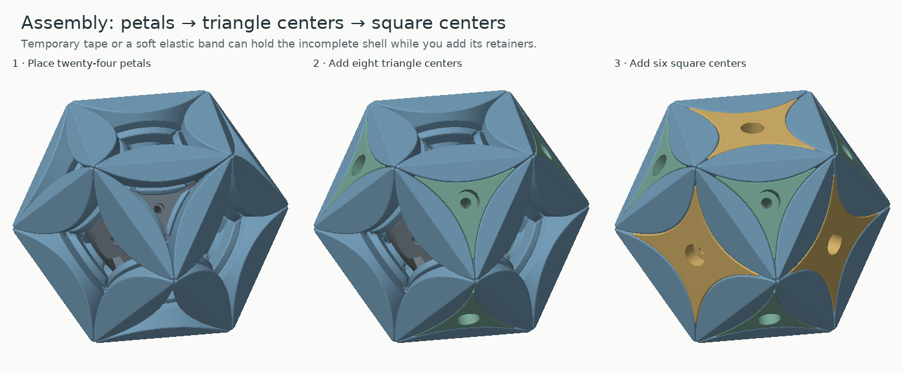
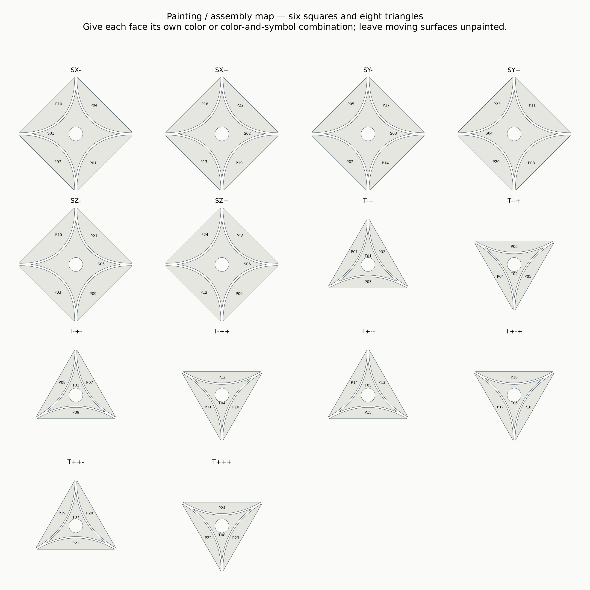
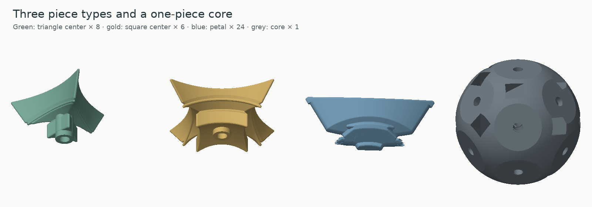
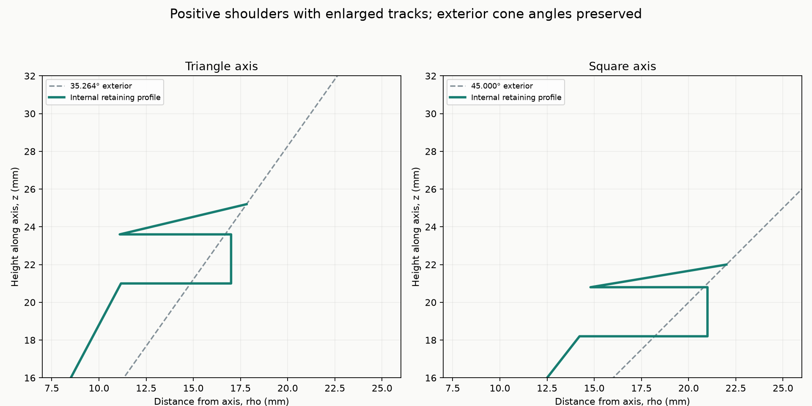

# Face-turning cuboctahedron · single cut

A naturally aligned face-turning cuboctahedron with **eight triangle centers, six square centers and twenty-four floating petals** around a one-piece core. Triangle faces turn 120°; square faces turn 90°. All twenty-four petals can exchange positions through ordinary turns. The exterior uses 35.264389683° triangle-axis cones and 45° square-axis cones, with the two families separately tangent.

The solved body is **64 mm between opposite square faces**, with 45.25 mm polyhedron edges and 90.51 mm between opposite vertices. This is the single-cut 38-piece surface design; it is a different mechanism from the twelve-axis vertex-turning cuboctahedron.

**Printed and assembled successfully.** The owner reports that the supplied v1 design printed and built well, but **the square faces are not very easy to turn**. See [physical feedback and supplied-file hashes](https://github.com/lukacslacko/wonkycube/blob/main/designs/face-turning-cuboctahedron-v1/physical-feedback.json).

A possible future shape is the dual body: a **vertex-turning rhombic dodecahedron**, with a projecting vertex around each turning axis to grasp. It may offer better purchase than the flat square faces here. This is a proposed ergonomic improvement, not a designed or tested replacement; the print files in this release keep the successfully built cuboctahedron unchanged. The physical report applies to the supplied v1 hashes; regenerated or modified files do not automatically inherit it.

## What to print

| STL in `stl/puzzle/` | Copies |
| --- | ---: |
| `triangle-center-print-8.stl` | 8 |
| `square-center-print-6.stl` | 6 |
| `petal-print-24.stl` | 24 |
| `core.stl` | 1 |

That is **39 printed puzzle parts**. Each family repeats exactly; no individually shaped part files are required. The `plates/` folder contains named copies packed into geometry-only 3MF plates, plus SVG plate maps. Choose the individual STL quantities or the supplied complete plates, not both. The reference solved 3MF is for viewing only.

Use millimetres, 100% scale, PLA and your Bambu P1S 0.4 mm profile. Suggested starting settings are 0.16 mm layers, five walls and five top/bottom layers, with 25–30% infill for the moving pieces. Use six walls and 40% infill for the core. The relatively narrow triangular roots should have continuous wall paths; check them in the slicer rather than relying on infill alone.

The petal STL has its **inward radial direction pointing down**, following the orientation that worked well on your other prints. Centers rest on their flat exterior faces. The core rests on an actual bearing pad; all other intended spherical areas remain spherical. Tree supports, automatic, build plate only are a reasonable starting point. Inspect support access under the retaining feet and inside the downward-facing screw wells. A 5–6 mm brim fits the petal plate spacing.

The layer-connectivity report checks both 0.16 mm / 0.42 mm width and 0.20 mm / 0.45 mm width. It is a geometric extrusion-width model, not a saved Bambu Studio toolpath. Remove support scars and first-layer lips from the moving surfaces without sanding away the retaining shoulders.

## Hardware

- **14 × DIN912 M3×20 mm socket-head screws**.
- **14 × 7 mm outside diameter × 0.5 mm thick M3 washers**.
- **14 × DIN985 M3 nylon-insert locknuts**, nominal 5.5 mm across flats and 4 mm high.
- A 2.5 mm hex key and a blunt rod for seating the nuts.

Use the 7×0.5 mm washers for every center. The 9×1 mm washers do not fit these wells. There are no separate sleeves, inserts, magnets, springs, glued joints or hidden retaining pieces.

The default nut seat is **5.25 mm across flats**, with a **5.85 mm loading mouth**, a 3 mm taper and a final 3 mm tight section. The pocket is 4.25 mm high. This preserves the easy insertion approach and makes only the terminal section an interference fit. The default is the small increase requested after the slightly tight wavy-core fit.

Print the 5.20/5.25/5.30 mm fit coupons first if the fit is uncertain. Check a real locknut by driving a screw through the nylon ring and reversing it. Optional 5.20 and 5.30 mm cores are supplied; print one core only. Differently angled pockets can behave differently, so check all fourteen seats in the actual core before assembly.

The rotating bores are Ø3.6 mm. The washer/driver wells are Ø7.6 mm. Triangle washer seats are 32.0 mm along their axes; square seats are 27.3 mm. Screw heads remain below the exterior. At nominal geometry, triangle screws project 1.15 mm beyond the nut and square screws 5.85 mm. The different seat depths use the same screws and washers.

## Assembly

1. Press all fourteen nuts into the bare core, with the metal entry faces outward and the nylon rings inward. Check that the nuts withstand screw installation torque without spinning.
2. Optionally attach the printed assembly stand at **S01**, using one of the puzzle's screws and washers. The stand replaces this square center temporarily; it is not an extra puzzle part.
3. Place all twenty-four petals around the core. Each bridges one square exterior face and one triangular exterior face. Slide it inward along its radial direction in the solved orientation. Temporary masking tape or a soft elastic band can support the incomplete shell.
4. Add the eight triangular centers and six square centers, sliding each inward along its screw axis. These centers can be fitted in either order. Insert a washer and screw through each well, initially leaving the adjustment loose. Leave S01 until last when using the stand.
5. Support the shell, remove the stand screw and washer, withdraw the stand along its axis, and install S01 with the same hardware.
6. Adjust the centers evenly until they support the shell without binding. M3 coarse pitch is 0.5 mm per revolution: a fifth of a turn changes the screw-head position by 0.10 mm. The retention checks include 0.10 mm outward center movement. Avoid using excess looseness to compensate for support scars or misalignment.

Nylon-ring resistance at the driver is separate from bearing pressure; judge adjustment by the puzzle's movement. Do not force a center against an obstructing piece. The supplied assembly paths do not require snapping or bending a flange into place.

`NEIGHBORS.md`, the painting map and `reference/DO-NOT-PRINT-solved.3mf` show the solved relationships. All T copies are interchangeable, all S copies are interchangeable, and all P copies are interchangeable. Marking labels inside with a Sharpie can still help when comparing a partial assembly with the map.

## Painting

Assemble and adjust the puzzle first, then paint the six squares and eight triangles. Use fourteen distinct colors, or distinct color-and-symbol combinations if needed. The map names every exterior face and labels the neighboring pieces.

Keep paint on the exterior flats. Leave sliding faces, retaining feet, tracks, screw bores and washer seats bare. Avoid carrying paint around an edge into a mating surface; let it dry fully before scrambling.

## Mechanism

The core anchors fourteen adjustable centers. Each petal is retained beneath its two neighboring centers by stepped rotational profiles. Assembly relief makes the centers insertable after the petals. The shoulders are sized and checked after rounding and relief, including intermediate turns with slightly lifted centers.

Each triangular center has an integral continuous stem around its screw bore, with a nominal 1.3 mm minimum wall. The petal has clearance for the full rotational sweep of that stem about a square axis, so the reinforcement clears intermediate turns as well as the aligned positions. This clearance is cut before edge rounding. The washer-seat root and the entire deeper bore wall are checked separately.

The two internal profiles are different because the triangle and square axes have different cone angles. They provide wider shoulders below the outer shell, then return to the chosen exterior cones below the nearest outer face. This preserves the surface pattern while giving the feet useful material. These internal shoulders need not remain inside the exterior cone's angular envelope; normal-turn clearance follows their own rotational sweep and is checked on the exported meshes.

| Feature | Dimension |
| --- | ---: |
| Main conical-face gap, total | 0.06 mm |
| Additional track-cutter expansion | 0.40 mm |
| Long petal radial ridges, including tracks | R2 |
| Other edge opening: petals / centers | R0.55 / R0.45 |
| Core sphere / moving inner cavity | R21.2 / R21.7 mm |
| Core bearing pad / foot plane | 19.6 / 19.7 mm along axis |
| Bearing foot / rotating bore | Ø6.2 / Ø3.6 mm |
| Nut roof thickness | 1.95 mm |

Track clearance is computed from the unrounded profile separately from the printed part's softening. R2 radial fillets continue through the tracks. Disconnected, nonfunctional tip remnants produced by rounding are removed and logged; the layer checks use the final supplied parts.

## Validation and limits

See `reports/` for the numerical results. Checks reload the actual STL exports and cover closed single-component meshes, assembly, all fourteen turn axes with hardware present, intermediate petal retention, tilted extraction probes, ordinary-turn destination fit, nut loading, hardware-to-hardware clearance, washer-root webs, the removable stand, and fixed-linewidth layer connectivity.

These are finite rigid-geometry checks. They do not measure friction, PLA flex, holding force, fatigue or every possible escape trajectory. Actual print finish and screw tension remain important. Ordinary turns are 120° about triangle axes and 90° about square axes.

The source and generated design are MIT licensed. Regeneration instructions are in `source/BUILD.md`; dimensions and print transforms are recorded in `reference/design-parameters.json` and `manifest.json`.
