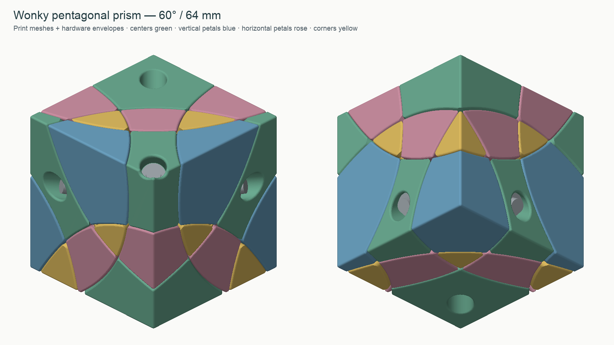

# Wonky pentagonal prism · 60° · 64 mm

A face-turning pentagonal-prism equivalent with conical cuts, presented as an uncolored cube shape mod. Five equatorial axes turn **180°**; the two polar axes turn **72°**. Solve the shape, including center orientation. C01–C05 run in cyclic order around the equator; C06 and C07 are the opposite poles.

The exterior is oriented so **C05, C06 and C07 lie in the cube plane x+y=0**, a diagonal mirror plane. This is a 5.67233332° adjustment from the shared starting cube orientation. The cone half-angle remains 60°. The complete rotation matrix is in `source/chosen_rotation.json`.

On **2026-09-23**, the owner reported that this puzzle **built together very well** and that the **nut-slot sizing is well tuned**. The printed core used the default **5.20 mm terminal seat**. The [physical feedback record](physical-feedback.json) includes the supplied part hashes and the Bambu P1S/PLA settings used. Turning smoothness and long-term wear were not separately assessed in that report.

## What to print

Print **one of every file in `stl/puzzle/`**: 7 screwed centers C01–C07, 5 vertical petals V01–V05, 10 horizontal petals H01–H10, 10 floating corners K01–K10, and one core. Total: **33 puzzle parts**. “Vertical/horizontal” refers to the prism's axes, not the rotated cube or print bed.

Use the named geometry-only 3MF plates in `plates/`, or import the individual STLs at **100% scale, millimetres**. The plates contain no printer presets. The solved assembly in `reference/DO-NOT-PRINT-solved.3mf` is an identification reference, not a print plate. Alternative orientations and alternate cores are duplicates: do not print them as extra puzzle parts.

For the Bambu P1S, start with the familiar PLA, 0.4 mm nozzle and 0.16 mm layers, 4 walls, 5 top/bottom layers and about 25–30% gyroid infill. Use more walls or high infill for the core and the optional stand. V and H STLs have their inward radial direction pointing straight down. C and K use a large exterior flat face down; optional orientations are supplied. Inspect the actual Bambu preview for each part: enable build-plate supports where the feet and undercuts need them, then remove supports and seam burrs completely from the sliding surfaces. Use a brim for small first-layer footprints if needed. Do not resize the models or globally offset every surface to adjust fit.

## Recorded successful build

All **33 puzzle parts fit on one P1S plate**, with blue PLA for the core, screwed centers and floating corners, and yellow PLA for both petal families. The default 5.20 mm nut-seat core was printed. Parts retained their supplied orientations; packing used only translations and rotations about the bed's vertical axis.

The job used a **0.4 mm nozzle, 0.16 mm layers, 4 walls, 5 top/bottom layers and 25% gyroid infill**. The core used **6 walls and 40% gyroid**. Supports were **automatic tree, default style, build plate only**, with a 30° threshold and 0.20 mm top gap. The textured PEI plate and automatic bed leveling were used. Bambu estimated 16 h 22 min and 320.33 g including supports, flushing and the prime tower; these are slicer estimates, not measured totals.

These settings record one successful build. Use the nut coupons when changing material, printer calibration or hardware. The geometry-only plates below remain independent of a particular printer profile.

## Hardware and nut fit

- **7 × DIN912 M3×20 socket-head machine screws**; nominal head envelope Ø5.5 × 3 mm.
- **7 × washers Ø9 × 1 mm**, with an M3 clearance hole.
- **7 × DIN985 M3 locknuts**, nominal 5.5 mm across flats and 4 mm high.
- A 2.5 mm hex key, and a blunt metal rod to seat the nuts.

The default core has **5.20 mm terminal nut seats**, with a **5.85 mm loading entrance** and a tapered transition. The tight loading-channel region extends 3.0 mm from the bore center, followed by a 3.0 mm taper to the entrance; the slot is 4.25 mm high. This default fit was reported well tuned in the assembled PLA build. Print the small `nut-fit-5.20` coupon first and test your real nut. If insertion requires excessive force or splits the coupon, test 5.30 and then 5.40; the matching alternate cores are in `stl/optional/`. Choose the tightest coupon that seats fully without damage and prevents the nut rotating. These intentionally undersized seats depend on printer calibration and nut dimensions. The coupon includes the same slot and roof geometry as the core. `rotor-fit` tests the washer well and screw passage.

Push each nut sideways to the center of its slot, **nylon ring toward the puzzle center**. Screws then enter through the metal-threaded face first and engage the nylon before reaching their tips. Keep glue out of the threads and bearings; the design does not require glue.

The Ø3.6 screw passage clears the shaft; the Ø9.6 well clears the washer. Flat bearing feet at radius 19.70 mm run over flat core pads at 19.60 mm. Washer seats are at 31.30 mm. A fully seated nominal screw extends 1.35 mm beyond a nominal nut. The core sphere is Ø42.4 mm, sized to support the screw stack. The overall cube stays 64 mm.

## Assembly

Use `images/assembly-map.png`, the inside-facing catalogs, and `NEIGHBORS.md`. Mark IDs inside with a fine permanent marker before mixing loose parts. The face map shows the flat surface areas; its white bands include the rounded edges. The colors in the drawings identify families only; colored filament is not required.

1. Test the nut fit and remove supports/burrs. Press all seven nuts fully into the core before adding the outer pieces.
2. Optionally mount the core on `assembly-stand` at C01, using one of the seven screws and washers. The stand temporarily replaces C01 and is reusable. It needs no extra permanent hardware.
3. Place the ten K corners against the core in their solved positions. Use gentle temporary tape or support from your fingers to hold this incomplete shell; it is not captive yet.
4. Insert the five V petals and ten H petals between them. Their shoulders overlap the K feet. V and H pieces can be inserted after the corners; the provided assembly tests include the other petals already in place. Keep the shell aligned as you close it.
5. Add and screw down C02–C07. Their shoulders retain the petals. Start every screw gently in its nut, and leave slight axial freedom while aligning the shell.
6. Support the puzzle, remove the stand and its screw/washer, then insert C01 and install that same screw/washer. Without the stand, install C01 last after the other centers.
7. Adjust all seven screws in small equal increments. A standard M3 coarse thread advances 0.5 mm per revolution: one fifth turn changes the axial setting by 0.10 mm. Aim for free turns with little play, not maximum screw torque. The nylon nuts resist screw rotation but do not replace careful adjustment. Begin with correctly aligned, slow full 180° side turns and 72° pole turns.

Assembly checks test radial insertion with already installed parts, the core, neighboring hardware and the optional stand. They establish a collision-free sampled route, not a claim that a partly assembled shell supports itself without your hands.

## Mechanism

Each cone cut becomes a stepped surface of revolution inside the cube. A flat shoulder provides positive capture: the screwed centers hold the petals, and the petals hold the corners. The shoulder is at transverse radius 26.5 mm, with local axial levels 12.6 and 14.4 mm; it rejoins the 60° cone at radius 14.4·tan(60°) ≈ 24.94 mm. The nominal shoulder overhang is therefore about 1.56 mm before clearances and rounding. It remains inside the cube's 32 mm insphere. There is no core-track retention layer.

The main conical body gap is **0.03 mm total**. Track cutters are expanded by **0.40 mm** in the mechanism, tapering back to the body gap outside it. Printed lips have their own rounding; tracks are not derived from the already rounded feet. Small convex internal edges use 0.60 mm rounding on floating parts and 0.45 mm on centers. Long radial ridges use a **2 mm transverse circle radius through the track region**, and exposed outer edges use **0.8 mm** rounding. The flat bearing interface has 0.10 mm initial axial clearance. These dimensions distinguish running clearance from retention overlap.

Only the interference volume needed by the specified insertion route is removed for assembly. Radial fillet fitting starts outside the hollow core and extends inward, so it follows the actual dihedral instead of mistakenly rounding the spherical cavity wall. The washer landing is protected during exterior rounding to keep it flat. The final CAD checks cover collisions, retention probes, hardware access, washer lands, nut loading, stalk continuity, watertight exports and fixed-linewidth layer connectivity. Read `VALIDATION.md` for exact coverage and limitations.

## Files and regeneration

- `images/`: actual mesh renders, six-face assembly map and inside-facing catalogs.
- `NEIGHBORS.md`: neighbors and parent turn axes for every exterior piece.
- `reports/`: numerical checks tied to the delivery manifest hash.
- `source/`: Python CAD, mesh export, rendering and validation scripts.
- `manifest.json`: quantities, hashes, dimensions and explicit assembly/print transforms.

See `source/BUILD.md` for regeneration. Source and generated design files are provided under the included MIT license.
