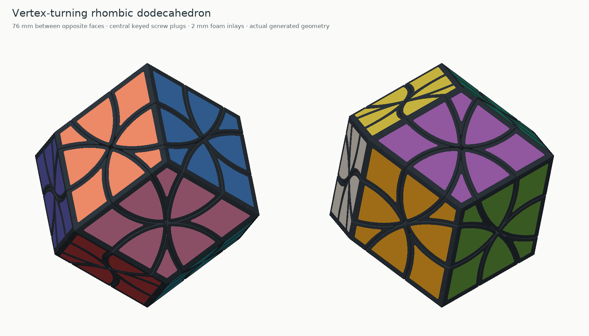
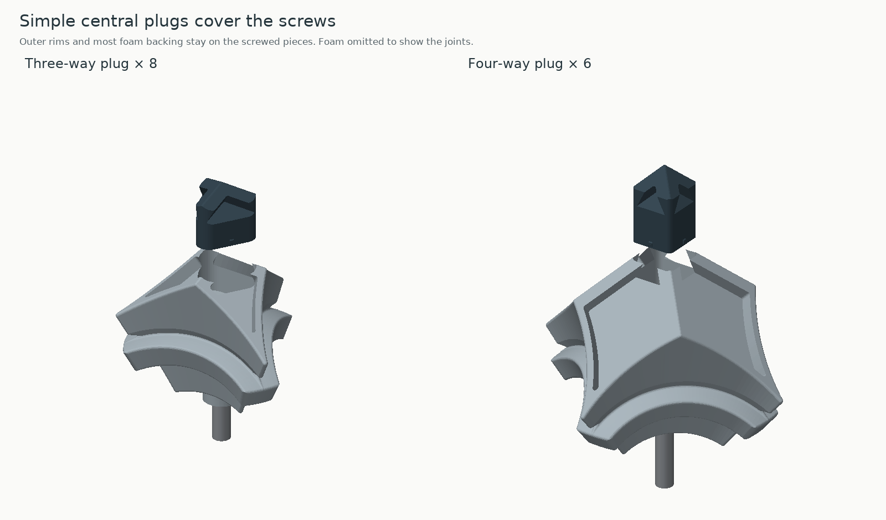
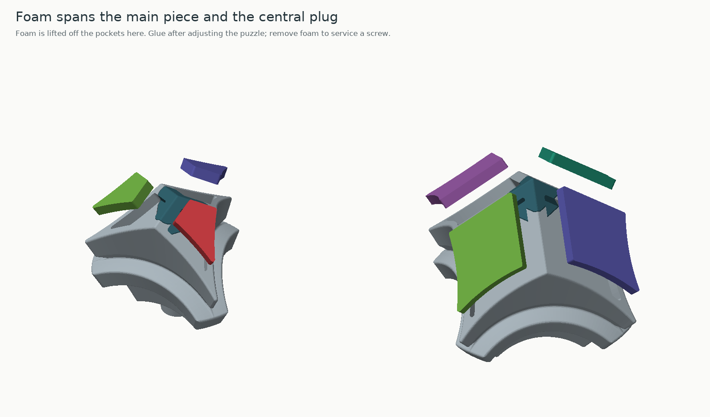
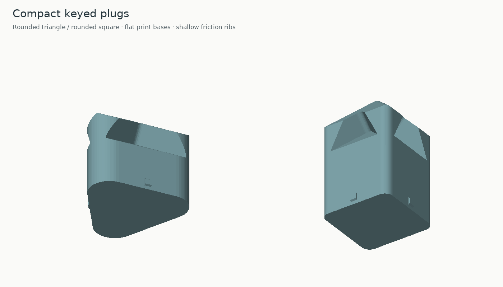
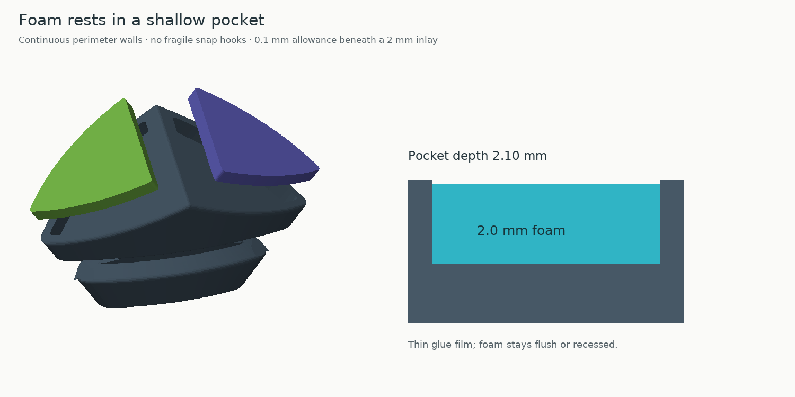
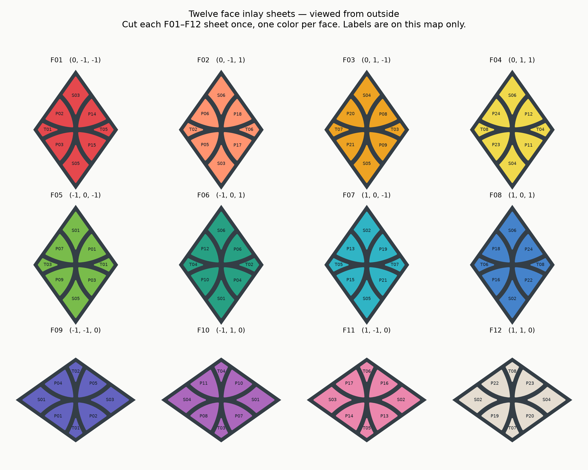
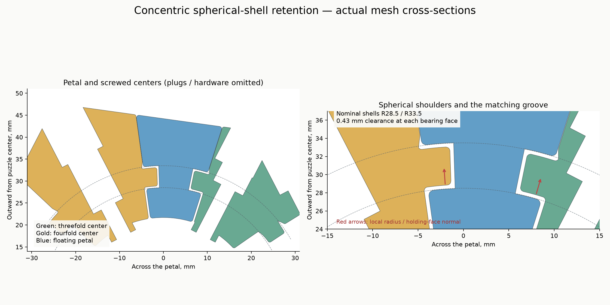

# Vertex-turning rhombic dodecahedron — spherical retention and 2 mm inlays

A fourteen-axis puzzle with **8 threefold centers, 6 fourfold centers and 24 floating petals**. Threefold vertices turn 120°; fourfold vertices turn 90°. Each turning axis has a projecting vertex to grasp. Its twelve rhombic faces carry **96 flat 2 mm inlays**, either cut from foam or printed in plastic.

**76 mm between opposite faces, 107.48 mm between the longest opposing vertices, and 93.08 mm between opposite threefold vertices.** Print at 100% scale: the hardware, clearances and foam thickness are fixed dimensions.

Each screwed center keeps its **complete outer rim, most of the foam-pocket floors and the divider walls away from the screw**. A small central plug closes the screw well and completes the inner three- or four-way divider pattern. Its rounded triangular or square section locates it at the appropriate 120° or 90° orientations.

The **foam spans the joint between the main piece and the plug**. Fit and adjust the puzzle first, then glue the foam over both as desired. To service a screw later, remove the affected center's foam, pull the plug, and replace the foam after adjustment. The cutting sheets are provided for that purpose; the design does not depend on preserving the foam during disassembly.

Threefold-center inlay panels are approximately **54.49 mm² each**, and fourfold-center panels **194.49 mm² each**. Use the complete set of screwed bases, petals, plugs and cutting sheets together. The retaining interfaces and foam recesses match this set; do not mix surface pieces from the stepped-retention or 3 mm-foam sets. Only the central screw region is split; the outer rim has no cap joint or pry notches.

The **face-turning cuboctahedron v1 core is directly reusable**, with its nuts left in place. The supplied core has the identical SHA-256 `2424250181e27338f25ef90b7bbe66e7d5ba9beca6b5c5e347a9555a172ab8cc`. This means the fourteen-axis face-turning puzzle's core. The twelve-axis curvy-copter core does not fit. All surface parts and cutting sheets in this package match the 76 mm exterior and should be used together.

**Printed and built very well, and turns smoothly**, as reported by the owner. The nominal-size rigid inlays fit nicely snugly. See [physical feedback](physical-feedback.json) and the [validation summary](VALIDATION.md) for the supplied geometry, exact inlay fit evidence and scope of the CAD checks.

## Print list

| File in `stl/puzzle/` | Copies | Role |
|---|---:|---|
| `threefold-center-print-8.stl` | 8 | T01–T08 screwed bases |
| `threefold-plug-print-8.stl` | 8 | Central threefold plugs for T01–T08 |
| `fourfold-center-print-6.stl` | 6 | S01–S06 screwed bases |
| `fourfold-plug-print-6.stl` | 6 | Central fourfold plugs for S01–S06 |
| `petal-print-24.stl` | 24 | P01–P24 floating petals |
| `core.stl` | 1, or reuse | Fourteen captive nuts |

There are **53 printed puzzle parts including the core**, forming 38 moving units. Every copy within a family is identical. The three geometry-only 3MF plates in `plates/` contain the required quantities, with SVG placement maps. The center/core plate includes a core: delete it in the slicer if reusing yours. Use either the plates or the STL quantities, not both. Files under `reference/` show the assembled puzzle and are not print plates.

Additional files:

- `stl/fit-coupons/cap-key-fit-tests.3mf`: two socket/peg pairs; also supplied as four separate STLs.
- `stl/fit-coupons/foam-pocket-test.stl`: tests actual foam thickness and cutting fit.
- `stl/fit-coupons/nut-fit-5.25.stl`: useful if printing a new core.
- `stl/optional/assembly-stand.stl`: optional temporary assembly tool.

Suggested P1S / PLA / 0.4 mm nozzle settings: 0.16 mm layers, five walls, five top/bottom layers, and 25–30% infill for the moving parts. Use six walls and 40% infill for a new core. For the main pieces and petals, start with automatic tree supports on the build plate only and a 5–6 mm brim. Inspect support under the retaining shoulders. The compact plugs stand on flat key bottoms and can be printed without supports; use five top/bottom layers and inspect the small friction ribs in the slicer. The key fit samples also print without support.

The STL orientations put the inward radial direction down and the foam pockets upward. Avoid shaving the small key ribs during cleanup. Remove any elephant's foot at a key's entry. Plate spacing allows the suggested brims; the 3MF files contain geometry rather than printer/material presets. Layer-connectivity checks pass at both 0.16 and 0.20 mm layers; these are geometric extrusion-width checks, not actual Bambu toolpaths.

## Plug fit and removal

The whole plug is a rounded triangular or rounded square key; there is no large removable foam carrier. It has a flat bottom, a pocketed top matching the exterior, and small tapered ribs on its sides for light friction. The main piece retains the surrounding divider walls and pocket floors.

| Feature | Dimension |
|---|---:|
| Female key across flats | 8.00 mm |
| Socket corner rounding, triangular / square | R2.25 / R1.00 mm |
| Rigid male-key clearance | 0.12 mm per side |
| Small tapered friction ribs | 0.04 mm beyond the socket flat |
| Threefold plug clearance above seated screw head | 1.10 mm |
| Fourfold plug clearance above seated screw head | 9.20 mm |

The ribs provide localized friction while the rest of the key has clearance. Print the key samples at the final layer height. Push the ribbed end of each tall peg into its matching shallow socket. It should seat with modest hand pressure, stay in when inverted and remain removable. If tight, scrape only the ribs lightly. If loose, adjust the rib fit rather than scaling the entire part. A full pair is the final fit test.

Test the plugs before fitting any foam. Press them down until their outer surfaces and divider walls align with the main piece. To remove a plug, first remove that center's foam, then grip the central divider with fingers or protected pliers, or lift gently at the exposed plug joint. Pull along the screw axis; the key prevents free twisting. Do not glue the key into its socket. Gluing the foam across the top joint is intentional and acceptable.

## Hardware

- 14 × DIN912 M3×20 socket-head screws.
- 14 × M3 washers, **7 mm outside diameter × 0.5 mm thick**.
- 14 × DIN985 M3 nylon locknuts.
- A 2.5 mm hex key; a blunt metal rod for seating nuts in a new core.

No extra screws, magnets or fasteners are required for the plugs. The wells are Ø7.6 mm and the rotating screw bores Ø3.6 mm. Washer seats lie 32.0 mm along T axes and 27.3 mm along S axes. The plug sockets pass the washers and driver when the plugs are removed.

The nut pocket has a **5.25 mm terminal across-flats size**, a 5.85 mm entrance, a 3 mm tapered transition and a 3 mm tight run to the seated nut. Pocket height is 4.25 mm, with a 1.95 mm roof. Press each nut firmly home with its metal entry face outward and nylon ring inward. Confirm resistance to the nylon ring's installation torque before building around the core.

## Assembly

1. Seat and torque-check the nuts if using a new core. Leave the plugs and foam off.
2. Assemble a **loose, interlocked shell** around the core, keeping all fourteen centers unscrewed. Add petals between their T and S neighbors, engaging their inner feet beneath the spherical flanges. Use `NEIGHBORS.md` and temporary masking tape to support the loose pieces. Keep the whole shell somewhat expanded while adding parts; do not fasten one side tightly first.
3. If using the optional stand to support the core initially, remove it **while the shell is still loose**, then add S01. It is not intended to reserve a final straight-in slot after tightening the rest.
4. Gradually close the shell, easing neighboring centers and petals inward together. Fit washers and start screws once the pieces are seated. Tighten all fourteen progressively and evenly. The full shoulders mean a final center cannot simply be pushed straight into already fixed petals.
5. Adjust until the petals are supported without binding. M3 coarse pitch is 0.5 mm per revolution; one fifth of a turn changes head position by 0.10 mm. Judge tension by movement, separately from the nut's nylon-ring resistance.
6. Test all turns with the plugs seated and without glued foam. Remove plugs for any further screw adjustment.
7. Once satisfied, fit and glue the foam one numbered face at a time. Center foam may be glued over both the main piece and its plug. Petal foam is glued to its petal. Keep glue out of moving seams and allow it to cure before turning.

The CAD assembly check constructs a loose state with centers 12 mm outward and petals 11.4 mm outward from their seated positions. Each part has a clear radial entry into that state. A coordinated contraction, with petals moving 0.95 mm per 1 mm of center travel, then reaches the seated shell without collision. These are coordinates of a verified construction, not distances you need to measure by hand. Several pieces must remain movable together; this is not a last-piece snap-fit. The owner has also successfully assembled the complete physical puzzle; the CAD path is one construction, not a measurement of the exact hand assembly sequence used.

## Foam and cutting files

There are **96 inlays: eight per rhombic face**. Each assembled T center has three, each S center four, and each petal two. Recesses are **2.10 mm deep for 2.00 mm foam**. Without glue the foam lies 0.10 mm below the plastic; a thin glue film can bring it flush. Do not allow foam or adhesive to protrude into the moving seams.

Continuous pocket walls grip the foam by slight compression; there is no overhanging snap hook. The nominal outer border is 1.0 mm, widened where needed. Adjacent-face recesses leave at least **1.6 mm of plastic between their full-depth voids**. The generated pockets preserve a 1.2 mm underlying floor envelope and 0.775 mm lateral web before the central plug is separated. The assembled pocket floor is checked to remain supported everywhere except the narrow plug-fit joint. Foam bridges that joint.

The Cameo files contain **closed outline cuts only**, without text, borders, registration marks or duplicate outlines. Each F01–F12 file contains the eight inlays for one face. Cut each face once, one color per face; with fewer colors, add markings to distinguish the faces. No mirroring is needed with the foam's colored side upward.

Use the **DXF** files for Silhouette Studio Basic. SVG import requires Designer Edition or above. Genuine DWG is supplied as the requested CAD format, but Silhouette's listed import formats do not include DWG. See the official [file-format guide](https://silhouetteamerica.freshdesk.com/support/solutions/articles/35000282776-file-types-and-features) and [DXF guidance](https://silhouetteamerica.freshdesk.com/support/solutions/articles/35000276938-importing-and-exporting-troubleshooting).

DXFs are R13 ASCII with closed 2D POLYLINEs. SVGs have explicit millimetre dimensions. DWGs are AutoCAD 2000 / AC1015, encoded with ODA and independently read back with LibreDWG; each resulting contour is compared with its source. Curve simplification tolerance is 0.008 mm.

### Select the foam fit before cutting the full set

1. Import `inlays/fit-test/calibration-20mm.dxf`. Verify a **20.00 × 20.00 mm** selection and measure the cut sample. DXF import settings can affect scale.
2. Print the pocket sample and cut `inlays/fit-test/foam-size-options.dxf` in the actual foam. Left to right: easy, standard, firm. Choose the smallest that stays flat and grips as desired.
3. Use **one complete cutting set** below. Select blade/pass settings for your Cameo model and actual foam; no untested machine preset is supplied.

| Set | Folder | Offset from pocket outline |
|---|---|---|
| Easy | `inlays/fit-variants/easy/` | −0.04 mm per side |
| Standard | `inlays/faces/` | +0.04 mm per side |
| Firm | `inlays/fit-variants/firm/` | +0.12 mm per side |

These are contour offsets, not uniform scale factors. All variants match the same printed pockets. Check the selected outlines rather than the 82 mm SVG page. Exact selection bounds for each face and fit variant are in `reports/cutting-files.json`; use the supplied 20 mm calibration square to confirm import scale.

The map is viewed from outside in the same orientation as each cutting sheet. Keep a face's eight cut pieces together. The T and S labels identify the assembled screwed centers; P labels identify petals. Use only the cutting sheets supplied with these 76 mm parts.

## 3D-printed inlays

You can mix **2 mm printed plastic inlays** with foam on any faces. The existing puzzle parts and 2.1 mm pockets accommodate both. Use `inlays/printable/faces/F01.3mf` through `F12.3mf`, or their matching STLs, to print the eight separate inserts for a selected color/face. Individual replacements are under `inlays/printable/individual/Fxx/`. Print each selected face once, using either its STL or its 3MF.

The rigid inserts **exactly match the pocket contours**, with **zero designed clearance**. Use **0.00 mm XY contour compensation**: do not apply an additional +0.15 mm correction. Nominal-size inlays were reported to fit nicely snugly; a thin glue layer is optional. Keep their tops flush or slightly recessed. Print flat as supplied, visible side upward, at 100% scale; 0.20 mm layers, at least five top/bottom layers, no supports or brim. Print one face first to check physical fit. The face plate contains eight disconnected pieces, with no backing sheet joining moving puzzle parts.

See `inlays/printable/README.md` and its placement map. On screwed centers these inserts still bridge the base/plug joint; finish adjustment before gluing and expect to remove the affected inlays for screw access. The original SVG/DXF/DWG files remain the foam cutting options.

## Mechanism and validation

The core anchors the fourteen adjustable centers. The floating petals have inner feet captured below **concentric spherical-shell flanges** on both center families. The nominal shell radii are 28.5 and 33.5 mm, centered at the puzzle origin. Their broad holding faces have normals along the local radius; the small edge transitions are rounded. The center flanges are approximately 4.20 mm thick radially and run in 5.06 mm radial grooves, leaving **0.43 mm at each spherical bearing face**. The inner feet are checked against the screwed centers alone, without crediting contact with neighboring floating bodies. Threefold centers have continuous screw stems; petal tracks clear the stems' full sweep. Exterior cone half-angles are 35.264389683° at the threefold axes and 45° at the fourfold axes.

| Feature | Dimension |
|---|---:|
| Main conical-face gap, total | 0.06 mm |
| Additional track-cutter expansion | 0.37 mm |
| Spherical shoulder / outer return radii, nominal | R28.5 / R33.5 mm |
| Spherical bearing gap, per face / total groove slack | 0.43 / 0.86 mm |
| Hidden neck half-angle, threefold / fourfold | 29.2644° / 39° |
| Center flange-end outline rounding, radial sweep | R1.2 mm |
| Petal radial-ridge rounding, through the tracks | R2 mm |
| Other edge rounding, petal / center | R0.55 / R0.45 mm |
| Core sphere / moving inner cavity | R21.2 / R21.7 mm |
| Core bearing pad / center foot plane | 19.6 / 19.7 mm along axis |
| Foot / rotating bore diameter | 6.2 / 3.6 mm |

Validation reloads the delivered STLs and checks connected watertight parts, washer-root and bore walls, ordinary turns about all fourteen axes at 3° intervals with hardware present, destination fit, sampled petal retention and rocking, inner-foot capture by centers alone with 0.15 mm center lift, coordinated assembly, nut insertion, stand removal, and layer connectivity at 0.16 and 0.20 mm layers. Spherical bearing faces are measured on the exported meshes. Installed foam is checked at flush height during turns and assembly. Plug checks cover extraction after foam removal, screw clearance, shared foam backing, correct key symmetry, unintended rotation and bounded intentional rib interference.

These finite rigid-geometry checks do not establish real press-fit force, fatigue, support quality, foam grip or every possible elastic escape path. Inspect slicer previews and test a pair before committing to all copies. Source and generated design are MIT licensed. `source/BUILD.md` explains regeneration; `reference/design-parameters.json` records dimensions and key profiles; `manifest.json` records quantities, transforms and STL hashes.
