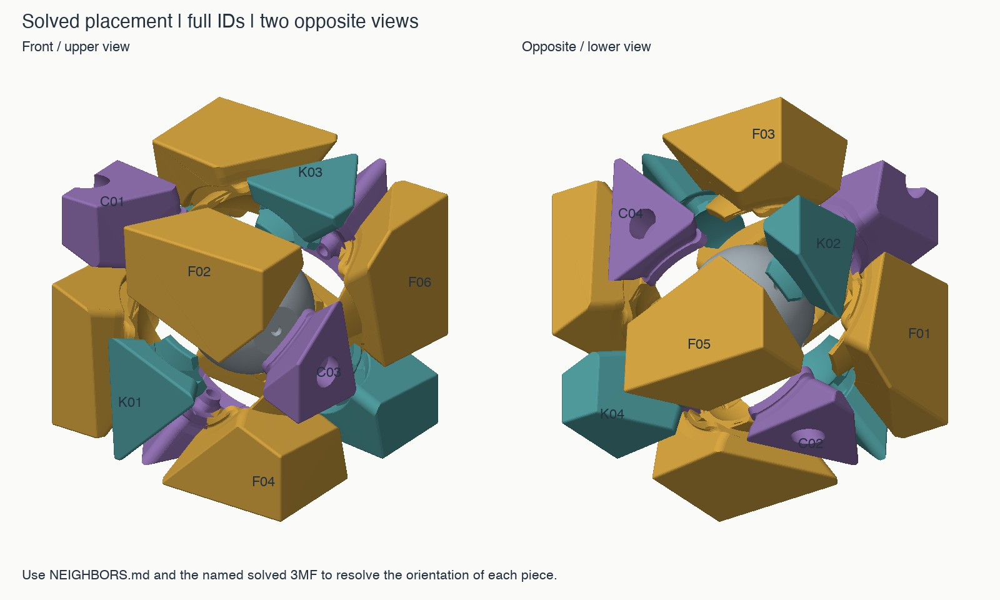

# Solved neighbors — Wonky Skewb v1.1

Mark each full ID on the inside, away from running surfaces. Tick after printing and marking. These are exterior seam neighbors, excluding point contacts; order is not clockwise. Use this Skewb list, not the Redi or 65° list.

| Marked | Piece | Family | Solved seam neighbors |
|---|---|---|---|
| ☐ | C01 | Screwed corner | F01, F02, F03 |
| ☐ | C02 | Screwed corner | F01, F04, F05 |
| ☐ | C03 | Screwed corner | F02, F04, F06 |
| ☐ | C04 | Screwed corner | F03, F05, F06 |
| ☐ | F01 | Face piece | C01, C02, K01, K02 |
| ☐ | F02 | Face piece | C01, C03, K01, K03 |
| ☐ | F03 | Face piece | C01, C04, K02, K03 |
| ☐ | F04 | Face piece | C02, C03, K01, K04 |
| ☐ | F05 | Face piece | C02, C04, K02, K04 |
| ☐ | F06 | Face piece | C03, C04, K03, K04 |
| ☐ | K01 | Floating corner | F01, F02, F04 |
| ☐ | K02 | Floating corner | F01, F03, F05 |
| ☐ | K03 | Floating corner | F02, F03, F06 |
| ☐ | K04 | Floating corner | F04, F05, F06 |

Assembly order: **K → F → C**. Every F is held by its two C neighbors; every K by its three F neighbors. The four C pieces screw to the core.

## Which pieces move in each turn?

A positive 120° turn uses the right-hand rule around the named C axis, pointing outward from the core. Each row lists the seven carried pieces.

| Axis | Pieces carried from the solved state |
|---|---|
| C01 | C01, F01, F02, F03, K01, K02, K03 |
| C02 | C02, F01, F04, F05, K01, K02, K04 |
| C03 | C03, F02, F04, F06, K01, K03, K04 |
| C04 | C04, F03, F05, F06, K02, K03, K04 |
