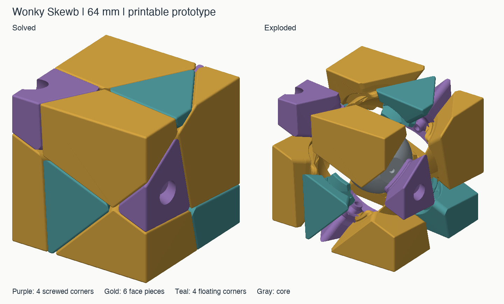
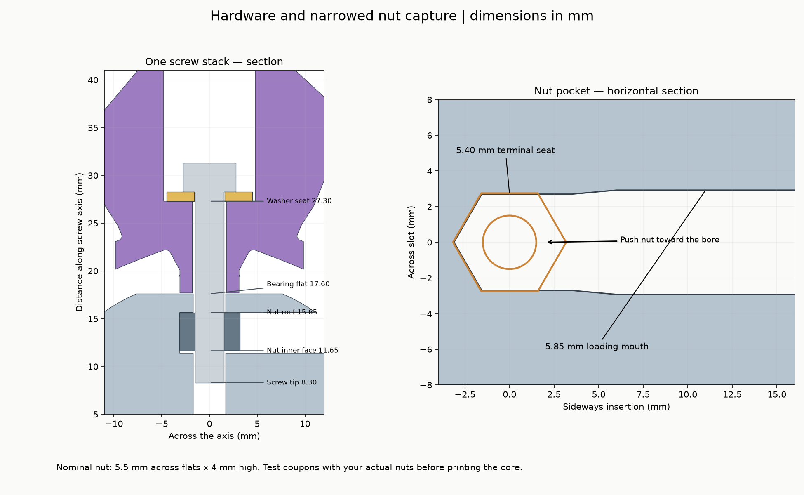

# Wonky Skewb — 64 mm v1.1

A Skewb shape mod adapted from the successful compact Wonky Redi v4.3: the same
64 mm outer cube, exterior rotation, M3 hardware stack, close main faces, generous
internal track allowance and rounded radial ridges.

**Owner-tested v1.1:** on 2026-09-18 the owner reported that the trimmed Skewb printed very well and turns very nicely. The STL hashes match the delivered revision associated with that report. See [physical-feedback.json](physical-feedback.json) for the
report, its scope and the supplied file hashes. This is qualitative owner feedback;
holding force, turn torque and long-term wear were not measured.

There are **14 shell pieces and one core**: four screwed corners C01–C04, six
floating face pieces F01–F06 and four floating corners K01–K04. The core has four
axes in a tetrahedral arrangement. A 120° turn carries one screwed corner, three
F pieces and three K pieces. The other three screwed corners remain on the core.
The outside cuts are central planes, so their intersections with the cube are
straight. Only the hidden retaining regions depart from those planes.

## v1.1: floating-corner flange tips removed

K01–K04 have the three thin, perforated flange corners explicitly trimmed away.
The broad retaining lobes remain. The v1 slicer issue arose because the nominally
connected tips had webs too thin to form extrusion paths. This revision removes
them from the CAD, instead of relying on slicer repair or adding supports to waste
material on isolated fragments.

Only the four K parts need replacing. All other STL files match v1 byte for byte.
The outside shape, part IDs, assembly order, hardware and main running clearances
are retained. See [TIP-REVISION.md](TIP-REVISION.md) for the change and its checks.

## What is retained from your last print

| Feature | Skewb v1.1 |
|---|---|
| Nominal cube side | 64 mm |
| Exterior rotation | Same orientation as the compact Redi; not reoptimized |
| Main planar-face gap | 0.03 mm total |
| Extra internal track allowance | 0.40 mm on the receiving side of the rotational profile |
| Radial dihedral rounding | Nominal R3 transverse circles, continuing through the tracks |
| Other inner lead-ins | 0.60 mm on the positive cut profile; 0.45 mm on its receiver |
| Exterior edge softening | 0.80 mm |
| Spherical core radius | 19.20 mm; bearing flats at 17.60 mm |
| Rotating screw bore | Ø3.6 mm |
| Washer/access well | Ø9.6 mm |
| Washer seat | 27.30 mm from the center along each screw axis |
| Corner bearing foot | Flat annulus, Ø6.2 mm outside, starting at radius 17.70 mm |

The retaining geometry is new for the Skewb. F pieces hook under the screwed
corners; K pieces hook under the F pieces. The side-loading reliefs allow assembly
in that same order reversed: **K → F → C**. All retaining feet are integral with
the shell pieces. There are no glued caps or separate hidden plastic carriers.

## Hardware and improved nut pockets

Use **four each** of your DIN912 M3 × 20 screws, M3 washers of **9 mm OD × 1 mm**,
and DIN985 M3 locknuts. A bare 2.5 mm hex key reaches the screw heads. Your 20 mm
screws fit: their tips reach radius 8.30 mm, 3.35 mm beyond the nut's nominal inner
face, and the four screws clear one another.

The core implements the requested narrowed nut seat. The loading mouth stays
**5.85 mm wide**, with a taper to a **5.40 mm final seat across flats** around the
bore. A nominal 5.5 mm nut therefore has 0.10 mm total interference at the seat.
A blunt Ø3 mm rod has a checked sideways pressing path. The slot roof captures
the nut axially; the close parallel flats and back of the hex seat resist rotation.

Check the press fit with your actual nuts and print. Three
fit coupons and matching 5.30 / 5.40 / 5.50 mm core seats are included. The default
`core.stl` is 5.40 mm. **Drive a screw through the nylon ring in the coupon:** an
insertion fit alone does not establish resistance to installation torque. Test
all four seats in the actual core before assembling the puzzle.

## Files and first print

1. Print the nut-fit coupons and rotor from `plates/fit-coupons-01.3mf`.
2. Choose one core matching the tightest coupon that seats without cracking and
   holds the nut under screw torque. Print C01–C04, F01–F06 and K01–K04 once each.
3. Follow [ASSEMBLY.md](ASSEMBLY.md), marking IDs using [NEIGHBORS.md](NEIGHBORS.md).

The STLs in `stl/puzzle` have F/K pieces pointing inward toward the print bed,
following your successful Redi orientation. Skewb tips are much smaller, so they
need support and careful bed adhesion in this orientation. **Face-down 3MF
alternatives** are supplied in `print-options` and the two `*-face-down` plates;
these have a broad exterior face on the bed and use exactly the same geometry.
Choose one orientation per piece, not both. The face-down files are a useful
starting option for a first Skewb build, especially K01–K04. The owner did not
restate the chosen orientation or detailed slicer settings in the success report.

All 3MFs are geometry only, without printer settings. Print at 100% scale; inspect
support placement in the slicer. The named reference `DO-NOT-PRINT-solved.3mf`
shows the solved assembly; it is not a print-in-place model. Plate maps and
identification images are included.

The optional assembly stand uses one of the four screws temporarily. The parts
are not interchangeable with the Redi or the 65° prototype, despite the shared
size and hardware. The Redi source and release are unchanged.

Read [DESIGN.md](DESIGN.md) for the mechanism, [VALIDATION.md](VALIDATION.md) for
checks and limits, and [source/README.md](source/README.md) to regenerate it.
MIT license covers the models, documentation and code; see [LICENSE](LICENSE).
