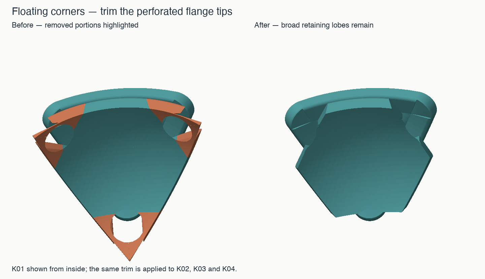

# v1.1 — replace only the four floating corners

The three perforated flange tips on each K piece are explicitly removed. Their
very thin webs could disappear during slicing while leaving isolated little tip
fragments that attracted support. A watertight CAD mesh did not prevent that.

## Files to replace

Print **K01, K02, K03 and K04** from this revision. Their IDs and solved positions
are unchanged. The core, C01–C04, F01–F06 and hardware are unchanged; all other STL
files are byte-for-byte identical to v1. Keep those existing pieces.

Both inward-down STLs and face-down 3MF alternatives are supplied, with updated
K print plates. Choose one orientation per piece. Retain support for normal
overhangs; removing these fragments does not make the whole piece support-free.

## What remains to hold the corners

The broad retaining lobes between the trimmed corners still engage all three F
neighbors. The sampled outward pull first meets them at the same 0.50 mm travel
as before. All tested tilted pulls and rocking paths remain blocked, including
the tests with the screwed corners lifted by 0.10 and 0.25 mm. The first-contact
distances for those tests match v1. The tips are therefore not required for
capture in these checks. This does not establish a physical breaking load.

The trim is subtraction only, at three chord planes 9.5 mm from the K axis and
confined below an axial coordinate of 22 mm. The actual removed material is
within radius 22.262 mm of the puzzle center. It removes approximately
143.765 mm³ per corner, leaving the exterior shape and mating-part geometry intact.
All four replacement meshes are closed and each is one connected solid.

## Printability check

A fixed-linewidth layer test reproduces six isolated fragments around the three
old tips at 0.16 mm layers / 0.42 mm width. The replacements have **one connected
printable layer graph in all 40 tested cases**, covering both orientations of all
four corners and layer/width pairs 0.12/0.42, 0.16/0.40, 0.16/0.42, 0.16/0.48 and
0.20/0.42 mm. Separate regions within one layer are allowed where they join the
main body higher up; those are normal overhangs, unlike isolated scraps.

These are geometric checks, not Bambu toolpaths. The installed Bambu Studio CLI
failed while loading its stock configuration, so no successful Bambu slicing
test is claimed. See [VALIDATION.md](VALIDATION.md) and `reports/tip-revision.json`.

## Physical result

On 2026-09-18 the owner reported that the Skewb with these trimmed tips printed
very well and turns very nicely. This supports the practical correction alongside
the geometry checks; it does not measure strength or long-term wear. The exact
settings and selected print orientation were not restated. See
[physical-feedback.json](physical-feedback.json) for the report and export hashes.

Source: `source/corner_tip_trim.py`. The trim happens after the original assembly
reliefs, preserving compatibility with the previous F and C pieces.
