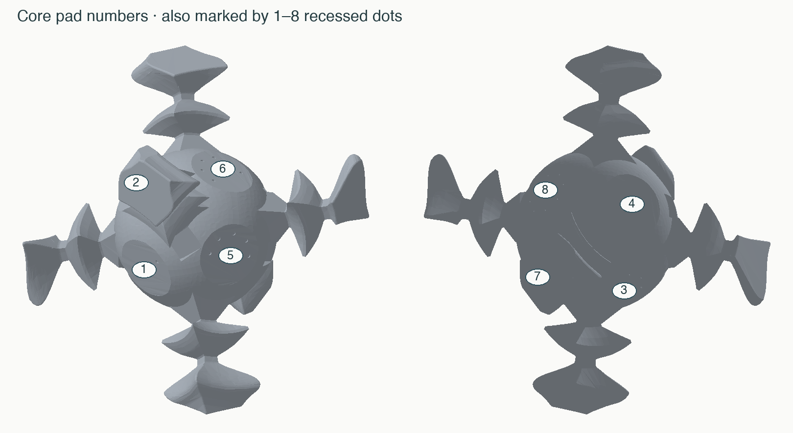
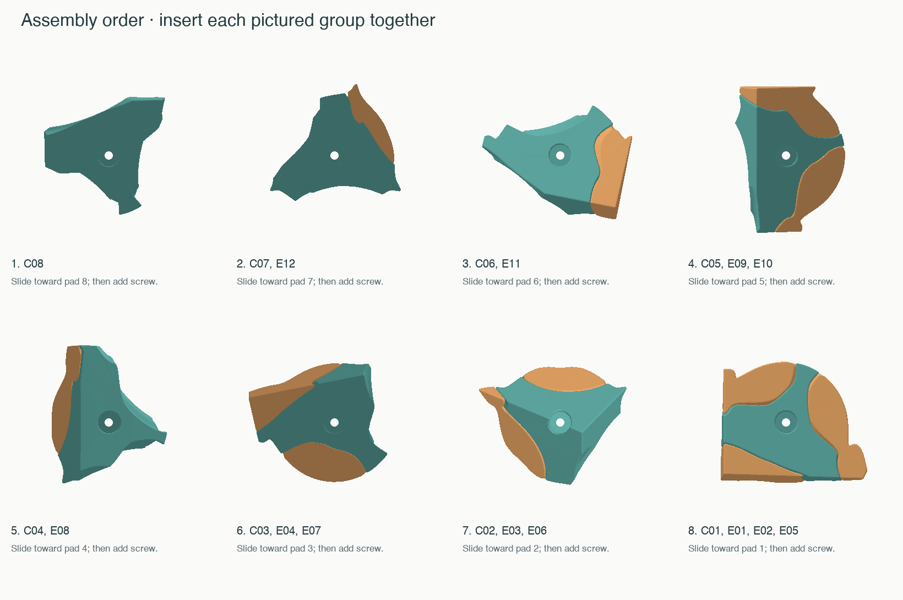
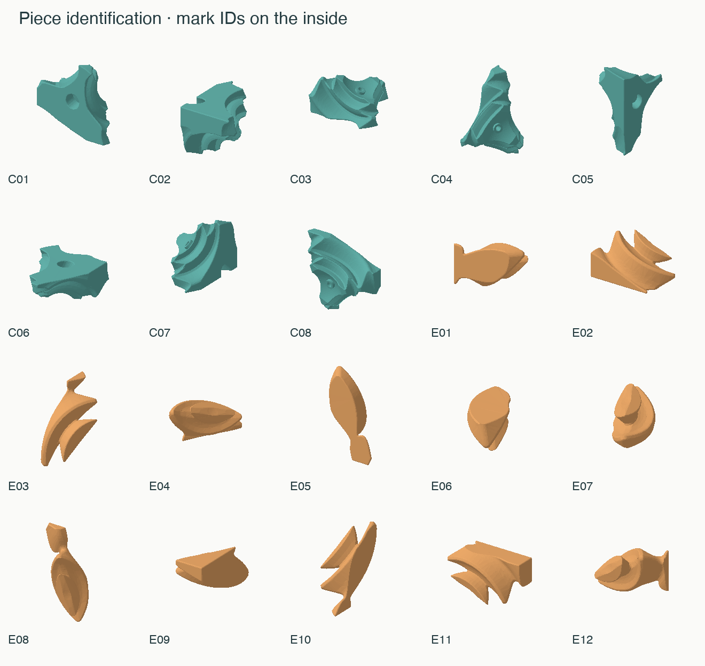

# Assembly and piece map

Press all eight nuts into the bare core first, nylon ends inward. The
recessed dot count on each flat screw pad gives its C number: one dot is
C01, eight dots is C08. Count before the pieces cover the marks. Test the
screws in the nuts, then remove them for loading the printed pieces.

## Insert these groups in this order

| Step | Group to hold together | Screw into core pad |
|---|---|---|
| 1 | C08 | 8 dots (C08) |
| 2 | C07, E12 | 7 dots (C07) |
| 3 | C06, E11 | 6 dots (C06) |
| 4 | C05, E09, E10 | 5 dots (C05) |
| 5 | C04, E08 | 4 dots (C04) |
| 6 | C03, E04, E07 | 3 dots (C03) |
| 7 | C02, E03, E06 | 2 dots (C02) |
| 8 | C01, E01, E02, E05 | 1 dots (C01) |

For each step, hold the listed petals in their solved positions against the
listed axial piece. Slide **the entire group together** inward along that
piece's screw axis; then install its washer and screw. Use the solved
reference model and piece map to identify each petal's orientation. A little
low-tack tape across matching exterior faces can temporarily hold a group
together. Remove it after the screw is installed.

Keep each completed group in its solved position during the remaining steps.
Do not turn the puzzle before all eight groups are installed. The final
group has three petals and needs the most care. Do not insert those petals
separately and then force C01 between them: the outer wave blocks that path.

Tighten gently to remove play, then adjust each screw in small increments
until turns are comfortable. Do not torque the plastic hard against the
core. With a 0.5 mm thread pitch, one fifth turn changes the head position
by 0.10 mm. Nyloc nuts resist rotation of the screws during play, but the
nut seats must remain fully seated and must not spin.

Disassembly is the exact reverse order: first remove the C01 screw, then
withdraw C01, E01, E02 and E05 **as a group**. Continue up the table backward.

## Neighbors

Each E petal belongs between the two listed screwed pieces. Every C has
three E neighbors. IDs refer to solved locations, not colors.

| Petal | Neighboring axial pieces |
|---|---|
| E01 | C01, C02 |
| E02 | C01, C03 |
| E03 | C02, C04 |
| E04 | C03, C04 |
| E05 | C01, C05 |
| E06 | C02, C06 |
| E07 | C03, C07 |
| E08 | C04, C08 |
| E09 | C05, C06 |
| E10 | C05, C07 |
| E11 | C06, C08 |
| E12 | C07, C08 |

| Axial piece | Neighboring petals |
|---|---|
| C01 | E01, E02, E05 |
| C02 | E01, E03, E06 |
| C03 | E02, E04, E07 |
| C04 | E03, E04, E08 |
| C05 | E05, E09, E10 |
| C06 | E06, E09, E11 |
| C07 | E07, E10, E12 |
| C08 | E08, E11, E12 |

