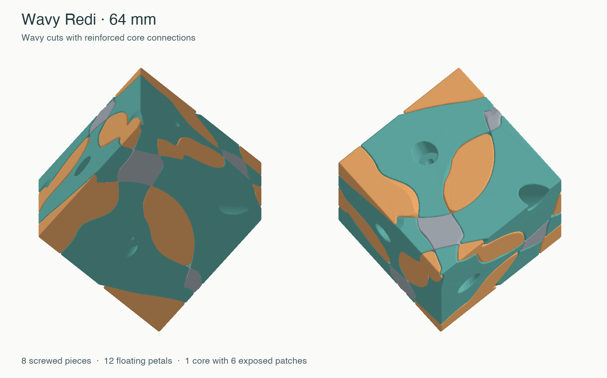
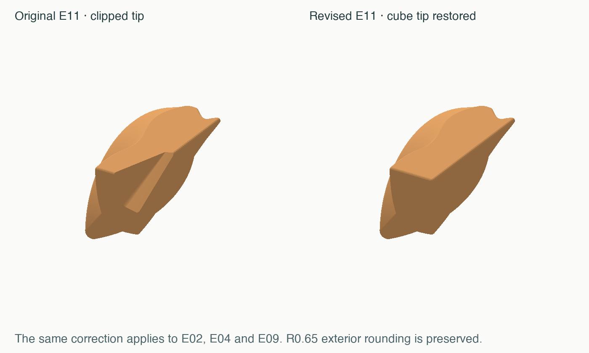
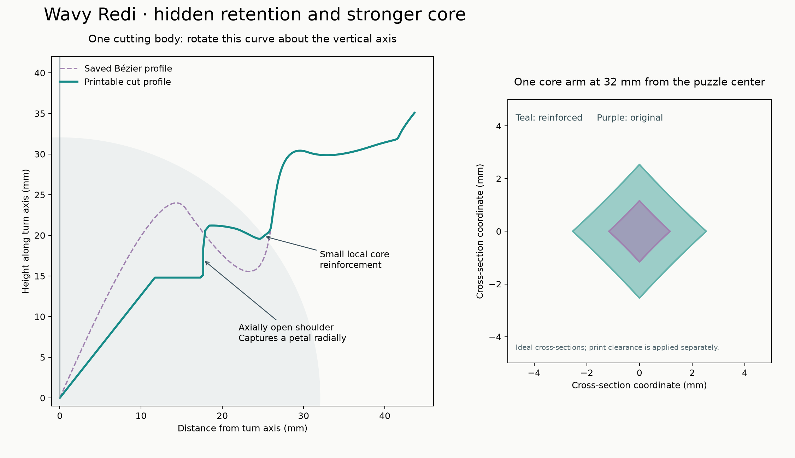
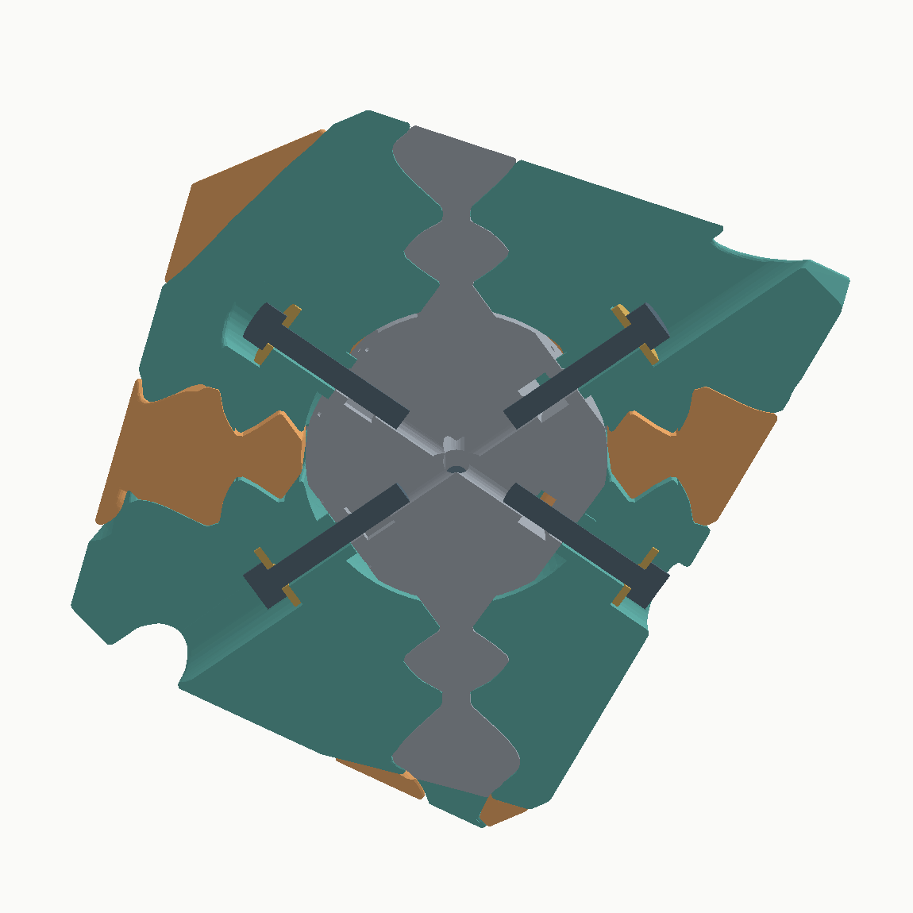

# Wavy Redi · 64 mm · v1.1

A Redi-equivalent shape puzzle with eight screwed axial pieces, twelve
floating petals and one stationary core. Six patches of the core appear on
the outside. Each move turns one axial piece and its three neighboring
petals through 120 degrees. There are 21 printed puzzle parts.

This is the printable interpretation of selection **wavy-90d18b40**.
The exact original selection is retained in `source/selection.json`.
The internal fold is replaced by an axially open retaining profile. The
user-approved strengthening widens the six core connections; a fine
surface-grid comparison found a maximum nearby seam shift of 0.92 mm.
The selected wave resumes unchanged outside that small region, apart from
manufacturing gaps and edge rounding. The solved cube remains 64 mm.

**Read [ASSEMBLY.md](ASSEMBLY.md) before printing.** These pieces assemble
in groups; the ordinary Redi's “all petals, then all screwed pieces” order
does not work with this exterior wave.

## Printed result and small refinements

The owner reports that **v1 built very well and turns great**. Its nut seats
were just slightly too tight, and four outside petal tips were unintentionally
clipped. The [physical feedback record](physical-feedback.json) identifies
the supplied v1 files; exact slicer settings for that print were not recorded.

This v1.1 revision widens only the nut seat from **5.20 to 5.25 mm across
flats** and restores the cube-corner tips of **E02, E04, E09 and E11**. The
entrance remains 5.85 mm, and the functional tracks, clearances and R2
rounding are unchanged. The restored tips retain gentle R0.65 exterior
rounding. Only the **core and those four petals** need replacing; the other
sixteen moving-piece STLs are preserved byte for byte in the published
release. Regenerated meshes may differ. The refinements pass the included
CAD checks but have not yet been physically printed.

## Files

- `stl/puzzle/`: print each of the 21 files once. Orientations are already set.
- `plates/core-and-axles-01.3mf`: core and eight axial pieces, if packed on one plate.
- `plates/petals-01.3mf`: twelve petals. See `plate-maps.html` for the actual plate inventory.
- `stl/fit-coupons/nut-fit-5.25.stl`: optional check of the slightly relaxed nut fit.
- `reference/DO-NOT-PRINT-assembled-cube.3mf`: assembled reference in cube coordinates.
- `source/`: parameterized CAD, exporter, render and validation scripts.
- `reports/`: checks on the exported/reloaded STLs; read `VALIDATION.md`.

The 3MF plates contain geometry and placement, not a configured printer job.
They do not select a printer, material or support profile.

## Hardware

Eight each of DIN912 M3 × 20 screws, 9 mm OD × 1 mm washers and DIN985 M3
nyloc nuts. The Ø9.6 mm access wells accommodate the washer and socket head;
use a 2.5 mm hex driver. The rotating bores are Ø3.6 mm. Screw tips extend
3.35 mm beyond the nominal nuts in the modeled stack. No glue, magnets,
additional hidden pieces or core joining screw are needed.

Nut channels start at 5.85 mm across and taper into a 5.25 mm terminal seat.
A nominal 5.5 mm nut deliberately has 0.125 mm interference per side in the
final seat. The 0.05 mm total increase responds to the slightly tight fit
of v1; print the coupon first when changing hardware or print settings.
Insert the nylon end toward the middle of the core. Support the central
hub while pressing; do not use an exposed core arm as a lever.

## Printing on a P1S, PLA, 0.4 mm nozzle

Start with 0.16 mm layers, 4 walls, 5 top/bottom layers and 25% gyroid for
the moving pieces. Use 6 walls and 40% gyroid for the core. The narrow roots
then fill with perimeters. Use automatic tree supports, build plate only,
and inspect the preview around the inner shoulders and overhanging lobes.
The pentagonal-prism build used a 30° support threshold and 0.20 mm top
contact gap; these are a starting point, not settings confirmed for the
wavy print or a sliced preset in this package.

Petals are oriented with their inward direction pointing down, as requested
for the earlier puzzles. A 0.24 mm trim of each hidden inner tip creates a
small bed flat without changing the exterior. The axial pieces and core sit on their largest
available exterior flat. Keep those orientations. Add a brim where the
initial petal footprint is small. Remove supports carefully from the tracks
and core branches. The fixed arms are substantially stronger than the
literal selected geometry, and the original wavy print assembled and turned well.

Mark **C01–C08** and **E01–E12** inside the pieces before mixing them up.
The recessed dot count on each core bearing pad identifies its C number.

## Mechanism choices

- An unbroken central hub carries all eight screw bearings. Six integral
  arms connect its exposed patches; they are not separate floating centers.
- Each petal is captured by two neighboring axial pieces. The shoulders
  open along an axis, permitting group insertion, but oppose an individual
  petal's outward motion. Rounded lead-ins ease realignment.
- Main-body separation is 0.08 mm total. Inner tracks receive an additional
  0.40 mm cutter expansion. Track relief is generated from the unrounded
  profile; rounding the printed foot does not narrow the channel.
- R2 mm circular rounding follows the actual curved dihedral edges over
  their full length, including the inner track region. Inner foot/body
  lead-ins are approximately R0.5/R0.4; exposed moving-piece rims are R0.65.
- The washer bears on a flat annular seat at 27.3 mm. A separate flat foot
  sits 0.10 mm above the core pad in the nominal CAD position. Adjust screw
  tension gently after assembly; 72° of an M3 screw is 0.10 mm of travel.

The CAD checks establish the documented geometric behavior at the sampled
positions and the constructive loading sequence. They are not a strength,
wear or friction certification. Physical feedback supports the original
v1 mechanism; it does not yet validate the revised v1.1 fit.

