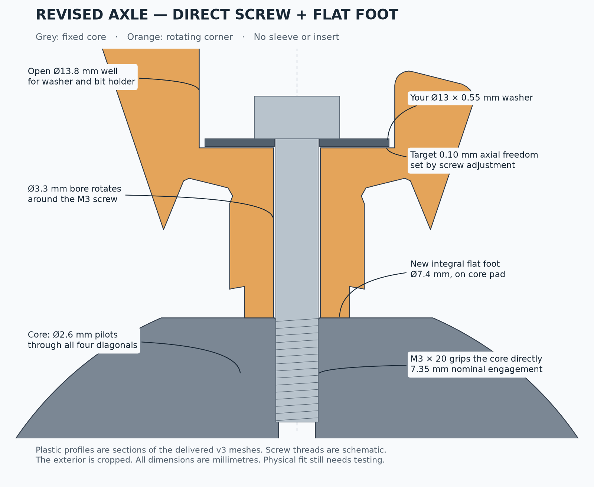

# Design reference — 80 mm v4.2.1

This is the preserved 80 mm design. See the [current design reference](design.md)
for the 64 mm v4.3 and the pending core improvement.

The exterior is an 80 mm cube rotated relative to a Redi-like corner-turning mechanism. Each 120° turn rotates one corner and cycles its three adjacent edges. Corners keep their axes; the twelve edges move between locations.

## Coordinates and exterior orientation

The mechanism center is the origin. Eight unit axes are `(±1, ±1, ±1) / sqrt(3)`, lexicographically ordered from C01 `(−,−,−)` to C08 `(+,+,+)`. An edge joins two axes whose dot product is `1/3`.

The exterior cube is transformed into mechanism coordinates using

`R = Rz(−13.232962300°) · Ry(26.192857308°) · Rx(32.391706195°)`.

These are rotations about fixed axes, applied X then Y then Z to column vectors. The full precision matrix is in [chosen_rotation.json](../cad/chosen_rotation.json), and each part's mechanism-to-print transform is in [design.json](../models/current/reference/design.json). STL coordinates are already oriented for printing; do not assemble those print-space coordinates directly. Use the assembled reference or the saved transforms.

The optimization maximizes the minimum sampled radial-profile difference between any pair of edge exteriors, considering their two compatible **proper** mounting orientations. Reflections are not allowed to identify shapes. A generic rotated cube breaks the repeated silhouettes; the numerical search spreads the least distinguishable pair apart. The result is best found under that metric, not a certified global optimum, perceptual optimum, or proof of a unique solution under every possible puzzle equivalence. [The current mesh check](../models/current/reference/edge_shape_check.json) evaluates all 66 pairs again after rounding.

The mounting geometry must interchange so the puzzle can scramble. “Different shapes” means the exterior of one edge does not reproduce another edge's solved exterior under the allowed mounting orientations. It does not mean mechanically keying each edge to one location.

## Dimensions

All lengths below are millimetres. These are the released design's settings, not universal FDM fit values.

| Feature | Value and interpretation |
|---|---|
| Solved exterior | 80 mm between the original opposing face planes |
| Core curved surface | Sphere R24 between eight intentional flat axle pads |
| Shell cavity | R24.5 nominal spherical envelope |
| Core axle-pad plane | 22 from center along its axis |
| Corner bearing foot | Ø7.4, flat annulus around Ø3.3 bore |
| Nominal foot area | Approximately 34.5 mm² before faceting |
| Rail | Maximum radial distance 28 from its turn axis; shoulder at axial coordinate 17 |
| Outer turning-interface separation | 0.20 nominal total, generated from ±0.10 profile offsets |
| Track cutter expansion | 0.40 from the unrounded v3.1 flange profile; 0.20 extra beyond the earlier allowance |
| Internal edge protrusion rounding | 0.60 nominal away from the later radial-ridge cuts |
| Internal corner lead-in rounding | 0.45 nominal |
| General exposed-edge rounding | 1.0 nominal |
| Two radial ridges per edge | Constant 3.0 transverse radius, including the stepped track zone |
| Rotating screw bore | Ø3.3 |
| Direct-to-plastic core pilots | Ø2.6, four through body diagonals / eight entries |
| Washer seat plane | 34 from center along the axis |
| Washer | OD13, ID nominal 3.2, thickness 0.55 |
| Access well | Ø13.8; checked for a Ø12 tubular bit-holder envelope |
| Intended axial play | About 0.10; practical starting range 0.08–0.15 |
| Screw | M3 × 20 machine screw, flat underside; nominal core engagement 7.35 |

The radial distance to the core sphere, axial pad coordinates and distance from a turn axis are different coordinates. The similar-looking numbers in the table must not be substituted for one another.

This axle drawing was made for v3; the bearing and hardware dimensions shown are retained in the current design. Its original testing-status footer refers to that earlier stage.

## Rail and track construction

The basic cut is a surface of revolution. In its meridian, `(rho,z)` follows a cone with `rho = sqrt(2) z`, detours through a stepped annular rail at z14–17, then returns to the cone. The shoulder at z17 supplies positive capture. [mechanism_v3.py](../cad/mechanism_v3.py) gives the full polygon and true-distance offsets.

Intersecting two axis cells produces an edge. Subtracting the other cells leaves space for the remaining pieces. Small disconnected inner intersections are discarded deliberately, with a check that they stay inside the intended inner region.

The assembly relief follows actual nonconvex edge-foot insertion sweeps. Later tracks use the rotational envelope of the **unrounded** foot, widened before subtracting it from the corner. Printed edge feet are rounded separately. Bearing feet, stems and washer collars are protected from these internal edits. [mechanism_v4.py](../cad/mechanism_v4.py) implements these operations.

The 3 mm ridge cutter uses actual inner track sections and the analytic conical profile farther outward. The radius stays fixed while the center follows the surface. It cuts both ridges of a canonical edge and maps them to the other edges using proper cube rotations. This also trims the radial ends of the flanges, so retention is rechecked. See [mechanism_v4p2.py](../cad/mechanism_v4p2.py).

The publication export uses the v4.1 baseline and only subtracts from the edges. Core and corner STL files are byte-identical to the baseline; no new screws, washers or main dimensions are needed.
