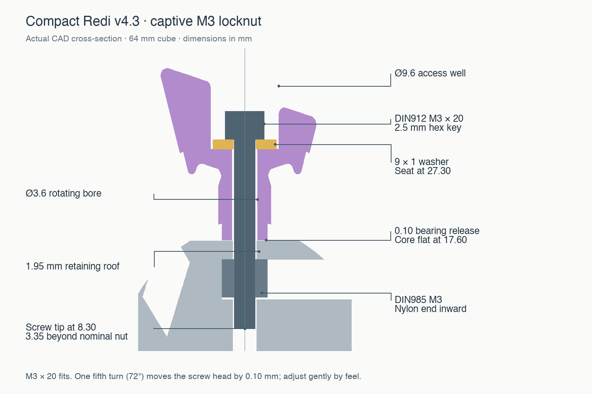

# Redi design reference

For the newer, owner-tested Skewb with trimmed flange tips, see its [design reference](../designs/skewb-v1.1/DESIGN.md) and [print files](../designs/skewb-v1.1). This page records the separate Redi design.

The current **v4.3** design is a 64 mm Redi-equivalent puzzle: eight screw-mounted
C pieces and twelve movable E pieces around one core. Each 120° turn rotates one
C piece and cycles its three neighboring edges. It has the original Redi cut
family, not the later experimental 65°/petal topology.

The owner has built the compact version and reports that everything except the
nut retention feels very nice. The release preserves that geometry and records
the remaining core issue below. See the [complete compact description](../designs/redi-v4.3/README.md),
[assembly guide](../designs/redi-v4.3/ASSEMBLY.md) and
[validation/provenance](../designs/redi-v4.3/VALIDATION.md).

## Coordinates and exterior orientation

The mechanism center is the origin. Its eight turn axes are
`(±1, ±1, ±1) / sqrt(3)`, ordered from C01 `(−,−,−)` to C08 `(+,+,+)`.
Each edge joins two axes whose dot product is `1/3`.

The cube-to-mechanism rotation is unchanged from v4.2:

`R = Rz(−13.232962300°) · Ry(26.192857308°) · Rx(32.391706195°)`.

These are fixed-axis rotations applied X, then Y, then Z to column vectors.
The full precision matrix is in [cube-to-mechanism.json](../designs/redi-v4.3/reference/cube-to-mechanism.json).
The original search maximized the minimum sampled radial-profile difference
between pairs of edge exteriors under their two compatible proper mounting
orientations; mirror images count as different. It is a best-found numerical
orientation, not a proof of a global or perceptual optimum. The compact revision
retains it and rechecks all 66 pairs on the exported meshes; the weakest sampled
pair has an RMS exterior difference of 3.024 mm.

Edge attachments intentionally interchange so the puzzle can scramble. Their
different exteriors distinguish solved positions; the parts are not mechanically
keyed to a single slot. Use the compact [neighbor sheet](../designs/redi-v4.3/NEIGHBORS.md).

## Dimensions and compatibility

All lengths are millimetres. Clearance values below describe different interfaces;
they are not interchangeable tolerances.

| Feature | Compact v4.3 | Previous 80 mm v4.2.1 |
|---|---|---|
| Solved exterior | 64 | 80 |
| Cone half-angle | 54.7356103° | Same |
| Core spherical radius | 19.20 | 24 |
| Core bearing-flat distance from center | 17.60 | 22 |
| Main conical-face gap, total | 0.03 | 0.20 |
| Track cutter expansion from unrounded flange sweep | 0.40 | 0.40 |
| Radial ridge transverse radius, including inner tracks | 3.00 | 3.00 |
| Internal edge / corner lead-in rounding | 0.60 / 0.45 | Same |
| General exterior softening | 0.80 | 1.00 |
| Rotating screw bore | Ø3.60 | Ø3.30 |
| Washer outside diameter × thickness | 9 × 1 | 13 × 0.55 |
| Washer/access well diameter | 9.60 | 13.80 |
| Screw | DIN912 M3 × 20, 2.5 mm hex key | M3 × 20, flat head underside |
| Thread anchorage | Captive DIN985 M3 nut | Ø2.60 direct-to-plastic pilot |

The compact rail dimensions are regenerated at 80% of the old size, while the
track allowance and R3 ridge rounding remain unscaled. The smaller washer well
allows the surrounding structure to shrink. Uniformly scaling the old STL would
also shrink hardware holes and working clearances, and would not produce this design.
The compact and 80 mm parts **do not interchange**. The older
[design reference](design-v4.2.1.md), [files](../models/current) and
[release](https://github.com/lukacslacko/wonkycube/releases/tag/v4.2.1) remain available.

## Retention, motion and bearings

Stepped surfaces of revolution provide flat retaining shoulders. Their remaining
overlap obstructs outward edge movement. Neighboring passages are derived from
the swept **unrounded** flanges, expanded by 0.40 mm; the printed flange receives
its small rounding separately. The long radial ridges use a constant 3 mm radius
in transverse sections, continuing through the inner track region. These features
provide entry relief while preserving capture material.

Reducing the main-face gap to 0.03 mm addresses one source of slack while keeping
the established track allowance. It does not eliminate every degree of freedom:
the retained track geometry still has measured radial travel before obstruction.
The numerical checks and physical feedback are detailed in
[VALIDATION.md](../designs/redi-v4.3/VALIDATION.md).

The core remains spherical between its eight intentional bearing flats and prints
on one of those flats. Each C piece has a matching flat annular foot, radius 3.20,
at axial coordinate 17.70, nominally 0.10 above the core flat. The stationary
screw clears the rotating Ø3.60 bore; the washer limits axial movement. The washer
seat is at 27.30, its top at 28.30, and the 20 mm screw tip at 8.30. The nominal
nut occupies axial coordinates 11.65–15.65, leaving 3.35 mm of screw past its inner
face. The eight screw envelopes clear each other, so shorter screws are not needed.

The nut loads sideways beneath a 1.95 mm roof, metal face toward the screw and
nylon end toward the center. The default pocket is 5.60 across flats; optional
5.50 and 5.70 variants and coupons are supplied. Existing small ribs aid insertion
retention but have not provided reliable resistance to screw torque in the build.

## Known core issue and next change

**Observed:** roughly half the installed nuts rotate in their seats as the screw
passes through the DIN985 nylon locking ring. This is a nut-to-core antirotation
failure; the report does not indicate a problem with the other pieces. A retaining
roof that blocks axial withdrawal does not establish torsional holding capacity.

**Proposed core-only change, not implemented in this release:**

- Keep the mouth and most of the loading passage easy to insert through.
- Narrow the terminal seat around the screw bore, with a short lead-in and enough
  flat engagement to prevent the nut turning. Press the nut through this final
  region with a blunt metal rod; avoid making the whole slot a long interference fit.
- Preserve the nut's final depth, screw alignment, roof, bearing flats and core
  envelope, keeping the printed C and E pieces compatible.
- Select the final interference using real nuts and printed coupons. Check that
  each fully seated nut survives screw insertion through the nylon ring and removal
  without spinning or splitting the pocket; repeat the check in all eight core
  slots. No final narrowed dimension or torque rating has yet been established.

The optional 5.50/5.70 cores change the existing pocket width; neither is claimed
to implement this separate entrance/seat fit or to resolve the reported defect.
This release publishes the tested assembly geometry with the limitation visible.

## Printing and assembly

Edges are supplied with their **inward radial vector pointing down (−Z)** and their
lowest point at Z = 0, matching the owner's preferred printing results. Corners
keep an exterior face on the bed. The core uses one existing axle flat. These print
poses are not assembly coordinates; transforms are stored in
[manifest.json](../designs/redi-v4.3/manifest.json).

Load and check all nuts, place the edges around the core, then insert and screw in
the C pieces. The optional stand withdraws through the last empty C corridor.
Tune each screw by the rotating piece's resistance: the locknut already creates
driver resistance before the bearing clamps. One fifth turn of an M3 × 0.5 thread
corresponds to 0.10 mm of screw-head travel, not a guarantee of a universal release
setting. See the [assembly guide](../designs/redi-v4.3/ASSEMBLY.md) for the sequence.
