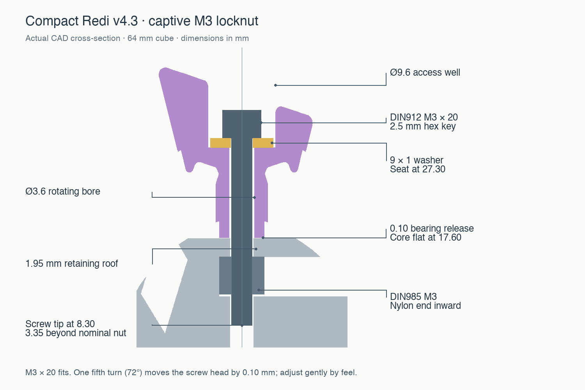

# Redi design reference

For reusable hardware geometry, see the self-contained [captive DIN985 M3 nut-slot specification](#captive-din985-m3-nut-slot-specification): **5.25 mm terminal seat and 5.85 mm entrance**. It includes exact CAD construction and fit checks for another project.

For the newer, owner-tested Skewb with trimmed flange tips, see its [design reference](../designs/skewb-v1.1/DESIGN.md) and [print files](../designs/skewb-v1.1). This page records the separate Redi design.

The current **v4.3** design is a 64 mm Redi-equivalent puzzle: eight screw-mounted
C pieces and twelve movable E pieces around one core. Each 120° turn rotates one
C piece and cycles its three neighboring edges. It has the original Redi cut
family, not the later experimental 65°/petal topology.

The owner has built the compact version and reports that everything except the
nut retention feels very nice. The release preserves that geometry and records
the remaining core issue below. See the [complete compact description](../designs/redi-v4.3/README.md),
[assembly guide](../designs/redi-v4.3/ASSEMBLY.md) and
[validation/provenance](../designs/redi-v4.3/VALIDATION.md).

## Coordinates and exterior orientation

The mechanism center is the origin. Its eight turn axes are
`(±1, ±1, ±1) / sqrt(3)`, ordered from C01 `(−,−,−)` to C08 `(+,+,+)`.
Each edge joins two axes whose dot product is `1/3`.

The cube-to-mechanism rotation is unchanged from v4.2:

`R = Rz(−13.232962300°) · Ry(26.192857308°) · Rx(32.391706195°)`.

These are fixed-axis rotations applied X, then Y, then Z to column vectors.
The full precision matrix is in [cube-to-mechanism.json](../designs/redi-v4.3/reference/cube-to-mechanism.json).
The original search maximized the minimum sampled radial-profile difference
between pairs of edge exteriors under their two compatible proper mounting
orientations; mirror images count as different. It is a best-found numerical
orientation, not a proof of a global or perceptual optimum. The compact revision
retains it and rechecks all 66 pairs on the exported meshes; the weakest sampled
pair has an RMS exterior difference of 3.024 mm.

Edge attachments intentionally interchange so the puzzle can scramble. Their
different exteriors distinguish solved positions; the parts are not mechanically
keyed to a single slot. Use the compact [neighbor sheet](../designs/redi-v4.3/NEIGHBORS.md).

## Dimensions and compatibility

All lengths are millimetres. Clearance values below describe different interfaces;
they are not interchangeable tolerances.

| Feature | Compact v4.3 | Previous 80 mm v4.2.1 |
|---|---|---|
| Solved exterior | 64 | 80 |
| Cone half-angle | 54.7356103° | Same |
| Core spherical radius | 19.20 | 24 |
| Core bearing-flat distance from center | 17.60 | 22 |
| Main conical-face gap, total | 0.03 | 0.20 |
| Track cutter expansion from unrounded flange sweep | 0.40 | 0.40 |
| Radial ridge transverse radius, including inner tracks | 3.00 | 3.00 |
| Internal edge / corner lead-in rounding | 0.60 / 0.45 | Same |
| General exterior softening | 0.80 | 1.00 |
| Rotating screw bore | Ø3.60 | Ø3.30 |
| Washer outside diameter × thickness | 9 × 1 | 13 × 0.55 |
| Washer/access well diameter | 9.60 | 13.80 |
| Screw | DIN912 M3 × 20, 2.5 mm hex key | M3 × 20, flat head underside |
| Thread anchorage | Captive DIN985 M3 nut | Ø2.60 direct-to-plastic pilot |

The compact rail dimensions are regenerated at 80% of the old size, while the
track allowance and R3 ridge rounding remain unscaled. The smaller washer well
allows the surrounding structure to shrink. Uniformly scaling the old STL would
also shrink hardware holes and working clearances, and would not produce this design.
The compact and 80 mm parts **do not interchange**. The older
[design reference](design-v4.2.1.md), [files](../models/current) and
[release](https://github.com/lukacslacko/wonkycube/releases/tag/v4.2.1) remain available.

## Retention, motion and bearings

Stepped surfaces of revolution provide flat retaining shoulders. Their remaining
overlap obstructs outward edge movement. Neighboring passages are derived from
the swept **unrounded** flanges, expanded by 0.40 mm; the printed flange receives
its small rounding separately. The long radial ridges use a constant 3 mm radius
in transverse sections, continuing through the inner track region. These features
provide entry relief while preserving capture material.

Reducing the main-face gap to 0.03 mm addresses one source of slack while keeping
the established track allowance. It does not eliminate every degree of freedom:
the retained track geometry still has measured radial travel before obstruction.
The numerical checks and physical feedback are detailed in
[VALIDATION.md](../designs/redi-v4.3/VALIDATION.md).

The core remains spherical between its eight intentional bearing flats and prints
on one of those flats. Each C piece has a matching flat annular foot, radius 3.20,
at axial coordinate 17.70, nominally 0.10 above the core flat. The stationary
screw clears the rotating Ø3.60 bore; the washer limits axial movement. The washer
seat is at 27.30, its top at 28.30, and the 20 mm screw tip at 8.30. The nominal
nut occupies axial coordinates 11.65–15.65, leaving 3.35 mm of screw past its inner
face. The eight screw envelopes clear each other, so shorter screws are not needed.

The nut loads sideways beneath a 1.95 mm roof, metal face toward the screw and
nylon end toward the center. The reusable specification below defines the
recommended pocket for new CAD. The [Redi source](../designs/redi-v4.3/source/README.md)
records the geometry of its supplied print files.



## Captive DIN985 M3 nut-slot specification

### Recommended dimensions

For a side-loaded **DIN985 M3 nylon locknut in an FDM PLA part**, start with a
**5.25 mm across-flats terminal seat and a 5.85 mm wide loading entrance**.
Keep the entrance wide: only the short region next to the screw axis should
grip the nut tightly.

This recipe assumes a nominal **5.50 mm across-flats, 4.00 mm high nut**. Measure
the actual hardware before adapting it to another nut type or size. All values
below are **CAD dimensions in millimetres**, not measured printed dimensions.

| Parameter | Value | Meaning |
|---|---:|---|
| `seat_af` | **5.25** | Recommended size, across opposite flats of the final hex seat |
| `entry_width` | **5.85** | Width of the accessible side-loading passage |
| `tight_run` | **3.00** | Distance from the screw-axis center to the start of the widening taper |
| `taper_run` | **3.00** | Length of the taper along the insertion path |
| `slot_height` | **4.25** | Cavity height along the screw axis for the nominal 4.00-high nut |
| `bore_diameter` | **3.40** | Clearance hole through the stationary host, coaxial with the nut |
| Screw-side retaining roof | **About 2.00** | Solid material above the nut cavity; 1.95 is the reference geometry |

At `seat_af = 5.25`, a nominal 5.50 mm nut has **0.25 mm total interference**,
or **0.125 mm per opposing flat**. This deliberately tight fit depends on the
printed plastic yielding locally. Do not add a normal sliding-fit clearance
to the terminal seat.

**5.25 mm is the owner-confirmed good seat size.** Use it as the nominal CAD
value when transferring this pocket to another project. The reference printer
setup is a Bambu Lab P1S, 0.4 mm nozzle and PLA. Validate the pocket in its actual
print orientation; this empirical fit does not imply a measured torque rating.

### Exact pocket construction for a CAD agent

Use a local coordinate system with the **screw axis along Z** and the **loading
opening toward +X**. The nut slides from the opening toward the origin, in the
**-X direction**. Its final threaded-hole center is at `x = y = 0`.

1. Make a regular hexagon centered on the origin in XY. Put vertices on the
   +X and -X directions, so two opposing flats lie at `y = +/- seat_af/2`.
   Its **circumradius is `seat_af / sqrt(3)`**, not `seat_af/2`.
2. Union that hexagon with the channel polygon below. Its width is `seat_af`
   from **x = 0 to 3**, increases linearly to `entry_width` from **x = 3 to 6**,
   and stays at `entry_width` from **x = 6 to the outside of the host part**.
   The 3 mm tight run is measured from the screw axis, not from the mouth or
   from the edge of the hexagon.
3. Extrude this union by `slot_height` along Z. Subtract it from the host so
   that a solid roof remains on the screw-entry side. Subtract a coaxial
   `bore_diameter` hole through the required screw path.
4. Keep the pocket's sidewalls continuously connected to substantial host
   material. The roof carries axial load; the tight flats and their supporting
   walls react installation torque. Small handling ribs are optional and do
   not establish torque capacity. About 2 mm of roof is a starting geometry,
   not a universal strength limit; check the load path and layer orientation.
5. Provide a straight, accessible pushing path through the loading mouth for
   a blunt tool, approximately 3 mm in diameter. The final seat must be reachable
   without using the screw to force a misaligned nut into position.

```text
h = seat_af / 2
e = entry_width / 2
L = a distance beyond the outer surface, with L > 6

hex_vertices[k] = (seat_af / sqrt(3)) * (cos(k*pi/3), sin(k*pi/3))
                 for k = 0, 1, 2, 3, 4, 5

channel = [(0,-h), (3,-h), (6,-e), (L,-e),
           (L, e), (6, e), (3, h), (0, h)]

pocket = extrude(union(hexagon(hex_vertices), polygon(channel)), 4.25)
```

Choose the pocket's axial position from the new project's screw stack. The
nut's **metal face points toward the screw entry and retaining roof**; its
**nylon locking end points away from the screw entry**. Verify that the chosen
screw reaches through the nylon locking section without bottoming out or
colliding with other screws. For a rotating part, provide separate clearance
around the screw shank; **3.60 mm** is the reference rotating bore. Keep hardware
holes and interference dimensions independent of the overall model scale.

### Print, insert and tune

- Print at **100% scale**. Use the intended material, layer height and wall
  settings. Six walls and 40% gyroid infill are a useful starting point for a
  small PLA host; inspect the actual pocket roof and wall toolpaths.
- Print a **5.25 mm coupon** with the pocket at the same inclination to
  the layers as the intended part. Include the same roof, taper and supporting
  walls. Check every substantially different pocket orientation in the part.
- Remove accessible support residue and burrs. Slide the nut into the wide
  mouth, keep its flats aligned, then press it squarely into the terminal seat
  with a blunt metal tool. It should seat fully, with its hole aligned to the
  bore, without cracking or splitting the host.
- Test with the actual M3 screw: drive it through the **nylon locking ring**,
  then back it out, and repeat. Accept the fit only if the nut does not rotate
  or progressively loosen. Insertion resistance alone is not the acceptance
  test.
- If the nut rotates, reduce only `seat_af` by **0.05 mm total across flats**.
  If it cannot seat or damages the part, increase `seat_af` by **0.05 mm total**.
  That is **0.025 mm per side**. Keep the 5.85 mm mouth and taper length fixed;
  check the surrounding material if the walls flex or split.

Implementation references: [pocket and coupon code](../designs/curvy-copter-cuboctahedron-v3.2/source/hardware.py)
and [5.25 mm parameter definition](../designs/curvy-copter-cuboctahedron-v3.2/source/design.py).

## Printing and assembly

Edges are supplied with their **inward radial vector pointing down (−Z)** and their
lowest point at Z = 0, matching the owner's preferred printing results. Corners
keep an exterior face on the bed. The core uses one existing axle flat. These print
poses are not assembly coordinates; transforms are stored in
[manifest.json](../designs/redi-v4.3/manifest.json).

Load and check all nuts, place the edges around the core, then insert and screw in
the C pieces. The optional stand withdraws through the last empty C corridor.
Tune each screw by the rotating piece's resistance: the locknut already creates
driver resistance before the bearing clamps. One fifth turn of an M3 × 0.5 thread
corresponds to 0.10 mm of screw-head travel, not a guarantee of a universal release
setting. See the [assembly guide](../designs/redi-v4.3/ASSEMBLY.md) for the sequence.
