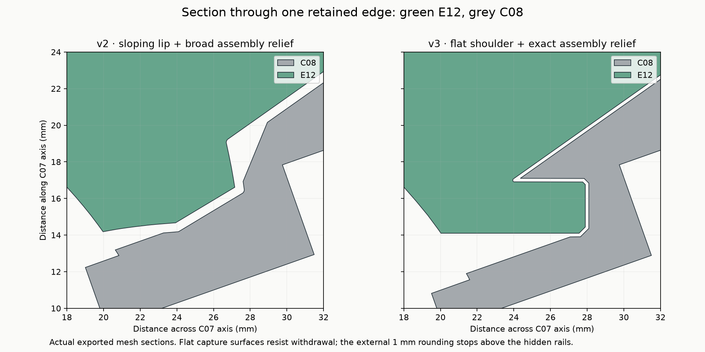
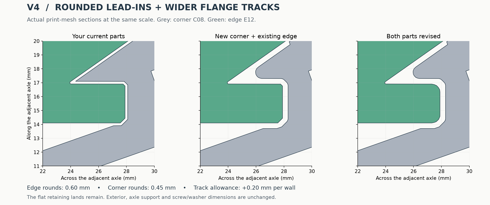
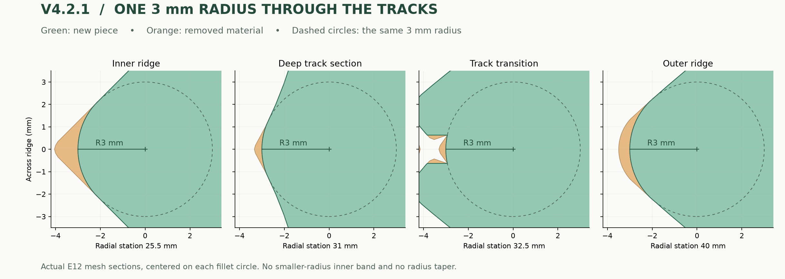
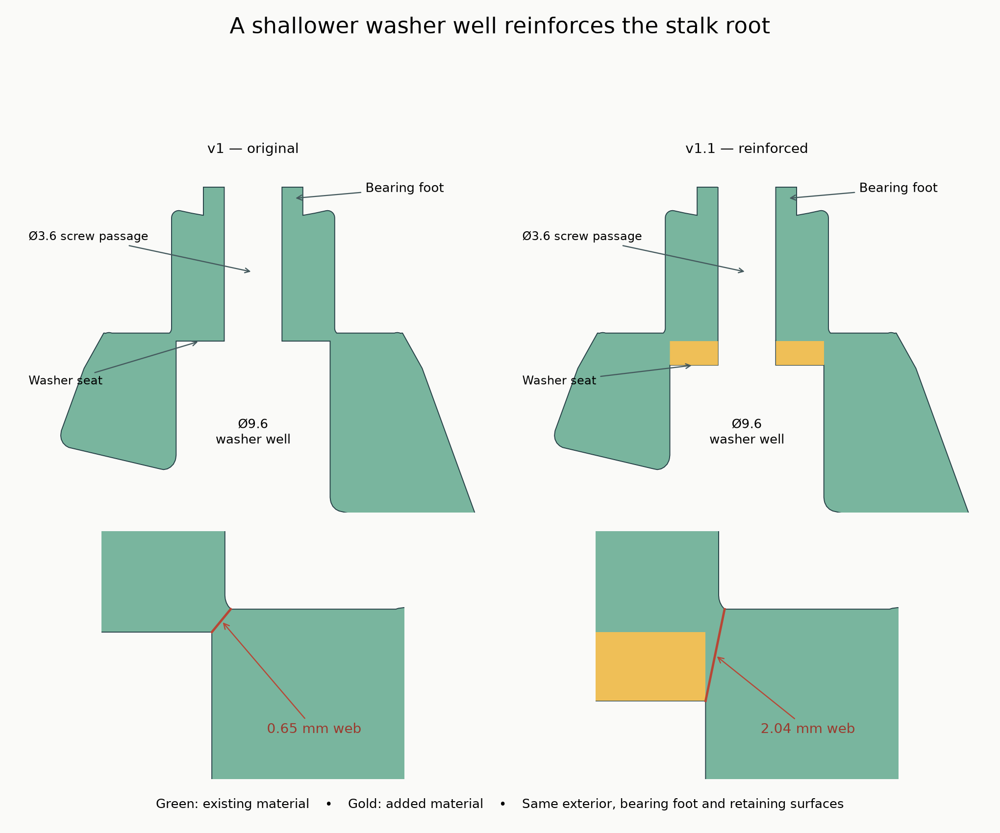

# Designing printed mechanisms that retain well and move freely

These lessons came from printing and revising the Wonky Redi, Wonky Skewb and Wonky conical 3×3. They apply more broadly to captive sliders, rotating shells and mechanisms with intersecting motion paths. The [Redi](design.md), [Skewb](../designs/skewb-v1.1/DESIGN.md) and [conical 3×3](../designs/conical-3x3-v1.1/DESIGN.md) references record particular dimensions; the principles below explain how to choose and evaluate such dimensions elsewhere.

The successful behavior comes from a combination of features. The print trials changed several features between revisions, so they do not isolate a measured contribution from each radius or clearance.

On 2026-09-18 the owner reported that the Skewb with trimmed flange tips printed very well and turns very nicely. This extends the physical evidence to a second mechanism topology using close main faces, wider tracks, continuous R3 radial rounding and flat axle bearings. It is qualitative print and turning feedback, not a measured strength or endurance rating. [Report and supplied export hashes](../designs/skewb-v1.1/physical-feedback.json).

## 1. Give retention, guidance and fastening separate jobs

A useful interface has an explicit answer to each of these questions:

| Job | Geometric feature | Failure when confused with another job |
|---|---|---|
| Locate an axis | Journal/bore and bearing foot | Wobble or off-axis rubbing |
| Support inward force | Flat annular bearing pad | Screw has to carry bending that a bearing could support |
| Limit outward movement | Washer, screw and seat | Loose adjustment becomes separation |
| Prevent an anchored nut turning | Seated hex flats with adequate engagement | Locknut spins before the screw can advance |
| Retain a sliding piece | Overlapping shoulder with a useful flat land | A sloped lip becomes an escape ramp |
| Permit intended motion | Swept track with positive allowance | Local interference despite an apparently generous gap elsewhere |
| Help entry under small misalignment | Rounded ends and ridges | A sharp tip meets a sharp track mouth |

In this puzzle, the core's curved envelope is spherical between its axle pads, but the corners rotate on **matching flat feet and pads**. A spherical-looking core does not imply that the corner's concave underside is its bearing. The support geometry must match where contact actually occurs.

The screw is stationary in the core; the corner clears its shank. Its washer limits outward movement, while a small adjustment gap prevents the screw from clamping the rotor onto its bearing.

## 2. Positive capture depends on direction, not just flange size

Start with the direction in which an unwanted piece could leave. The retainer must intersect that path with meaningful material remaining after all track and assembly cuts.

A broad sloping flange can still let a piece cam outward. A flatter shoulder presents a more direct obstruction. In the working design, a stepped surface of revolution replaces the early conical flare. Its constant-axis-coordinate shoulder leaves a flat land; the two adjacent corner retainers cooperate to capture an edge.

Increasing flange projection alone is insufficient: a larger flange also needs a larger swept passage past neighboring structures. Enlarging that passage can remove the very land that was supposed to retain it. Design the flange and its neighboring passages together, then inspect the *remaining* overlap.

Keep entrance radii local enough to preserve a substantial load-bearing land. A perfectly rounded nub can be easy to turn and easy to pull out. Recheck retention whenever rounding or track widening removes material near the capture surface.

Do more than a straight radial pull test. Include tilted pieces, lifted retainers and intermediate turn positions. An early print escaped by motions that a simple aligned test did not adequately characterize.

## 3. Derive clearance from the mating part's motion

For a moving solid F and motion transforms T(t), its occupied envelope is

`S = union over t of T(t) F`.

A useful starting groove is that envelope expanded by a distance allowance c: `S ⊕ ball(c)`. The actual construction may use a two-dimensional profile and revolution when the motion permits it. The essential point is to preserve the swept solid's concavities and account for approximation error.

For this design, the flange is projected into `(rho, z)` coordinates about the relevant axis, its profile is expanded, and the result is revolved. Sampling the triangle interiors matters: rotating only the mesh vertices can miss the inner radial bound of a face.

Use the **unrounded mating flange** to create the track cutter, expand that cutter, and round the printed flange separately. Otherwise, a smaller rounded flange can produce a narrower groove, cancelling part of the intended entry relief.

A whole-object convex hull is often too aggressive for a retaining mechanism. It fills useful concavities and may erase the lock. Assembly clearances need the same care as turning clearances: use the real insertion sweep, not an arbitrary oversized cavity.

## 4. Treat clearance as several independent dimensions

There is no single tolerance that controls a mechanism's feel. Distinguish at least:

- Sliding separation between the main surfaces.
- Extra clearance inside tracks and at their mouths.
- Axial movement allowed by the fastener.
- Diametral clearance around a rotating screw shank.
- Interference in a screw pilot that must grip plastic, or the fit of a captive nut.
- Easy-loading clearance at a nut-slot entrance versus interference at its final seat.
- Access clearance for the actual washer and driver holder.

Name whether a value is **per wall, total separation, radial or diametral**. An offset applied to the entire swept profile moves every profile boundary by that distance; it is not the same as a diametral hole allowance.

The 80 mm version used 0.20 mm nominal main-face separation. The later 64 mm version reduces this to 0.03 mm while retaining the **0.40 mm track-cutter expansion** from the unrounded flange and roughly 0.10 mm axial adjustment. Its owner likes the resulting feel apart from the nut seats. This supports tuning main-face fit separately from track relief; it does not establish 0.03 mm as a general printer tolerance. That gap is below normal FDM variation, and the wider track still allows some travel before capture. These numbers describe different contacts and should not be added into a single “puzzle gap.”

Reducing every gap toward zero may reduce wobble but increase binding. Negative clearance plus a loose screw is especially hard to control: loosening moves one retainer along one axis; it does not open all intersecting tracks uniformly. Excessive lift also reduces capture and permits rocking.

Use print coupons to calibrate holes and short comparison parts to calibrate motion. A nominal CAD allowance is not a promise of the as-printed gap.

## 5. Round the entire contact path, including its transitions

A rounded ridge helps an approaching surface slide past or guide it toward alignment instead of presenting a knife edge. Whether it actually realigns depends on freedom of movement, friction and the applied force; a fillet alone does not guarantee corner cutting.

Two different rounding operations proved useful:

- Small radii on internal protrusions and track entrances remove local snag points while preserving flat lands.
- Larger radii on the long radial dihedral ridges relieve contacts as the turn changes from one axis to another.

The radius must continue through the part of the ridge that enters the track. Protecting an entire inner zone preserved its smaller radius, leaving a catch-prone transition even though the visible outer ridge looked rounded.

The final intent is a **3 mm circular radius in sections transverse to each radial ridge**. That is a precise construction, not a claim that every principal curvature of a three-dimensional fillet is 3 mm. The circle center follows the stepped track profile; it does not simply extend the outer cone inward. Different opening angles can make equal radii look different.

Some track sections contain a thin foreground rib, then a void, then the main body. Fitting to the first boundary can put the rounding cutter into the void and leave a smaller-radius strip behind. Determine the actual solid interval that must survive, then verify the exported mesh in sections. A parameter labelled “3 mm” is not evidence that the print file has that radius everywhere.

## 6. Preserve the useful constraints when making compatibility revisions

Holding the main dimensions fixed makes physical experiments informative. Keep axes, bearing heights, fastener seats, exterior face planes and part IDs stable while changing a particular sliding feature.

A subtract-only revision has a valuable ideal-geometry property: if each new part is a subset of its old part, it cannot create a new collision at the same rigid poses. This supports mixing old and new parts. It does **not** prove unchanged strength, retention, available grip or self-alignment. Removing material can worsen all of those.

Protect the exact bearing foot and washer collar rather than broadly protecting every internal surface. Broad protection can accidentally leave the sharp transition the revision was intended to remove. Check motion, material left at the lands, and assembly access separately.

The Skewb tip correction is a concrete example: only its four floating K corners change, and all 18 other STL files remain byte-for-byte identical to v1. Apply the final tip subtraction after generating the original insertion reliefs; keep the original mating envelope when rebuilding neighboring parts. Otherwise a smaller corner can inadvertently produce a smaller clearance in a supposedly compatible replacement. Sampled retention was checked again after trimming, and the owner subsequently confirmed a successful print and nice turning.

## 7. Size the exterior around a mechanically adequate interior

Set the fastener, bearing, retaining and access dimensions first. Then make the decorative or puzzle exterior large enough to contain those features with adequate walls in every direction.

The exterior need not be as large as the first prototype. Reducing this puzzle from 100 to 80 mm kept the 24 mm core radius and brought the grip closer to the interfaces. A later 64 mm build reduced the core radius to 19.2 mm and regenerated the rails at 80% size, enabled by smaller washers and access wells. It retained full-size M3 × 20 screws, the 0.40 mm track allowance and 3 mm ridge radius. The owner successfully built it. These are two different sizing changes: reducing excess shell and redesigning the mechanism around smaller hardware access.

Check the entire fastener stack before concluding that a long screw sets the minimum exterior size. The compact design accommodates its extra length inside the core, with clearance between all screw tips. Conversely, a small head may still need a substantial access well or bearing collar. Use actual hardware envelopes and the least favorable part, not a uniform percentage reduction.

Do not shrink a finished STL uniformly to achieve that result. Uniform scaling also shrinks screw holes, washer wells, lands and gaps. Change the outer envelope independently and regenerate/check the affected intersections.

An asymmetric shell can expose thin spots that a symmetric prototype hides. Inspect the least favorable rotated direction, not just a central section.

## 8. Design the assembly path at the same time as the motion

Closed-loop retention is only useful if there is an assembly sequence. Model the swept volume of each insertion, the driver and washer access, and the withdrawal of any assembly jig.

The Redi is assembled by placing the edges around the core before installing the corner retainers. The Skewb adds another level of capture: floating K corners are held by F face pieces, which are held by screwed C corners. Its assembly order is therefore **K → F → C**. Both designs use whole pieces with checked insertion paths; one C corridor stays empty until the optional stand is withdrawn. Nothing needs to pass through an already installed flange.

A fastener can be visible yet unreachable by the actual tool: include the tubular bit holder, not just the Phillips tip. Likewise, a jig that supports the first step can be trapped by the last step. Explicitly reserve and verify its exit route.

## 9. Separate ideal geometry from printed behavior

Use a ladder of evidence:

1. Validate the delivered files: closed, connected, consistently wound meshes and correct scale.
2. Check aligned fit and sampled intended turns with hardware present.
3. Check insertion, tool access and jig withdrawal.
4. Probe escape paths and small misalignment, especially after material removal.
5. Check printable connectivity at the intended layer height, line width and orientation; inspect slicer toolpaths and support placement.
6. Print a coupon/fixture or a few interchangeable parts.
7. Test the full mechanism and record the exact file hashes, material and settings. Distinguish hashes of supplied files from independently confirmed printer inputs, and record missing settings as unknown.

Finite collision samples do not prove clearance at every possible pose. Intersection volume does not measure hand torque. A blocked rigid extraction path does not establish a holding-force rating or resistance to elastic popping.

Layer steps, supports, seams, elephant foot, washer burrs and screw tension can dominate small nominal clearances. Clean raised residue from sliding surfaces while preserving the retaining lands. Keep material and settings unchanged when comparing geometry; test a new polymer as a separate experiment. There is no measured PLA-versus-ABS friction ranking for this puzzle.

Numerical export deserves its own checks. Very small Boolean slivers can collapse when STL coordinates become float32. Controlled simplification and welding must still yield a closed mesh; then inspect the actual fillet sections. On steep profiles, a small normal-distance simplification error can become a larger transverse section error.

## 10. Design captive nuts for installation torque, not just handling retention

A captive locknut has three distinct requirements: a path to insert it, axial capture once installed, and resistance to screw torque. A roof can satisfy axial capture while leaving the nut free to rotate. Small ribs that stop a nut falling out during handling do not necessarily supply enough torque resistance.

The compact build exposed this distinction: roughly half the nuts spun in their seats as the M3 screws engaged the DIN985 nylon rings. The owner otherwise liked the puzzle. The evidence identifies a local anchorage problem; it does not call for changing the successful sliding pieces.

Separate the **loading passage** from the **final torque seat**. Keep the entrance generous, then use a short lead-in to a tighter terminal region around the screw bore. Give the nut flats enough engagement and surrounding material to react torque. A blunt rod can press the nut through the last region without making the entire insertion path an interference fit. Keep the final nut depth and screw alignment fixed when revising an otherwise compatible core.

The Skewb implements this separation with a 5.85 mm loading mouth, a tapered approach to a nominal 5.40 mm terminal seat across flats, and access for a blunt Ø3 mm pressing rod. Fit coupons and 5.30/5.50 mm alternatives accommodate print and nut variation. Its successful whole-puzzle report supports buildability, but does not identify the chosen seat variant or independently establish installation-torque capacity or long-term resistance to spinning. The released **Redi v4.3 core remains unchanged**; its tighter seat is still a proposed follow-up.

Validate with the actual locking nut: push it fully home, drive the screw through the nylon ring, and reverse it. Watch for nut rotation, damaged flats, splitting and progressive loosening over repeated cycles. Check all differently oriented pockets in the real printed core; a single conveniently oriented coupon cannot represent them all. Choose the final interference from those results rather than treating nominal nut dimensions or insertion feel as a torque test.

Keep screw-thread locking separate from bearing adjustment too. The rotating piece needs shank clearance, and the washer/foot need enough axial freedom. The nylon ring produces driver resistance before the bearing clamps, so tune by the rotating part's feel rather than assuming all resistance at the tool is clamp load. Long-term adjustment stability remains a separate wear/settling observation.

## 11. Choose print orientation for the working surfaces

The owner found that the Redi edges printed best with their inward radial vectors pointing down. The compact Redi release supplies that pose in both the STLs and the plates. This is useful empirical evidence for these parts, not a universal rule that a narrow footprint always prints better than a broad face.

The Skewb's inward-down F/K pieces have very small initial footprints, so it also supplies broad-face-down 3MF alternatives. Trimming its disconnected tip remnants fixes the geometry in both orientations; it does not remove the need to support ordinary overhangs. The successful print report did not restate which orientation was used, so it is not an orientation comparison.

Compare the surfaces that actually slide, enter tracks, or carry load: layer steps, seams and support scars on those surfaces can matter more than minimizing support volume alone. Evaluate adhesion, support removal and flange strength alongside surface quality. Keep the other slicer settings fixed when comparing orientations.

Store the print-to-assembly transform and retain part IDs. Verify scale, bed height and closed meshes after reorientation. A rigid rotation should change the printing pose without redesigning the mechanism, but its physical effect on finish and strength still needs a print trial.

## 12. Check printable connectivity and remove nonfunctional thin remnants

A watertight, connected CAD solid can slice into disconnected pieces. In the first Skewb floating corners, three small holes near the flange vertices left thin terminal loops. Their connecting webs were too narrow to generate extrusion paths, while the tips themselves survived as separate scraps. The slicer then spent support material holding those scraps instead of making a useful connection.

Inspect the geometry at the intended layer height and extrusion width, not just its mesh connectivity. A fixed-width layer graph reproduced six isolated scraps in the old K01 at 0.16 mm layers and 0.42 mm width. After trimming, all four corners had one connected printable graph in 40 tested combinations of orientation, layer height and width. Those are geometric simulations, not actual slicer toolpaths; the subsequent successful physical print supplies separate evidence.

Determine what each suspect region does before removing it. Here the broad lobes between the vertices provide capture, so the revision cuts away the three perforated tips and opens their holes to the perimeter. The sampled pull and rocking paths remain blocked at the same first-contact travel, including checks with lifted screwed corners. Those results justify retaining the broad lobes while removing the troublesome remnants; they do not prove equal breaking strength.

The case-specific trim uses three chords 9.5 mm from the corner axis, limited below axial distance 22 mm. Those numbers are not a general design rule. The transferable process is to locate material that cannot print reliably, distinguish it from load-bearing lands, make a local correction, and recheck capture, assembly and motion. If a thin web is essential, thicken or redesign it and its mating clearance instead. Filling holes or adding material without checking the swept path can create a new jam.

Support is appropriate for a useful overhang that joins the body later. It cannot compensate for a connecting web omitted from every extrusion layer. Keep such overhangs distinct from permanently isolated scraps, and correct the latter explicitly in the CAD when they serve no necessary function.

## 13. Check the load path around access wells, not just connectivity

A connected solid and even a connected printable layer graph can contain a mechanically poor junction. A broad stalk may look substantial in sections perpendicular to its axis while connecting to the shell through a thin, sloping web beside an access recess. Inspect longitudinal and oblique sections as well as the minimum distance between the recess and the outside root.

The conical 3×3 exposed this distinction. Its screwed centers were connected solids, but a slicer review drew attention to their foot-to-body junctions. Measuring the actual exported meshes found about **0.65 mm** between the washer-well rim and the outside root. The prior connectivity and motion checks did not establish adequate strength there.

Moving the washer seat **1.5 mm outward**, so that the wide access well became shallower, increased the smallest measured root web to **2.04 mm** on all six centers. The narrow screw passage remained open, and the bearing foot, exposed flange, tracks and outside shape kept their working dimensions. The same M3 × 20 screws still extend **1.85 mm beyond the locknuts** with their heads contained inside the solved cube. A thicker connection was achieved by filling an internal recess rather than thinning a retaining flange.

This illustrates a useful redesign sequence: identify the force path from the retainer into the shell, find the internal cut that weakens it, and add material where it does not occupy a neighboring piece's motion envelope. Then recheck the whole hardware stack—thread engagement, head containment, washer insertion and driver access—as well as assembly and turning. A shallower well is only an option when the fastener still reaches its nut and the head still fits.

The compatible release changes only the six screwed puzzle pieces; the other 21 puzzle STLs keep their exact bytes. Its root check samples 720 positions around each washer-well rim and verifies that the shortest measured segment lies in solid material. This is a targeted geometric measurement, not a universal minimum-wall analysis or a strength calculation. Print orientation, continuous wall paths and local solid layers still affect how the load is carried; sparse infill alone is not a substitute for the connection.

The owner subsequently reported that the reinforced version **printed very well**. That confirms a successful print of the supplied design, while strength, fatigue and a separate turning assessment remain unmeasured in that report. [Feedback and associated supplied-file hashes](../designs/conical-3x3-v1.1/physical-feedback.json). Never turn a thickness ratio into a claimed strength multiplier without mechanical evidence.

## A practical diagnosis table

| Symptom | Inspect first | Design response to evaluate |
|---|---|---|
| Pulls out while aligned | Remaining capture land and escape direction | More positive shoulder; avoid a ramp |
| Pops only when turning | Intermediate overlap, rocking and retainer lift | Rework intersecting paths; reduce excess axial play |
| Drags throughout a turn | Bearing pressure, track allowance, support residue | Separate fastening friction from sliding interference |
| Catches when changing axes | Ridge/track-mouth contact and transition bands | Continuous local rounding; expanded unrounded sweep |
| Turns freely but feels unstable | Axial and diametral freedom | Tighten the appropriate constraint without closing every gap |
| CAD passes but print catches | Seams, supports, first-layer lip, dimensions | Calibrate and finish before changing the whole mechanism |
| Watertight flange slices into isolated supported scraps | Thin webs around holes and corners, at actual layer height and line width | Trim nonfunctional tips or redesign essential webs; recheck retention and motion |
| Connected stalk looks weak beside a washer or tool well | Shortest solid web at the root, including longitudinal and oblique sections | Make the wide recess shallower or reinforce its root; recheck screw reach and head clearance |
| Nut spins as the screw reaches its locking ring | Final seat flat engagement and actual installation torque | Keep entrance easy; tighten only the final seat; test with real locknuts |
| Nut stays in during handling but spins under a driver | Grip ribs versus torque-bearing walls | Treat handling retention and antirotation as separate requirements |

The reusable rule is to preserve firm constraints in unwanted directions while making the intended paths forgiving. Capture lands, bearings, clearances and rounded entrances cooperate; none can substitute for all the others.
