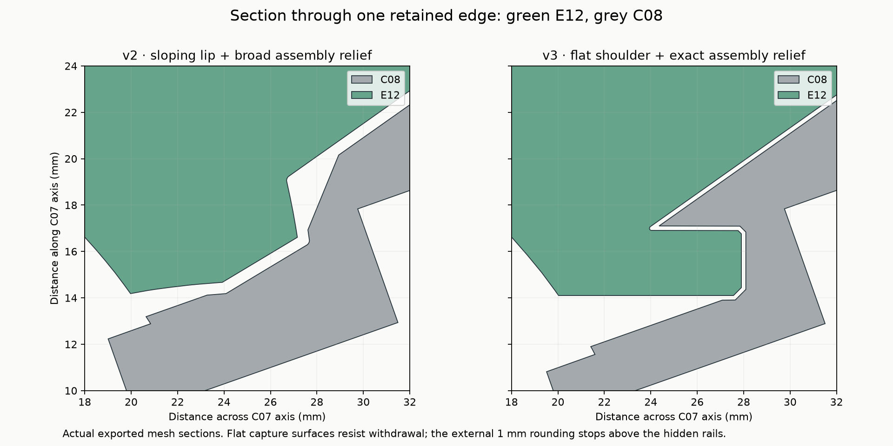
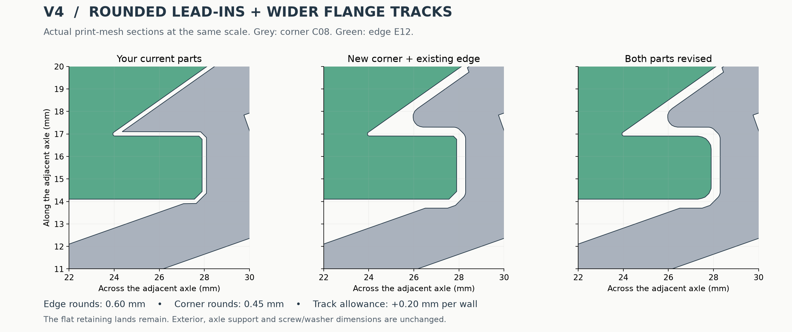
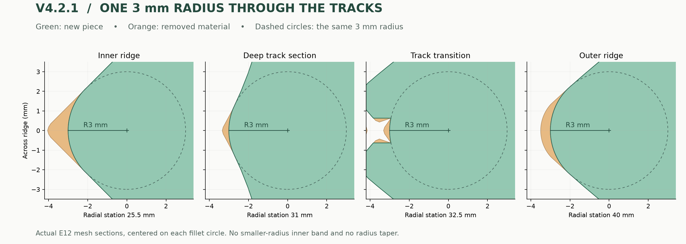
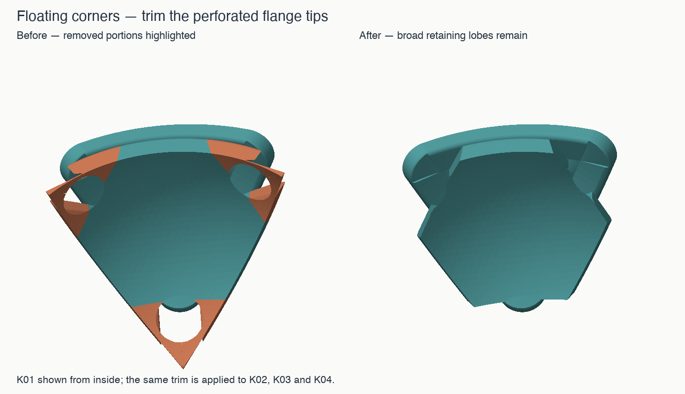
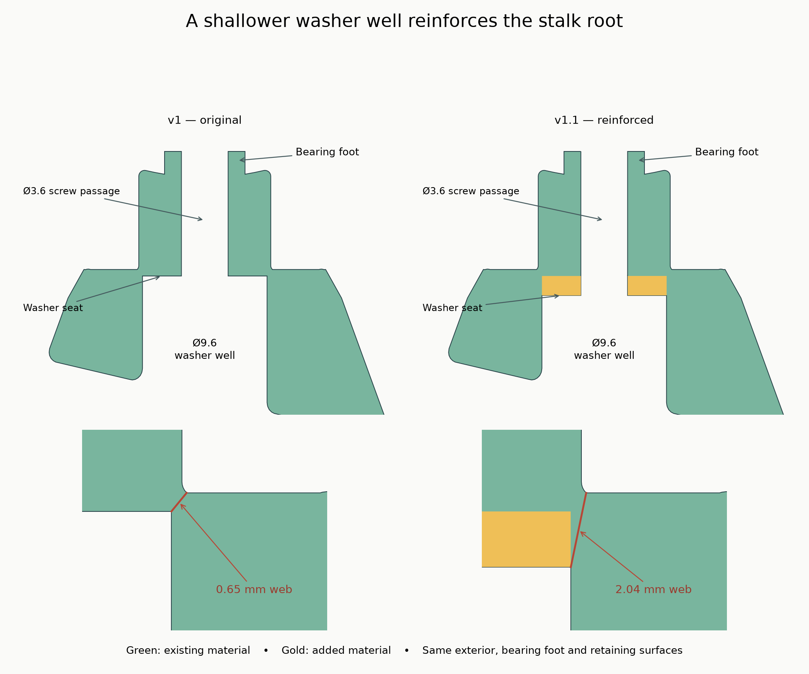
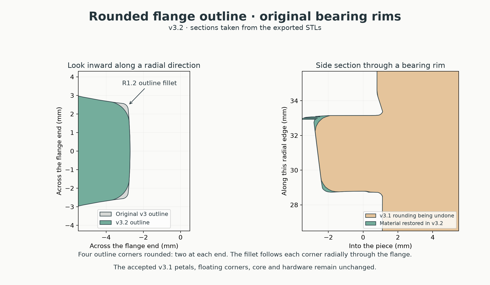

# Designing printed mechanisms that retain well and move freely

These lessons came from printing and revising the Wonky Redi, Wonky Skewb, Wonky conical 3×3, Wonky pentagonal prism, Wavy Redi, Wonky triangular prism, face-turning cuboctahedron, Curvy Copter cuboctahedron and Double Ivy. They apply more broadly to captive sliders, rotating shells and mechanisms with intersecting motion paths. The [Redi](design.md), [Skewb](../designs/skewb-v1.1/DESIGN.md), [conical 3×3](../designs/conical-3x3-v1.1/DESIGN.md), [pentagonal prism](../designs/pentagonal-prism-v1/README.md#mechanism), [Wavy Redi](../designs/wavy-redi-v1.1/README.md#mechanism-choices) and [triangular prism](../designs/triangular-prism-v1/README.md#retention-and-fit) references record particular dimensions; the principles below explain how to choose and evaluate such dimensions elsewhere.

The successful behavior comes from a combination of features. The print trials changed several features between revisions, so they do not isolate a measured contribution from each radius or clearance.

On 2026-09-18 the owner reported that the Skewb with trimmed flange tips printed very well and turns very nicely. This extends the physical evidence to a second mechanism topology using close main faces, wider tracks, continuous R3 radial rounding and flat axle bearings. It is qualitative print and turning feedback, not a measured strength or endurance rating. [Report and supplied export hashes](../designs/skewb-v1.1/physical-feedback.json).

## Default for new designs

Use **concentric spherical-shell shoulders centered on the puzzle origin** for floating-piece retention. On each broad load-bearing face, the surface normal should follow the local radius (`n = ±x / |x|`). Conical or wavy exterior cuts do not change this requirement. Flat washer seats and matching axle-bearing pads have separate jobs and remain appropriate.

Provide substantial overlap after all grooves, tolerances and rounding. Round the outline of flange ends in the radial view while preserving the spherical bearing lands. Keep main-body clearance separate from sliding-track clearance, and check the remaining inner feet against their actual retainers, including lifted neighbors and intermediate turns. See section 17 for demonstrated dimensions and section 18 for layered support.

## 1. Give retention, guidance and fastening separate jobs

A useful interface has an explicit answer to each of these questions:

| Job | Geometric feature | Failure when confused with another job |
|---|---|---|
| Locate an axis | Journal/bore and bearing foot | Wobble or off-axis rubbing |
| Support inward force | Flat annular bearing pad | Screw has to carry bending that a bearing could support |
| Limit outward movement | Washer, screw and seat | Loose adjustment becomes separation |
| Prevent an anchored nut turning | Seated hex flats with adequate engagement | Locknut spins before the screw can advance |
| Retain a sliding piece | Overlapping concentric spherical bearing land for radial capture in new puzzle designs | A sloped lip becomes an escape ramp |
| Permit intended motion | Swept track with positive allowance | Local interference despite an apparently generous gap elsewhere |
| Help entry under small misalignment | Rounded ends and ridges | A sharp tip meets a sharp track mouth |

In this puzzle, the core's curved envelope is spherical between its axle pads, but the corners rotate on **matching flat feet and pads**. A spherical-looking core does not imply that the corner's concave underside is its bearing. The support geometry must match where contact actually occurs.

The screw is stationary in the core; the corner clears its shank. Its washer limits outward movement, while a small adjustment gap prevents the screw from clamping the rotor onto its bearing.

## 2. Positive capture depends on direction, not just flange size

Start with the direction in which an unwanted piece could leave. The retainer must intersect that path with meaningful material remaining after all track and assembly cuts.

A broad sloping flange can still let a piece cam outward. A flatter shoulder presents a more direct obstruction. In the working design, a stepped surface of revolution replaces the early conical flare. Its constant-axis-coordinate shoulder leaves a flat land; the two adjacent corner retainers cooperate to capture an edge.

Increasing flange projection alone is insufficient: a larger flange also needs a larger swept passage past neighboring structures. Enlarging that passage can remove the very land that was supposed to retain it. Design the flange and its neighboring passages together, then inspect the *remaining* overlap.

Keep entrance radii local enough to preserve a substantial load-bearing land. A perfectly rounded nub can be easy to turn and easy to pull out. Recheck retention whenever rounding or track widening removes material near the capture surface.

Do more than a straight radial pull test. Include tilted pieces, lifted retainers and intermediate turn positions. An early print escaped by motions that a simple aligned test did not adequately characterize.

## 3. Derive clearance from the mating part's motion

For a moving solid F and motion transforms T(t), its occupied envelope is

`S = union over t of T(t) F`.

A useful starting groove is that envelope expanded by a distance allowance c: `S ⊕ ball(c)`. The actual construction may use a two-dimensional profile and revolution when the motion permits it. The essential point is to preserve the swept solid's concavities and account for approximation error.

For this design, the flange is projected into `(rho, z)` coordinates about the relevant axis, its profile is expanded, and the result is revolved. Sampling the triangle interiors matters: rotating only the mesh vertices can miss the inner radial bound of a face.

Use the **unrounded mating flange** to create the track cutter, expand that cutter, and round the printed flange separately. Otherwise, a smaller rounded flange can produce a narrower groove, cancelling part of the intended entry relief.

A whole-object convex hull is often too aggressive for a retaining mechanism. It fills useful concavities and may erase the lock. Assembly clearances need the same care as turning clearances: use the real insertion sweep, not an arbitrary oversized cavity.

## 4. Treat clearance as several independent dimensions

There is no single tolerance that controls a mechanism's feel. Distinguish at least:

- Sliding separation between the main surfaces.
- Extra clearance inside tracks and at their mouths.
- Axial movement allowed by the fastener.
- Diametral clearance around a rotating screw shank.
- Interference in a screw pilot that must grip plastic, or the fit of a captive nut.
- Easy-loading clearance at a nut-slot entrance versus interference at its final seat.
- Access clearance for the actual washer and driver holder.

Name whether a value is **per wall, total separation, radial or diametral**. An offset applied to the entire swept profile moves every profile boundary by that distance; it is not the same as a diametral hole allowance.

The 80 mm version used 0.20 mm nominal main-face separation. The later 64 mm version reduces this to 0.03 mm while retaining the **0.40 mm track-cutter expansion** from the unrounded flange and roughly 0.10 mm axial adjustment. Its owner likes the resulting feel apart from the nut seats. This supports tuning main-face fit separately from track relief; it does not establish 0.03 mm as a general printer tolerance. That gap is below normal FDM variation, and the wider track still allows some travel before capture. These numbers describe different contacts and should not be added into a single “puzzle gap.”

Reducing every gap toward zero may reduce wobble but increase binding. Negative clearance plus a loose screw is especially hard to control: loosening moves one retainer along one axis; it does not open all intersecting tracks uniformly. Excessive lift also reduces capture and permits rocking.

Use print coupons to calibrate holes and short comparison parts to calibrate motion. A nominal CAD allowance is not a promise of the as-printed gap.

## 5. Round the entire contact path, including its transitions

A rounded ridge helps an approaching surface slide past or guide it toward alignment instead of presenting a knife edge. Whether it actually realigns depends on freedom of movement, friction and the applied force; a fillet alone does not guarantee corner cutting.

Two different rounding operations proved useful:

- Small radii on internal protrusions and track entrances remove local snag points while preserving flat lands.
- Larger radii on the long radial dihedral ridges relieve contacts as the turn changes from one axis to another.

The radius must continue through the part of the ridge that enters the track. Protecting an entire inner zone preserved its smaller radius, leaving a catch-prone transition even though the visible outer ridge looked rounded.

The Redi and Skewb use a **3 mm circular radius in sections transverse to each radial ridge**; the 64 mm pentagonal prism uses **2 mm** along the same complete contact path, including the tracks. That is a precise construction, not a claim that every principal curvature of a three-dimensional fillet is 3 mm. The circle center follows the stepped track profile; it does not simply extend the outer cone inward. Different opening angles can make equal radii look different.

Some track sections contain a thin foreground rib, then a void, then the main body. Fitting to the first boundary can put the rounding cutter into the void and leave a smaller-radius strip behind. Determine the actual solid interval that must survive, then verify the exported mesh in sections. A parameter labelled “3 mm” is not evidence that the print file has that radius everywhere.

## 6. Preserve the useful constraints when making compatibility revisions

Holding the main dimensions fixed makes physical experiments informative. Keep axes, bearing heights, fastener seats, exterior face planes and part IDs stable while changing a particular sliding feature.

A subtract-only revision has a valuable ideal-geometry property: if each new part is a subset of its old part, it cannot create a new collision at the same rigid poses. This supports mixing old and new parts. It does **not** prove unchanged strength, retention, available grip or self-alignment. Removing material can worsen all of those.

Protect the exact bearing foot and washer collar rather than broadly protecting every internal surface. Broad protection can accidentally leave the sharp transition the revision was intended to remove. Check motion, material left at the lands, and assembly access separately.

The Skewb tip correction is a concrete example: only its four floating K corners change, and all 18 other STL files remain byte-for-byte identical to v1. Apply the final tip subtraction after generating the original insertion reliefs; keep the original mating envelope when rebuilding neighboring parts. Otherwise a smaller corner can inadvertently produce a smaller clearance in a supposedly compatible replacement. Sampled retention was checked again after trimming, and the owner subsequently confirmed a successful print and nice turning.

## 7. Size the exterior around a mechanically adequate interior

Set the fastener, bearing, retaining and access dimensions first. Then make the decorative or puzzle exterior large enough to contain those features with adequate walls in every direction.

The exterior need not be as large as the first prototype. Reducing this puzzle from 100 to 80 mm kept the 24 mm core radius and brought the grip closer to the interfaces. A later 64 mm build reduced the core radius to 19.2 mm and regenerated the rails at 80% size, enabled by smaller washers and access wells. It retained full-size M3 × 20 screws, the 0.40 mm track allowance and 3 mm ridge radius. The owner successfully built it. These are two different sizing changes: reducing excess shell and redesigning the mechanism around smaller hardware access.

Check the entire fastener stack before concluding that a long screw sets the minimum exterior size. The compact design accommodates its extra length inside the core, with clearance between all screw tips. Conversely, a small head may still need a substantial access well or bearing collar. Use actual hardware envelopes and the least favorable part, not a uniform percentage reduction.

Do not shrink a finished STL uniformly to achieve that result. Uniform scaling also shrinks screw holes, washer wells, lands and gaps. Change the outer envelope independently and regenerate/check the affected intersections.

An asymmetric shell can expose thin spots that a symmetric prototype hides. Inspect the least favorable rotated direction, not just a central section.

## 8. Design the assembly path at the same time as the motion

Closed-loop retention is only useful if there is an assembly sequence. Model the swept volume of each insertion, the driver and washer access, and the withdrawal of any assembly jig.

The Redi is assembled by placing the edges around the core before installing the corner retainers. The Skewb adds another level of capture: floating K corners are held by F face pieces, which are held by screwed C corners. Its assembly order is therefore **K → F → C**. The pentagonal prism uses the same capture hierarchy with two petal families: **K corners → V/H petals → screwed C centers**. Its successful assembly confirms that this arrangement can be built with a one-piece core and integral feet. These designs use whole pieces with checked insertion paths; one C corridor stays empty until the optional stand is withdrawn. Nothing needs to pass through an already installed flange.

A fastener can be visible yet unreachable by the actual tool: include the tubular bit holder, not just the Phillips tip. Likewise, a jig that supports the first step can be trapped by the last step. Explicitly reserve and verify its exit route.

## 9. Separate ideal geometry from printed behavior

Use a ladder of evidence:

1. Validate the delivered files: closed, connected, consistently wound meshes and correct scale.
2. Check aligned fit and sampled intended turns with hardware present.
3. Check insertion, tool access and jig withdrawal.
4. Probe escape paths and small misalignment, especially after material removal.
5. Check printable connectivity at the intended layer height, line width and orientation; inspect slicer toolpaths and support placement.
6. Print a coupon/fixture or a few interchangeable parts.
7. Test the full mechanism and record the exact file hashes, material and settings. Distinguish hashes of supplied files from independently confirmed printer inputs, and record missing settings as unknown.

Finite collision samples do not prove clearance at every possible pose. Intersection volume does not measure hand torque. A blocked rigid extraction path does not establish a holding-force rating or resistance to elastic popping.

Layer steps, supports, seams, elephant foot, washer burrs and screw tension can dominate small nominal clearances. Clean raised residue from sliding surfaces while preserving the retaining lands. Keep material and settings unchanged when comparing geometry; test a new polymer as a separate experiment. There is no measured PLA-versus-ABS friction ranking for this puzzle.

Numerical export deserves its own checks. Very small Boolean slivers can collapse when STL coordinates become float32. Controlled simplification and welding must still yield a closed mesh; then inspect the actual fillet sections. On steep profiles, a small normal-distance simplification error can become a larger transverse section error.

## 10. Design captive nuts for installation torque, not just handling retention

A captive locknut needs an accessible insertion path, axial capture, and resistance to screw torque. Give these functions distinct geometry: an easy-loading entrance, a retaining roof, and a short press-fit seat supported by substantial walls.

For DIN985 M3 nuts in FDM PLA, use a **5.25 mm across-flats terminal seat**, a **5.85 mm entrance**, a **3.0 mm tight run measured from the screw-axis center**, a **3.0 mm taper**, and **4.25 mm cavity height**. The [self-contained nut-slot specification](design.md#captive-din985-m3-nut-slot-specification) gives the exact local coordinates, polygon, bore, roof and pressing-tool requirements for implementation in another CAD project.

**5.25 mm is the owner-confirmed good seat size.** The reference printer setup is a Bambu Lab P1S with a 0.4 mm nozzle and PLA. A nominal 5.50 mm nut has 0.25 mm total interference at this seat size, or 0.125 mm per opposing flat. Keep that distinction explicit in CAD parameters.

Press the nut squarely into the terminal seat with a blunt tool. Validate by driving the actual screw through the nylon ring and backing it out repeatedly: the nut must stay aligned without spinning, splitting the pocket or progressively loosening. Match coupon orientation and surrounding material to the real part, and check all differently oriented pockets. Tune the seat in 0.05 mm total increments while keeping the loading entrance wide. A roof or small handling rib alone does not establish antirotation capacity.

Keep thread locking separate from bearing adjustment. A rotating part needs clearance around the screw shank and suitable axial freedom at its washer and bearing. The nylon ring produces driver resistance before a bearing clamps, so adjust by the rotating part's feel. Fit tests establish practical assembly behavior, not a universal shrink allowance or measured long-term torque rating.

## 11. Choose print orientation for the working surfaces

The owner found that the Redi edges printed best with their inward radial vectors pointing down. The compact Redi release supplies that pose in both the STLs and the plates. This is useful empirical evidence for these parts, not a universal rule that a narrow footprint always prints better than a broad face.

The Skewb's inward-down F/K pieces have very small initial footprints, so it also supplies broad-face-down 3MF alternatives. Trimming its disconnected tip remnants fixes the geometry in both orientations; it does not remove the need to support ordinary overhangs. The successful print report did not restate which orientation was used, so it is not an orientation comparison.

Compare the surfaces that actually slide, enter tracks, or carry load: layer steps, seams and support scars on those surfaces can matter more than minimizing support volume alone. Evaluate adhesion, support removal and flange strength alongside surface quality. Keep the other slicer settings fixed when comparing orientations.

Store the print-to-assembly transform and retain part IDs. Verify scale, bed height and closed meshes after reorientation. A rigid rotation should change the printing pose without redesigning the mechanism, but its physical effect on finish and strength still needs a print trial.

## 12. Check printable connectivity and remove nonfunctional thin remnants

A watertight, connected CAD solid can slice into disconnected pieces. In the first Skewb floating corners, three small holes near the flange vertices left thin terminal loops. Their connecting webs were too narrow to generate extrusion paths, while the tips themselves survived as separate scraps. The slicer then spent support material holding those scraps instead of making a useful connection.

Inspect the geometry at the intended layer height and extrusion width, not just its mesh connectivity. A fixed-width layer graph reproduced six isolated scraps in the old K01 at 0.16 mm layers and 0.42 mm width. After trimming, all four corners had one connected printable graph in 40 tested combinations of orientation, layer height and width. Those are geometric simulations, not actual slicer toolpaths; the subsequent successful physical print supplies separate evidence.

Determine what each suspect region does before removing it. Here the broad lobes between the vertices provide capture, so the revision cuts away the three perforated tips and opens their holes to the perimeter. The sampled pull and rocking paths remain blocked at the same first-contact travel, including checks with lifted screwed corners. Those results justify retaining the broad lobes while removing the troublesome remnants; they do not prove equal breaking strength.

The case-specific trim uses three chords 9.5 mm from the corner axis, limited below axial distance 22 mm. Those numbers are not a general design rule. The transferable process is to locate material that cannot print reliably, distinguish it from load-bearing lands, make a local correction, and recheck capture, assembly and motion. If a thin web is essential, thicken or redesign it and its mating clearance instead. Filling holes or adding material without checking the swept path can create a new jam.

Support is appropriate for a useful overhang that joins the body later. It cannot compensate for a connecting web omitted from every extrusion layer. Keep such overhangs distinct from permanently isolated scraps, and correct the latter explicitly in the CAD when they serve no necessary function.

## 13. Check the load path around access wells, not just connectivity

A connected solid and even a connected printable layer graph can contain a mechanically poor junction. A broad stalk may look substantial in sections perpendicular to its axis while connecting to the shell through a thin, sloping web beside an access recess. Inspect longitudinal and oblique sections as well as the minimum distance between the recess and the outside root.

The conical 3×3 exposed this distinction. Its screwed centers were connected solids, but a slicer review drew attention to their foot-to-body junctions. Measuring the actual exported meshes found about **0.65 mm** between the washer-well rim and the outside root. The prior connectivity and motion checks did not establish adequate strength there.

Moving the washer seat **1.5 mm outward**, so that the wide access well became shallower, increased the smallest measured root web to **2.04 mm** on all six centers. The narrow screw passage remained open, and the bearing foot, exposed flange, tracks and outside shape kept their working dimensions. The same M3 × 20 screws still extend **1.85 mm beyond the locknuts** with their heads contained inside the solved cube. A thicker connection was achieved by filling an internal recess rather than thinning a retaining flange.

This illustrates a useful redesign sequence: identify the force path from the retainer into the shell, find the internal cut that weakens it, and add material where it does not occupy a neighboring piece's motion envelope. Then recheck the whole hardware stack—thread engagement, head containment, washer insertion and driver access—as well as assembly and turning. A shallower well is only an option when the fastener still reaches its nut and the head still fits.

The compatible release changes only the six screwed puzzle pieces; the other 21 puzzle STLs keep their exact bytes. Its root check samples 720 positions around each washer-well rim and verifies that the shortest measured segment lies in solid material. This is a targeted geometric measurement, not a universal minimum-wall analysis or a strength calculation. Print orientation, continuous wall paths and local solid layers still affect how the load is carried; sparse infill alone is not a substitute for the connection.

The owner subsequently reported that the reinforced version **printed very well**. That confirms a successful print of the supplied design, while strength, fatigue and a separate turning assessment remain unmeasured in that report. [Feedback and associated supplied-file hashes](../designs/conical-3x3-v1.1/physical-feedback.json). Never turn a thickness ratio into a claimed strength multiplier without mechanical evidence.

## 14. Transfer functions and checks, then retune dimensions

The pentagonal prism retains the roles of flat bearing feet, positive shoulders, enlarged unrounded track cutters and continuous radial rounding, but changes the number and spacing of axes and the move angles. Its seven axes require 180° equatorial and 72° polar moves. Copying the previous puzzle's shoulder coordinates would not by itself establish compatibility: check each new symmetry orbit, the hardware stack and the complete capture/assembly chain.

It keeps the separate 0.03 mm body gap and 0.40 mm track allowance, uses R2 radial fillets, and preserves flat washer lands while rounding the exterior. The observed assembly success supports the combination. It does not isolate the contribution of each parameter or establish turning quality in every state. Keep physical feedback tied to exact print files and record the slicer settings when they are available.

The **64 mm non-wavy triangular prism** adds a successful five-axis example: on 2026-09-27 the owner reported that it printed, assembled and turns well. The triangular design uses **70° cones**, because this axis arrangement needs about 63.435° before floating corners exist; copying the pentagonal prism's 60° cuts would change the piece set. Its closed shoulders preserve the same **corners → petals → screwed centers** capture hierarchy, with no core tracks or split core. R2 ridges continue through the tracks, and three nonprinting terminal regions are trimmed from each corner while retaining the broad lobes. [Build report and associated supplied files](../designs/triangular-prism-v1/physical-feedback.json).

The earlier 48 mm wavy triangular version had loose, popping corners even after enlargement. The successful replacement changes size, profile and retaining geometry together, so it does not isolate which change fixed the problem. The useful lesson is to preserve a well-defined capture chain, assess each new axis layout and check corner retention when neighboring floating pieces also move outward. A blocked pull against otherwise fixed neighbors alone was insufficient evidence. Exact print settings and the selected core variant were not restated for the 64 mm build.

## 15. Wavy exteriors need their own assembly and rounding checks

The owner reported that the Wavy Redi **built very well and turns great**. It uses eight screwed axial pieces, twelve captive petals and a one-piece core with six exposed patches. The physical report belongs to the original v1 files; the v1.1 nut-seat and exterior-tip refinements have CAD validation but await a reprint. [Feedback and supplied v1 hashes](../designs/wavy-redi-v1.1/physical-feedback.json).

**Keep the chosen outside shape while designing an open inside.** A surface preview can hide disconnected core patches or undercuts that prevent assembly. Replacing the interior fold with a stepped, axially open profile gave the petals retaining shoulders and made group insertion possible. A locally reduced cut near the exposed core neck widened six connections from roughly 1.5 mm to a 3.38 mm minimum inscribed diameter, with at most 0.92 mm of exterior seam movement. Thickness was measured through the actual perforated core. The successful print supports this particular geometry, not a universal minimum web dimension.

**Assembly can use groups of neighboring pieces.** The ordinary sequence of placing all petals and then adding screw-mounted pieces fails for the wave. Sliding each axial piece together with its still-uninstalled neighboring petals along its own screw axis works. Nondecreasing radial distance along the cut's meridian makes that path axially open. Record the order, check it against hardware, and disassemble in reverse. No piece needs snapping or a hidden split merely because the individual insertion path is blocked.

**Follow the curved ridge when defining its radius.** Cartesian sections of a wavy ridge can have several branches; selecting the wrong one gouges the petal. The working method rounds the spherical lens on concentric spherical sections, using angular radius `asin(R/r)` so the circular fillet has radius R2 in millimetres. It extends through the tracks, with separate R0.5/R0.4 inner lead-ins, R0.65 exterior rims, a 0.08 mm body gap and 0.40 mm track-cutter allowance. These values worked together in this print; their individual contributions were not measured.

**A tool's rim beyond the part is insufficient: its cap must also clear it.** The original spherical rounding mask ended in a triangle fan. Although the rim was outside the cube's circumradius, the fan bowed inward and clipped four cube-corner tips. Extend the tool before closing it, then bound the entire cap outside the part's swept envelope. Check the eight intended cube vertices on the finished exports as a regression test, while allowing the intentional gentle exterior rounding. This caught a defect that watertightness, retention and collision checks could not detect.

**Specify press fits as total across-flats dimensions.** Use a 5.25 mm terminal seat and a 5.85 mm loading entrance for the DIN985 M3 pocket described in the [nut-slot specification](design.md#captive-din985-m3-nut-slot-specification). A 0.05 mm total dimensional adjustment changes clearance by 0.025 mm per side. Print the coupon in the actual pocket orientation and check installation torque with the actual hardware.

## 16. Give the hand a useful way to drive each turn

The natural **face-turning cuboctahedron printed and assembled well**, but its owner reports that **the square faces are not very easy to turn**. This separates mechanical buildability from handling: a collision-free, retained mechanism can still offer poor purchase for the fingers. The report does not isolate grip from friction, support finish or screw adjustment. [Physical feedback and supplied files](../designs/face-turning-cuboctahedron-v1/physical-feedback.json).

Evaluate each turning axis from the user's hand, as well as from the CAD model. Look for a surface that can be grasped to apply torque, enough room to hold the stationary body, and useful leverage throughout the turn. Increasing internal clearance is not automatically the right response to a difficult-to-grasp exterior.

The cuboctahedron's dual, a **vertex-turning rhombic dodecahedron**, preserves the fourteen face-normal directions as vertex directions. Its projecting vertices could provide a shape to grasp around every turning axis, including the six fourfold axes associated with the square faces. This is a proposed future exterior, not an implemented or tested improvement. A different outer body still needs its own wall-thickness, hardware-access, grip and motion checks.

## A practical diagnosis table

| Symptom | Inspect first | Design response to evaluate |
|---|---|---|
| Pulls out while aligned | Remaining capture land and escape direction | More positive shoulder; avoid a ramp |
| Pops only when turning | Intermediate overlap, rocking and retainer lift | Rework intersecting paths; reduce excess axial play |
| Mechanism assembles but a face is hard to drive by hand | Available grip and leverage, separately from friction and screw tension | Consider a grippable projection or a dual exterior; test handling before changing track fit |
| Drags throughout a turn | Bearing pressure, track allowance, support residue | Separate fastening friction from sliding interference |
| Catches when changing axes | Ridge/track-mouth contact and transition bands | Continuous local rounding; expanded unrounded sweep |
| Turns freely but feels unstable | Axial and diametral freedom | Tighten the appropriate constraint without closing every gap |
| CAD passes but print catches | Seams, supports, first-layer lip, dimensions | Calibrate and finish before changing the whole mechanism |
| Watertight flange slices into isolated supported scraps | Thin webs around holes and corners, at actual layer height and line width | Trim nonfunctional tips or redesign essential webs; recheck retention and motion |
| Connected stalk looks weak beside a washer or tool well | Shortest solid web at the root, including longitudinal and oblique sections | Make the wide recess shallower or reinforce its root; recheck screw reach and head clearance |
| Nut spins as the screw reaches its locking ring | Final seat flat engagement and actual installation torque | Keep entrance easy; tighten only the final seat; test with real locknuts |
| Nut stays in during handling but spins under a driver | Grip ribs versus torque-bearing walls | Treat handling retention and antirotation as separate requirements |

The reusable rule is to preserve firm constraints in unwanted directions while making the intended paths forgiving. Capture lands, bearings, clearances and rounded entrances cooperate; none can substitute for all the others.

## 17. Use spherical shoulders for radial capture, and round the intended edge

The **Curvy Copter cuboctahedron printed and built very well**, reported on 2026-09-29. Its working spherical-shell design followed an earlier mechanism in which the screwed pieces stayed attached but the floating shell fell apart. The successful full build supports the revised combination of retaining geometry, size, clearances and rounding; it does not isolate a single cause or establish endurance. [Physical feedback and associated supplied files](../designs/curvy-copter-cuboctahedron-v3.2/physical-feedback.json).

**Make the bearing face oppose the escape direction.** A concentric spherical surface has a normal along the local radial direction, so an overlapping spherical shoulder can directly block outward lift. Here the nominal shell radii are R28.5 and R33.5, with a 40° hidden neck returning to 45° exterior cuts. The centers retain petals, and petals retain floating corners. Spherical shells still need angular overlap: roundness alone cannot retain a foot that fits through the opening.

**Check the whole support chain.** Retention checks limited to an isolated part against perfectly fixed neighbors can miss a shell that opens collectively. In this design the CAD checks credit only inner feet, test petals against the screwed centers with 0.15 mm center lift, and test corners against petals displaced outward 0.8 mm. A legal jumbling walk and limited rocking paths add coverage. These are finite obstruction checks, not an exhaustive escape proof or a force test.

**Specify rounding by its view and sweep direction.** The desired center-flange correction was R1.2 rounding of the outline seen radially, swept through the thickness, approximately cylindrical with the cylinder axis radial. An additional whole-body ball rounding had instead rolled over the spherical bearing rims and reduced their area. Restoring those rims while rounding the outline preserves about 169 mm² of inner spherical bearing face per center. This separates entry relief at the ends from the area providing retention.

**Carry radial fillets through the exterior.** Petal tips beside the floating corners initially stayed sharp because the fillet ended about half a millimeter below the surface. Fitting R2 against an extended, unclipped reference and carrying it through the outside removes that terminal sharp corner. Inspect the exterior intersection as well as the hidden track: a correctly rounded internal ridge can still end in a sharp exposed tip.

**Allow for the actual supported surface.** Supported center flanges and petal grooves seized on local roughness during test prints. The petal groove was widened by 0.20 mm overall, split equally between its two spherical walls. The resulting nominal gap is 0.43 mm at each center–petal bearing face, or 0.86 mm total radial groove/flange clearance, while the main conical gap remains 0.08 mm and corner–petal bearing gap 0.33 mm. These are dimensions for this mechanism, not a universal layer-height rule. Remove support nubs and keep paint out of the tracks.

**Distinguish a demonstrated assembly from a computed path.** No assembly-relief cuts were made for the spherical version, preserving its shoulders; the owner successfully interlocked the full shell with screwed centers absent or loose. That is useful physical evidence even though a complete CAD insertion sequence was not established. Keep the original numerical result and the later physical report separately rather than changing an uncomputed-path flag to “proved.”

## 18. Separate retention, guidance and bedding-in in a layered mechanism

The **Double Ivy** uses four radial piece levels with the holding order **floating centers → edges → wings → screwed centers**. Its owner reported a solid, captive build with smooth shallow turns; two deep axes initially caught severely, then **turned quite well after repeated movement**. The report supports the combination, not a measured contribution from any one interface. [Physical feedback](../designs/double-ivy-v7.1/physical-feedback.json).

**A holding chain needs inward support too.** Concentric spherical shoulders block outward escape. Separate integral E/W bearing webs run near the core to limit inward rocking. The nominal 0.30 mm track allowance, 0.05 mm main-face gap and 0.20 mm web/core gap serve different jobs. Increasing all gaps together can reintroduce looseness; target a demonstrated tight sliding surface instead.

**Collision-free geometry is not a friction prediction.** Fine rigid sweeps and photographs did not identify the cause of the early deep-turn seizure. Improvement with use is consistent with roughness or local binding, but does not prove that support scars were responsible. Record bedding-in and hand feel separately from capture and collision results. Preserve a mechanism that is improving rather than automatically enlarging every track.

**Check both sides of a nominally symmetric fillet.** A tangent-selection threshold below mesh asymmetry caused the C/F fitting routine to select only one side of an R2 fillet. The missing half-arc left a sharp outer shoulder. Inspect sections and the actual exterior, not merely the requested radius or mesh connectivity. The published correction completes both sides outside the retaining region, preserving the working feet and bearing faces. It is CAD-checked and not yet reprinted; it must not be credited with the improvement that the owner observed before replacing those parts.

**Keep evidence tied to the exact geometry.** Archive the printed baseline hashes and its checks, identify the eight revised parts, and distinguish the physically proven baseline mechanism from the unprinted finishing change. Small local corrections can preserve mechanical compatibility without inheriting an unearned claim of physical testing.

## 19. Size rigid inlays from the tested pocket fit

For the **76 mm rhombic dodecahedron**, make rigid inlays **2.00 mm thick with the exact nominal pocket contour: zero offset**. Use **0.00 mm XY contour compensation** when slicing these exports. The owner found this nominal size nicely snug by cancelling a 0.15 mm reduction in the slicer; the reduced version was less satisfactory. Use this demonstrated fit for this design instead of applying a generic shrink allowance. Printer and material changes may still call for a sample fit. [Physical evidence](../designs/rhombic-dodecahedron-v5.1/physical-feedback.json).

Keep foam cutting allowances separate from rigid printed contours. Compressible foam can use a slightly oversized contour; rigid inserts should follow their own fit evidence. The 2.1 mm recess leaves 0.1 mm for a thin adhesive film under either 2 mm material. Keep the finished inlay flush or recessed, and keep adhesive out of moving seams.

Small keyed central plugs can close screw wells and complete the divider walls while the main piece keeps its outer rim and most of its pocket floor. The inlays may bridge the base/plug joint. Finish screw adjustment before fitting them, and plan to remove the affected inlays for later access. Do not add a large detachable face carrier solely to preserve inexpensive replaceable coverings.

The rhombic dodecahedron’s full build was reported to assemble very well and turn smoothly with R28.5/R33.5 spherical retention, 0.43 mm clearance at each spherical bearing face, close 0.06 mm main-face gaps and rounded flange ends. This supports that combination, not an isolated friction or strength rating for any single dimension.
