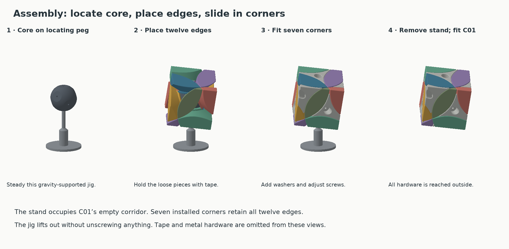

# Printing and assembly — 80 mm v4.2.1

This guide is for the older 80 mm direct-screw version. For the latest 64 mm
locknut version, use [v4.3 assembly](../designs/redi-v4.3/ASSEMBLY.md).
The hardware and pieces are different; do not mix the sets.

Print one core, C01–C08 and E01–E12 from [models/current/parts](../models/current/parts). The [plates](../models/current/plates) arrange those parts for a 256 mm bed. `comparison_E12.3mf` is optional, not an additional required piece.

## Hardware

| Quantity | Item |
|---|---|
| 8 | M3 × 20 machine screws with flat undersides to their heads |
| 8 | Washers: 13 mm outside diameter, 0.55 mm thick; bore must pass the screw |
| 1 | Phillips driver; tubular holder no larger than the checked Ø12 envelope |

The 2.6 mm pilots grip the machine screws directly in printed plastic. There are no inserts. The corner's 3.3 mm bore must clear the screw freely; only the core should grip its thread. Use the [fit coupon](../models/current/calibration/fit_coupon.stl) if your material or hole sizing differs. It includes several pilot and clearance sizes plus a washer-well sample.

The hardware model assumes an approximately Ø6 × 3 mm screw head envelope. Check unusually large heads. The reference seat is designed around the specified washer; changing washer thickness changes axial adjustment and screw engagement. M3 × 20 gives 7.35 mm nominal engagement. Longer screws are not needed for the supplied set.

## Printing

Use **millimetres and 100% scale**. The models contain their clearances already. The 3MF files are geometry-only and carry no verified Bambu Studio settings or G-code.

The original development printer was a Bambu Lab P1S with a 0.4 mm nozzle. Use settings that have given you accurate PLA parts. If starting fresh, 0.16 mm layers, five walls, six top/bottom layers and approximately 20% infill are suggested starting settings for the outer pieces, not a tested preset. Inspect the sliced walls, washer collars and retaining overhangs, and provide removable supports where needed.

Parts are preoriented with a broad exterior face on the bed. The core sits on its C01 axle pad; its curved portions remain spherical. Keep each file's ID associated with the piece after printing. IDs are file/object names, not guaranteed embossed labels.

Remove support residue, raised seams and first-layer lips from sliding surfaces. Preserve flat retaining lands and bearing feet. Inspect the inside of the track mouths, not just the visible exterior.

PLA was the original baseline; the exact material/settings of the latest reported v4.2 print were not separately logged. To compare a geometry change, keep material, orientation and settings fixed. ABS can be evaluated with the same comparison piece and its manufacturer's printing guidance, but there is no controlled friction or turning-force comparison for this puzzle. Material-dependent dimensional change can alter fit; do not assume uniform scaling is a suitable correction.

## Full assembly

1. Print the [assembly stand](../models/current/calibration/assembly_stand.stl). Stand the core on the C01 pad with the stand's peg in that pilot. The stand is held by gravity, not a deeply recessed fastening screw.
2. Place the twelve edges in their solved positions around the core. Use the piece map and the [assembled reference](../models/current/reference/assembled_reference_DO_NOT_PRINT.3mf). Low-tack tape or careful hand support can hold the loose shell together.
3. Slide C02–C08 inward along their individual axes. Put a washer into each access well and screw into the core through the corner. Fit each corner without clamping its rotation.
4. Support the puzzle and withdraw the stand through C01's still-empty corridor.
5. Slide in C01 and install its washer and screw. Adjust all eight corners, then check slow turns before scrambling.

All fasteners are accessible from outside. Edges go in before the retainers close their escape paths; do not force them through installed flanges. The assembled reference is for inspection only—do not print it as a fused object.

## Adjustment

Aim for roughly **0.10 mm axial freedom** at each corner, with 0.08–0.15 mm as a starting range. Gently remove play, then back off enough that the corner rotates freely. With standard 0.5 mm-pitch M3 screws, one fifth of a turn corresponds to 0.10 mm of screw travel; printed thread compliance and washer seating mean the resulting play still needs checking.

If a turn catches, inspect the contacting track/ridge and print residue before loosening all screws. Excessive lift permits wobble and can weaken retention. This design has no springs or detents.

Use a hand driver. On reassembly, let the screw find the existing plastic thread before advancing. Repeated removal can wear the pilot. A rough washer or tight bearing foot can cause drag independently of edge-track clearance.

## Piece map

Axis signs refer to the mechanism frame, not the rotated exterior faces.

| Corner | Axis signs | Adjacent edges |
|---|---|---|
| C01 | − − − | E01, E02, E05 |
| C02 | − − + | E01, E03, E06 |
| C03 | − + − | E02, E04, E07 |
| C04 | − + + | E03, E04, E08 |
| C05 | + − − | E05, E09, E10 |
| C06 | + − + | E06, E09, E11 |
| C07 | + + − | E07, E10, E12 |
| C08 | + + + | E08, E11, E12 |

## Replacing edges on an existing 80 mm puzzle

The publication revision reuses the v4/v4.1/v4.2 core, corners and hardware. Only edges need replacement. Earlier v3/v3.1 outer interfaces have compatible main dimensions, but the new wider v4 corner tracks are part of the intended smooth-turning configuration. Do not mix these parts with the old 100 mm v2 puzzle.

To try E12 first, return to the solved shape, support nearby pieces, remove C07 and C08, and withdraw the old edge outward. Install the new E12 and refit those corners. Do not pry it past their installed shoulders. A single replacement changes only some contacts, so other edges may still catch.

## Optional bench fixture

The [calibration folder](../models/current/calibration) contains seven STLs: the stand, fit coupon, fixed bowl (`test_fixture`), rotor, and three cropped edge segments. Only the last five form the mechanism fixture.

Place the three edge segments 120° apart in the bowl, insert the rotor axially, and fasten it with one washer and M3 × 20 screw. Adjust like a full-puzzle corner. Its fixed bowl is axisymmetric, so this fixture exercises one rotating track but cannot reproduce all crossing-axis interactions of the full puzzle.
